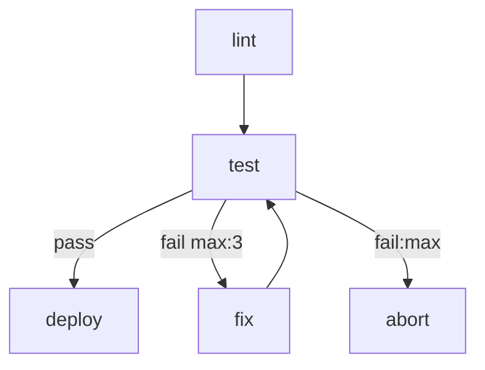

# markflow

A workflow engine that uses a single Markdown file as both human-readable documentation and executable specification. Define your workflow topology as a Mermaid flowchart, implement steps as shell scripts or AI agent prompts, and let the engine handle routing, retries, parallel execution, and run history.

## Quick Start

```bash
# Run a workflow — auto-creates a ./<workflow-name>/ workspace on first use
npx markflow run workflow.md

# Pass inputs on the command line
npx markflow run workflow.md --input ISSUE_ID=abc --input PROJECT_ID=xyz
```

On first run, markflow scaffolds a workspace directory (`./<workflow-name>/`) containing an `.env` file prefilled with any declared inputs, plus a `runs/` subdirectory that accumulates per-run event logs.

## Loading Workflows From a URL or Stdin

`markflow run` accepts an `http(s)` URL or `-` (stdin) as the target:

```bash
# Fetch and run — creates ./flow/ from the URL basename, persists flow.md locally
markflow run https://example.com/flow.md

# Pipe from stdin — --workspace is required
cat flow.md | markflow run - --workspace ./my-flow

# Re-run later without hitting the network (uses the frozen local copy)
markflow run ./flow

# Explicitly re-fetch the URL before running
markflow run ./flow --refresh
```

On materialization the workspace records provenance in `.markflow.json`:

```json
{
  "workflow": "flow.md",
  "origin": {
    "type": "url",
    "url": "https://example.com/flow.md",
    "fetchedAt": "2026-04-15T16:29:00.070Z"
  }
}
```

`markflow ls` and `markflow show` display the recorded origin for URL/stdin-backed workspaces. Remote workflows can run arbitrary shell — only run URLs you trust.

## Writing a Workflow

A workflow is a `.md` file with up to four sections:

````markdown
# CI Pipeline

Runs lint and tests, then deploys on success.

# Inputs

- `DEPLOY_TARGET` (required): Deploy target environment
- `SLACK_CHANNEL` (default: `#deploys`): Where to notify

# Flow



# Steps

## lint

```bash
npm run lint
```

## test

```bash
npm test
```

## fix

You are a coding agent. The deploy target is {{ DEPLOY_TARGET }}.
Review the test failures in context and fix the source code so the tests pass.

## deploy

```bash
./scripts/deploy.sh "$DEPLOY_TARGET"
```

## abort

```bash
echo "Failed after max retries" >&2
exit 1
```
````

### Step Types

| Content | Type | Executor |
|---|---|---|
| ` ```bash ` or ` ```sh ` | Script | `bash` |
| ` ```python ` | Script | `python3` |
| ` ```js ` or ` ```javascript ` | Script | `node` |
| Plain prose (no code block) | Agent | Configured agent CLI |

### Inputs

The optional `# Inputs` section declares workflow-level parameters:

```markdown
- `NAME` (required): description
- `NAME` (optional): description
- `NAME` (default: "value"): description
```

At runtime inputs are resolved from `--input` flags, `--env <file>`, the workspace's `.env`, process environment, and declared defaults (highest priority first). Required inputs with no value abort the run. All declared inputs are exported as environment variables to script steps.

### Templating and context

Agent prompts are rendered with LiquidJS (`{{ VAR }}`, ``, filters). Steps can read and write two JSON-shaped context surfaces — `LOCAL` (step-private) and `GLOBAL` (workflow-wide) — and emit routing decisions via a `RESULT:` stdout sentinel.

See [`docs/arch/templating-and-context.md`](docs/arch/templating-and-context.md) for the full variable list, filter catalog, and stdin/stdout contract.

### Edge Annotations

```
A --> B                    # unconditional
A -->|pass| B              # labelled
A -->|fail max:3| B        # retry up to 3 times
A -->|fail:max| C          # followed when retries exhausted
```

Multiple unlabelled edges from a node fan out in parallel. A node with multiple incoming edges waits for all upstreams to complete.

### forEach (Dynamic Task Mapping)

A thick edge declares a forEach fan-out — the engine spawns one token per array item:

```
A ==>|each: items| B --> C   # B runs once per item; C collects results
```

Configure concurrency and failure policy on the source step:

```yaml
foreach:
  maxConcurrency: 3          # 0 = unlimited (default), 1 = serial
  onItemError: continue      # or: fail-fast (default)
```

Body steps receive `$ITEM` (current element) and `$ITEM_INDEX` (position). After all items complete, the collector receives `GLOBAL.results` indexed by original position.

Full routing semantics — including step-level retry policies, forEach, and timeouts — in [`docs/arch/routing-and-retries.md`](docs/arch/routing-and-retries.md).

## CLI

```bash
# Create or update a workspace for a workflow
markflow init <workflow.md> [--workspace <dir>] [--input KEY=VAL] [--force] [--remove]

# Execute a workflow (auto-inits the workspace if needed)
markflow run <workflow.md | workspace-dir> [options]
    --workspace <dir>       # override default workspace location
    --env <file>            # extra env file
    --input KEY=VAL         # repeatable input override
    --dry-run               # validate only
    --no-parallel           # run fan-outs sequentially
    --agent <cli>           # override the agent CLI
    --verbose / -v          # stream each step's stdout/stderr to the console
    --debug                 # pause before each step for interactive inspection
    --break-on <step>       # run until the named step, then pause (implies --debug)
    --json                  # output events and final result as JSON lines

# List past runs in a workspace
markflow ls <workspace-dir> [--json]

# Show details of a specific run
markflow show <run-id> [--workspace <dir>] [--json]
    --events                # print the raw event timeline
    --output <seq>          # dereference an output:ref to its sidecar file
```

### Debugger

`markflow run <workflow> --debug` pauses before each step and prints the node, inputs, outgoing edges, and prior step. At the prompt:

- **[c]ontinue** — run the step normally
- **[i]nspect** — dump the script body or the assembled agent prompt
- **[s]kip** — short-circuit with a synthetic edge + summary (validated against outgoing edge labels)
- **[q]uit** — abort the run

`--break-on <step>` runs freely until it reaches the named step, then pauses there. Debug mode forces sequential execution (parallel + interactive stdin deadlocks).

## Library Usage

```typescript
import {
  parseWorkflow,
  validateWorkflow,
  executeWorkflow,
  ParseError,
  ValidationError,
  ExecutionError,
} from "markflow";

const definition = await parseWorkflow("workflow.md");

const diagnostics = validateWorkflow(definition);
if (diagnostics.some(d => d.severity === "error")) {
  console.error(diagnostics);
  process.exit(1);
}

const controller = new AbortController();
process.on("SIGINT", () => controller.abort());

const runInfo = await executeWorkflow(definition, {
  inputs: { DEPLOY_TARGET: "staging" },
  signal: controller.signal,
  onEvent: (event) => console.log(event),
});
```

The library exports a typed error hierarchy — `ParseError`, `ValidationError`, `ExecutionError`, `ConfigError`, `TemplateError` — all extending `MarkflowError` with a `.code` string. Pass an `AbortSignal` via the `signal` option to cancel a running workflow gracefully.

For a mock-driven test harness, see [`docs/arch/testing-harness.md`](docs/arch/testing-harness.md).

## Configuration

Defaults can be set at three granularities — inline ` ```config ` block, `.workflow.json` sidecar, or per-step ` ```config ` block — with programmatic `options.config` overriding all three. Workflow-wide settings include `agent`, `flags`, `parallel`, `max_retries_default`, and `timeout_default`. Per-step blocks additionally support `timeout` and `retry` policies.

See [`docs/arch/configuration.md`](docs/arch/configuration.md) for the full schema, precedence rules, and how markflow owns the non-interactive agent invocation prefix.

## Examples

### Tutorial

A progressive series of self-contained examples — each demonstrates one feature and runs locally without setup:

| # | Example | Feature |
|---|---------|---------|
| 01 | [hello-world](docs/examples/tutorial/01-hello-world.md) | Minimal 2-step workflow |
| 02 | [data-passing](docs/examples/tutorial/02-data-passing.md) | LOCAL, GLOBAL, and STEPS context |
| 03 | [inputs](docs/examples/tutorial/03-inputs.md) | Declared workflow parameters |
| 04 | [branching](docs/examples/tutorial/04-branching.md) | Conditional edge routing |
| 05 | [parallel](docs/examples/tutorial/05-parallel.md) | Fan-out and fan-in |
| 06 | [foreach-basic](docs/examples/tutorial/06-foreach-basic.md) | forEach batch iteration |
| 07 | [foreach-concurrency](docs/examples/tutorial/07-foreach-concurrency.md) | maxConcurrency sliding window |
| 08 | [foreach-serial](docs/examples/tutorial/08-foreach-serial.md) | Sequential loop (maxConcurrency: 1) |
| 09 | [retry-step](docs/examples/tutorial/09-retry-step.md) | Step-level retry with backoff |
| 10 | [retry-edge](docs/examples/tutorial/10-retry-edge.md) | Edge-level retry + exhaustion handler |
| 11 | [timeout](docs/examples/tutorial/11-timeout.md) | Per-step timeouts |
| 12 | [multi-language](docs/examples/tutorial/12-multi-language.md) | Bash, Python, and JavaScript steps |
| 13 | [approval](docs/examples/tutorial/13-approval.md) | Human decision nodes |
| 14 | [complex-pipeline](docs/examples/tutorial/14-complex-pipeline.md) | All features combined |

### Real-World

- [`docs/examples/loop.md`](docs/examples/loop.md) — issue-triage loop demonstrating the **emitter pattern**: one step owns a cached list, keeps its cursor in `LOCAL`, publishes the current item into `GLOBAL`, and self-loops until exhausted. Ports in [JavaScript](docs/examples/loop-js.md) and [Python](docs/examples/loop-py.md) show the protocol is language-agnostic.
- [`docs/examples/config-block.md`](docs/examples/config-block.md) — small haiku-generator demonstrating the **top-level config block**: a random topic flows from a script step into an agent step (inheriting workflow-level `agent` and `flags`) and back out to a formatter script.

## How It Works

- **Parser** extracts name, declared inputs, Mermaid topology (via `@emily/mermaid-ast`, a full-fidelity JISON-based parser), and step definitions. All standard Mermaid flowchart node shapes, edge types, and subgraphs are supported.
- **Validator** checks structural correctness: node–step matching, single start node enforcement, retry handler completeness, edge label uniqueness, mixed labelled/unlabelled edge detection, unreachable node detection, and duplicate input/step name detection. Diagnostics include source file, line numbers, and actionable suggestions.
- **Engine** runs a token-based execution loop — linear flows, branching, parallel fan-out/fan-in, cycles, and retry budgets. See [`docs/arch/routing-and-retries.md`](docs/arch/routing-and-retries.md).
- **Routing** maps script exit codes to edges (`0` → pass/ok/success/done, non-zero → fail/error/retry). Scripts and agents can also emit `RESULT:` / `LOCAL:` / `GLOBAL:` stdout sentinels — see [`docs/arch/templating-and-context.md`](docs/arch/templating-and-context.md).
- **Run history** is persisted as an append-only event stream in `<workspace>/runs/<timestamp>/events.jsonl`, with step stdout/stderr in sidecar `output/` files. Runs are reconstructed by folding the events through a pure `replay()` function — see [`docs/arch/event-sourced-run-log.md`](docs/arch/event-sourced-run-log.md).

## Development

```bash
npm install
npm test          # run tests
npm run lint      # type-check
npm run dev       # run CLI via tsx
npm run build     # build with tsup
```

## Project Structure

```
src/
  core/           # Library (public API)
    parser/       # Markdown + Mermaid parsing
    runner/       # Script and agent step execution
    engine.ts     # Token-based workflow executor
    router.ts     # Edge resolution and retry accounting
    validator.ts  # Structural validation
    errors.ts     # Typed error hierarchy (ParseError, ExecutionError, etc.)
    event-logger.ts
    replay.ts     # Pure fold from event stream to EngineSnapshot
    run-manager.ts
    env.ts        # Layered input resolution
  cli/
    commands/     # init, run, show, ls
    debug.ts      # Interactive debugger hook
    workspace.ts  # Workspace resolution helpers
  testing/        # WorkflowTest harness (markflow/testing entry)
```
