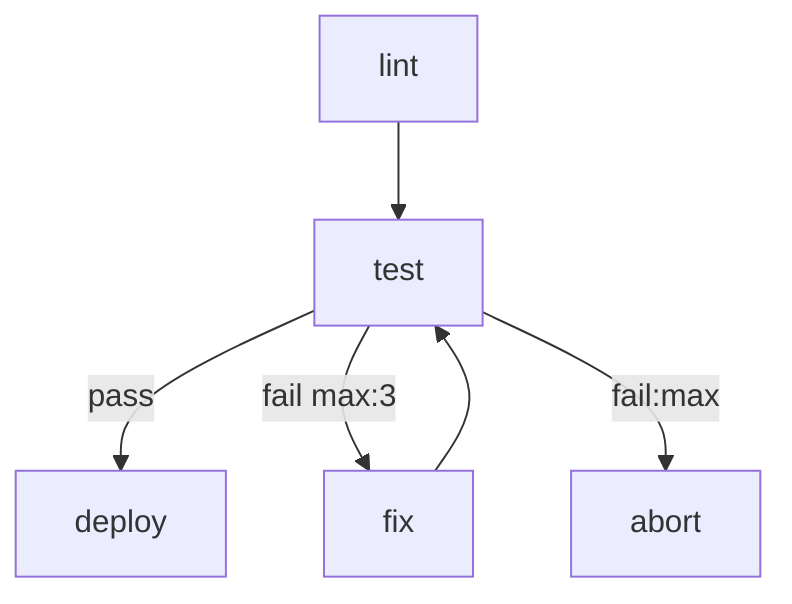
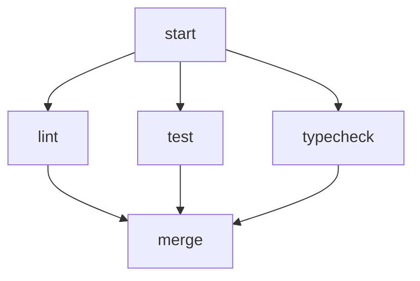

# markflow

A workflow engine that uses a single Markdown file as both human-readable documentation and executable specification. Define your workflow topology as a Mermaid flowchart, implement steps as shell scripts or AI agent prompts, and let the engine handle routing, retries, parallel execution, and run history.

## Quick Start

```bash
# Run a workflow — auto-creates a ./<workflow-name>/ workspace on first use
npx markflow run workflow.md

# Pass inputs on the command line
npx markflow run workflow.md --input ISSUE_ID=abc --input PROJECT_ID=xyz
```

On first run, markflow scaffolds a workspace directory (`./<workflow-name>/`) containing an `.env` file prefilled with any declared inputs, plus a `runs/` subdirectory that accumulates JSONL logs of every run.

## Writing a Workflow

A workflow is a `.md` file with up to four sections:

````markdown
# CI Pipeline

Runs lint and tests, then deploys on success.

# Inputs

- `DEPLOY_TARGET` (required): Deploy target environment
- `SLACK_CHANNEL` (default: `#deploys`): Where to notify

# Flow



# Steps

## lint

```bash
npm run lint
```

## test

```bash
npm test
```

## fix

You are a coding agent. The deploy target is ${DEPLOY_TARGET}.
Review the test failures in context and fix the source code so the tests pass.

## deploy

```bash
./scripts/deploy.sh "$DEPLOY_TARGET"
```

## abort

```bash
echo "Failed after max retries" >&2
exit 1
```
````

### Step Types

| Content | Type | Executor |
|---|---|---|
| ` ```bash ` or ` ```sh ` | Script | `bash` |
| ` ```python ` | Script | `python3` |
| ` ```js ` or ` ```javascript ` | Script | `node` |
| Plain prose (no code block) | Agent | Configured agent CLI |

### Inputs

The optional `# Inputs` section declares workflow-level parameters:

```markdown
- `NAME` (required): description
- `NAME` (optional): description
- `NAME` (default: "value"): description
- `NAME` (default: `value`): description
```

At runtime inputs are resolved from (highest priority first): `--input` flags, `--env <file>`, the workspace's `.env`, process environment, declared defaults. Required inputs with no value abort the run. All declared inputs are exported as environment variables to script steps.

#### Variable Templating in Agent Prompts

Agent prompts use `${VAR}` syntax to reference workflow inputs and runtime context. Only explicitly referenced variables appear in the prompt — nothing is injected automatically.

```markdown
## review

You are a code reviewer. The repository is at ${MARKFLOW_WORKDIR}.
The previous step reported: ${MARKFLOW_PREV_SUMMARY}
Review the code for ${REVIEW_CRITERIA}.
```

Available variables:
- Any declared workflow input (e.g. `${DEPLOY_TARGET}`)
- `${MARKFLOW_STEP}` — current step name
- `${MARKFLOW_PREV_STEP}`, `${MARKFLOW_PREV_EDGE}`, `${MARKFLOW_PREV_SUMMARY}` — context from the previous step
- `${MARKFLOW_WORKDIR}` — per-run working directory (cwd for scripts and agents)
- `${MARKFLOW_WORKSPACE}` — persistent workspace directory (contains `.env` and `runs/`)
- `${MARKFLOW_RUNDIR}` — run log directory

Undefined variables cause the run to fail with a descriptive error. To include a literal `${VAR}` in your prompt, escape it as `$${VAR}`.

### Edge Annotations

```
A --> B                    # unconditional
A -->|pass| B              # labelled
A -->|fail max:3| B        # retry up to 3 times
A -->|fail:max| C          # followed when retries exhausted
```

### Parallel Execution

Multiple unlabelled edges from a node fan out in parallel. A node with multiple incoming edges waits for all upstreams to complete before executing.



## CLI

```bash
# Create or update a workspace for a workflow
markflow init <workflow.md> [--workspace <dir>] [--input KEY=VAL] [--force] [--remove]

# Execute a workflow (auto-inits the workspace if needed)
markflow run <workflow.md | workspace-dir> [options]
    --workspace <dir>       # override default workspace location
    --env <file>            # extra env file
    --input KEY=VAL         # repeatable input override
    --dry-run               # validate only
    --no-parallel           # run fan-outs sequentially
    --agent <cli>           # override the agent CLI
    --verbose / -v          # stream each step's stdout/stderr to the console
    --debug                 # pause before each step for interactive inspection
    --break-on <step>       # run until the named step, then pause (implies --debug)

# List past runs in a workspace
markflow ls <workspace-dir> [--json]

# Show details of a specific run
markflow show <run-id> [--workspace <dir>] [--json]
```

### Debugger

`markflow run <workflow> --debug` pauses before each step and prints the node, inputs, outgoing edges, and prior step. At the prompt:

- **[c]ontinue** — run the step normally
- **[i]nspect** — dump the script body or the assembled agent prompt
- **[s]kip** — short-circuit with a synthetic edge + summary (validated against outgoing edge labels)
- **[q]uit** — abort the run

`--break-on <step>` runs freely until it reaches the named step, then pauses there. Debug mode forces sequential execution (parallel + interactive stdin deadlocks).

## Library Usage

### Running workflows programmatically

```typescript
import {
  parseWorkflow,
  validateWorkflow,
  executeWorkflow,
} from "markflow";

const definition = await parseWorkflow("workflow.md");

const diagnostics = validateWorkflow(definition);
if (diagnostics.some(d => d.severity === "error")) {
  console.error(diagnostics);
  process.exit(1);
}

const runInfo = await executeWorkflow(definition, {
  inputs: { DEPLOY_TARGET: "staging" },
  onEvent: (event) => console.log(event),
});
```

### Testing workflows

The `markflow/testing` entry point provides `WorkflowTest`, a harness that injects synthetic step results through the `beforeStep` hook so tests run fast with no network or agent calls.

```typescript
import { WorkflowTest } from "markflow/testing";

const wft = await WorkflowTest.fromFile("./ci.md");

// Single mock — every call to this node returns the same result
wft.mock("fetch-ticket", { edge: "pass", summary: "Fetched TKT-123" });

// Sequential — each call consumes the next entry; last entry repeats
wft.mock("test", [{ edge: "fail" }, { edge: "fail" }, { edge: "pass" }]);

const result = await wft.run({
  inputs: { DEPLOY_TARGET: "staging" },
  // Optional: seed the per-run working directory before execution
  workdirSetup: async (dir) => {
    await writeFile(join(dir, "ticket.json"), JSON.stringify(fixture));
  },
});

expect(result.status).toBe("complete");
expect(result.callCount("test")).toBe(3);
expect(result.edgeTaken("test", 1)).toBe("fail");
expect(result.edgeTaken("test", 3)).toBe("pass");
expect(result.events.filter(e => e.type === "retry:increment")).toHaveLength(2);
```

Unmocked steps run for real — mock only the steps you need to isolate.

## How It Works

- **Parser** extracts name, declared inputs, Mermaid topology, and step definitions.
- **Validator** checks structural correctness: node-step matching, retry handler completeness, edge label uniqueness.
- **Engine** runs a token-based execution loop — linear flows, branching, parallel fan-out/fan-in, cycles, and retry budgets.
- **Routing** maps script exit codes to edges (`0` → pass/ok/success/done, non-zero → fail/error/retry). Scripts and agents can also emit `RESULT: {"edge": "...", "summary": "..."}` as the final stdout line for explicit control.
- **Run history** is persisted as JSONL in `<workspace>/runs/<timestamp>/context.jsonl`.

## Configuration

Place a `.workflow.json` next to your workflow `.md` file to override defaults:

```json
{
  "agent": "claude",
  "agent_flags": ["-p"],
  "max_retries_default": 3,
  "parallel": true
}
```

The assembled prompt is piped to the agent's stdin; argv contains only the flags in `agent_flags`. Set `agent_flags` to whatever puts your CLI into non-interactive mode — e.g. `["-p"]` for `claude` and `gemini`, or `["exec", "-"]` for `codex`. The default is `["-p"]`.

Per-step overrides live in a fenced config block inside the step body:

````markdown
## analyze-ticket

```json
{ "agent": "gemini", "flags": ["-p"] }
```

You are a ticket analyst. …
````

## Development

```bash
npm install
npm test          # run tests
npm run lint      # type-check
npm run dev       # run CLI via tsx
npm run build     # build with tsup
```

## Project Structure

```
src/
  core/           # Library (public API)
    parser/       # Markdown + Mermaid parsing
    runner/       # Script and agent step execution
    engine.ts     # Token-based workflow executor
    router.ts     # Edge resolution and retry accounting
    validator.ts  # Structural validation
    run-manager.ts
    context-logger.ts
    env.ts        # Layered input resolution
  cli/
    commands/     # init, run, show, ls
    debug.ts      # Interactive debugger hook
    workspace.ts  # Workspace resolution helpers
  testing/        # WorkflowTest harness (markflow/testing entry)
```
