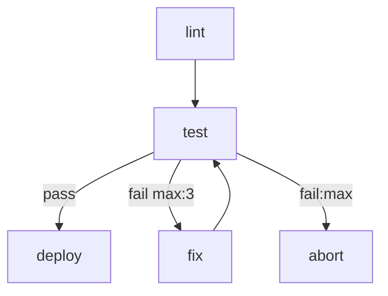
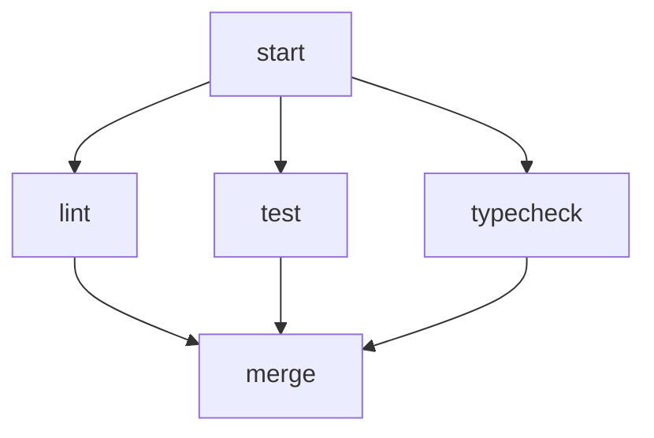

# markflow

A workflow engine that uses a single Markdown file as both human-readable documentation and executable specification. Define your workflow topology as a Mermaid flowchart, implement steps as shell scripts or AI agent prompts, and let the engine handle routing, retries, and parallel execution.

## Quick Start

```bash
npx markflow start workflow.md
```

## Writing a Workflow

A workflow is a `.md` file with three sections:

````markdown
# CI Pipeline

Runs lint and tests, then deploys on success.

# Flow



# Steps

## lint

```bash
npm run lint
```

## test

```bash
npm test
```

## fix

You are a coding agent. Review the test failures in context
and fix the source code so the tests pass.

## deploy

```bash
./scripts/deploy.sh
```

## abort

```bash
echo "Failed after max retries" >&2
exit 1
```
````

### Step Types

| Content | Type | Executor |
|---|---|---|
| ` ```bash ` or ` ```sh ` | Script | `bash` |
| ` ```python ` | Script | `python3` |
| ` ```js ` or ` ```javascript ` | Script | `node` |
| Plain prose (no code block) | Agent | Configured agent CLI |

### Edge Annotations

```
A --> B                    # unconditional
A -->|pass| B              # labelled
A -->|fail max:3| B        # retry up to 3 times
A -->|fail:max| C          # followed when retries exhausted
```

### Parallel Execution

Multiple unlabelled edges from a node fan out in parallel. A node with multiple incoming edges waits for all upstreams to complete before executing.



## CLI

```bash
# Parse, validate, and execute a workflow
markflow start <file> [--dry-run] [--no-parallel] [--agent <cli>] [--runs-dir <path>]

# List past runs
markflow ls [--runs-dir <path>] [--json]

# Show details of a specific run
markflow run <id> [--runs-dir <path>] [--json]
```

Use `--dry-run` to validate a workflow without executing it.

## Library Usage

```typescript
import {
  parseWorkflow,
  validateWorkflow,
  executeWorkflow,
} from "markflow";

const definition = await parseWorkflow("workflow.md");

const diagnostics = validateWorkflow(definition);
if (diagnostics.some(d => d.severity === "error")) {
  console.error(diagnostics);
  process.exit(1);
}

const runInfo = await executeWorkflow(definition, {
  onEvent: (event) => console.log(event),
});
```

## How It Works

- **Parser** extracts the workflow name, Mermaid flowchart, and step definitions from the `.md` file.
- **Validator** checks structural correctness before execution: node-step matching, retry handler completeness, edge label uniqueness.
- **Engine** uses a token-based execution model that supports linear flows, branching, parallel fan-out/fan-in, cycles, and retry logic.
- **Routing** maps script exit codes to edges (`0` = pass/ok/success/done, non-zero = fail/error/retry). Scripts and agents can also emit `RESULT: {"edge": "...", "summary": "..."}` as the last stdout line for explicit control.
- **Run history** is logged as JSONL in `runs/<timestamp>/context.jsonl`.

## Configuration

Place a `.workflow.json` next to your workflow file to override defaults:

```json
{
  "agent": "claude",
  "agent_flags": ["--dangerously-skip-permissions"],
  "max_retries_default": 3,
  "parallel": true
}
```

## Development

```bash
npm install
npm test          # run tests
npm run lint      # type-check
npm run dev       # run CLI via tsx
npm run build     # build with tsup
```

## Project Structure

```
src/
  core/           # Library (public API)
    parser/       # Markdown + Mermaid parsing
    runner/       # Script and agent step execution
    engine.ts     # Token-based workflow executor
    router.ts     # Edge resolution and retry accounting
    validator.ts  # Structural validation
    run-manager.ts
    context-logger.ts
  cli/            # CLI wrapper (yargs)
    commands/     # start, ls, run
```
