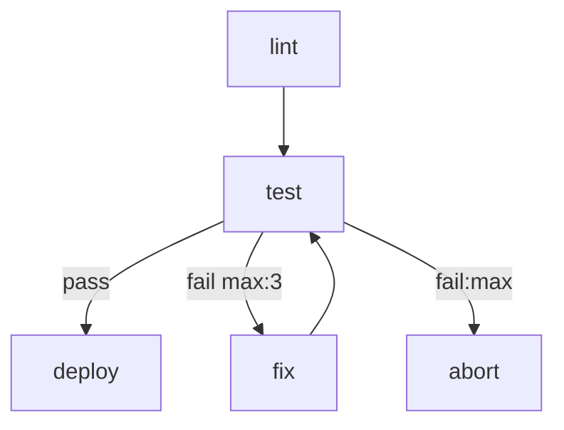
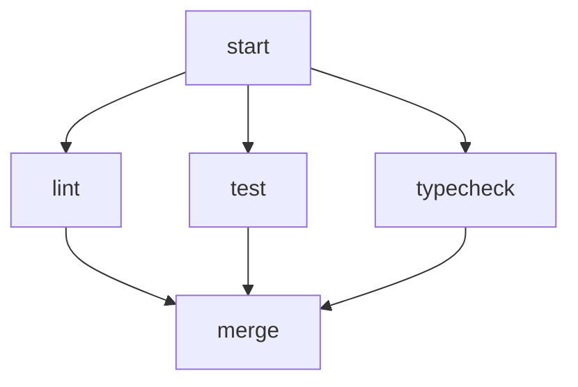

# markflow

A workflow engine that uses a single Markdown file as both human-readable documentation and executable specification. Define your workflow topology as a Mermaid flowchart, implement steps as shell scripts or AI agent prompts, and let the engine handle routing, retries, parallel execution, and run history.

## Quick Start

```bash
# Run a workflow — auto-creates a ./<workflow-name>/ workspace on first use
npx markflow run workflow.md

# Pass inputs on the command line
npx markflow run workflow.md --input ISSUE_ID=abc --input PROJECT_ID=xyz
```

On first run, markflow scaffolds a workspace directory (`./<workflow-name>/`) containing an `.env` file prefilled with any declared inputs, plus a `runs/` subdirectory that accumulates JSONL logs of every run.

## Writing a Workflow

A workflow is a `.md` file with up to four sections:

````markdown
# CI Pipeline

Runs lint and tests, then deploys on success.

# Inputs

- `DEPLOY_TARGET` (required): Deploy target environment
- `SLACK_CHANNEL` (default: `#deploys`): Where to notify

# Flow



# Steps

## lint

```bash
npm run lint
```

## test

```bash
npm test
```

## fix

You are a coding agent. The deploy target is {{ DEPLOY_TARGET }}.
Review the test failures in context and fix the source code so the tests pass.

## deploy

```bash
./scripts/deploy.sh "$DEPLOY_TARGET"
```

## abort

```bash
echo "Failed after max retries" >&2
exit 1
```
````

### Step Types

| Content | Type | Executor |
|---|---|---|
| ` ```bash ` or ` ```sh ` | Script | `bash` |
| ` ```python ` | Script | `python3` |
| ` ```js ` or ` ```javascript ` | Script | `node` |
| Plain prose (no code block) | Agent | Configured agent CLI |

### Inputs

The optional `# Inputs` section declares workflow-level parameters:

```markdown
- `NAME` (required): description
- `NAME` (optional): description
- `NAME` (default: "value"): description
- `NAME` (default: `value`): description
```

At runtime inputs are resolved from (highest priority first): `--input` flags, `--env <file>`, the workspace's `.env`, process environment, declared defaults. Required inputs with no value abort the run. All declared inputs are exported as environment variables to script steps.

#### Variable Templating in Agent Prompts

Agent prompts are rendered with [LiquidJS](https://liquidjs.com/) in strict mode. Use `{{ VAR }}` to interpolate, `` for control flow, and `|` for filters. Undefined variables cause the run to fail with a descriptive error.

```markdown
## review

You are a code reviewer. The repository is at {{ MARKFLOW_WORKDIR }}.
The previous step reported: {{ MARKFLOW_PREV_SUMMARY }}
Review the code for {{ REVIEW_CRITERIA }}.
```

Flat variables:
- Any declared workflow input (e.g. `{{ DEPLOY_TARGET }}`)
- `{{ MARKFLOW_STEP }}` — current step name
- `{{ MARKFLOW_PREV_STEP }}`, `{{ MARKFLOW_PREV_EDGE }}`, `{{ MARKFLOW_PREV_SUMMARY }}` — context from the previous step
- `{{ MARKFLOW_WORKDIR }}` — per-run working directory (cwd for scripts and agents)
- `{{ MARKFLOW_WORKSPACE }}` — persistent workspace directory (contains `.env` and `runs/`)
- `{{ MARKFLOW_RUNDIR }}` — run log directory

Structured namespaces:
- `{{ GLOBAL.* }}` — workflow-wide context accumulated across steps
- `{{ STEPS.<id>.edge }}`, `{{ STEPS.<id>.summary }}`, `{{ STEPS.<id>.local.* }}` — results from prior steps

To include literal `{{` or `{%` in a prompt, wrap the region in `…`.

Markdown-oriented filters are registered for turning structured data into prompt-ready markdown: `json`, `yaml`, `list`, `table`, `code`, `heading`, `quote`, `indent`, `pluck`, `keys`, `values`. The `json` and `yaml` filters accept an optional comma-separated field list, e.g. `{{ issue | json: "number,title" }}`.

#### Context Surfaces (`LOCAL` / `GLOBAL` / `STEPS`)

Every step can read and emit two JSON-shaped context surfaces:

- **`LOCAL`** — step-private. Only the same step sees it on re-entry (the cursor memory used by loops/emitters).
- **`GLOBAL`** — workflow-wide. All subsequent steps read it.
- **`STEPS`** — read-only map of prior steps' `{ edge, summary, local }`.

Scripts receive `$LOCAL`, `$GLOBAL`, and `$STEPS` as JSON-string env vars, and emit updates as stdout sentinels:

```
LOCAL:  {"cursor": 3}
GLOBAL: {"item": {...}}
RESULT: {"edge": "next", "summary": "..."}
```

Multiple `LOCAL:` / `GLOBAL:` lines shallow-merge (later keys win). These surfaces are unrelated to the engine's internal token-state machine.

### Edge Annotations

```
A --> B                    # unconditional
A -->|pass| B              # labelled
A -->|fail max:3| B        # retry up to 3 times
A -->|fail:max| C          # followed when retries exhausted
```

### Parallel Execution

Multiple unlabelled edges from a node fan out in parallel. A node with multiple incoming edges waits for all upstreams to complete before executing.



## CLI

```bash
# Create or update a workspace for a workflow
markflow init <workflow.md> [--workspace <dir>] [--input KEY=VAL] [--force] [--remove]

# Execute a workflow (auto-inits the workspace if needed)
markflow run <workflow.md | workspace-dir> [options]
    --workspace <dir>       # override default workspace location
    --env <file>            # extra env file
    --input KEY=VAL         # repeatable input override
    --dry-run               # validate only
    --no-parallel           # run fan-outs sequentially
    --agent <cli>           # override the agent CLI
    --verbose / -v          # stream each step's stdout/stderr to the console
    --debug                 # pause before each step for interactive inspection
    --break-on <step>       # run until the named step, then pause (implies --debug)
    --json                  # output events and final result as JSON lines

# List past runs in a workspace
markflow ls <workspace-dir> [--json]

# Show details of a specific run
markflow show <run-id> [--workspace <dir>] [--json]
```

### Debugger

`markflow run <workflow> --debug` pauses before each step and prints the node, inputs, outgoing edges, and prior step. At the prompt:

- **[c]ontinue** — run the step normally
- **[i]nspect** — dump the script body or the assembled agent prompt
- **[s]kip** — short-circuit with a synthetic edge + summary (validated against outgoing edge labels)
- **[q]uit** — abort the run

`--break-on <step>` runs freely until it reaches the named step, then pauses there. Debug mode forces sequential execution (parallel + interactive stdin deadlocks).

## Library Usage

### Running workflows programmatically

```typescript
import {
  parseWorkflow,
  validateWorkflow,
  executeWorkflow,
  ParseError,
  ValidationError,
  ExecutionError,
} from "markflow";

const definition = await parseWorkflow("workflow.md");

const diagnostics = validateWorkflow(definition);
if (diagnostics.some(d => d.severity === "error")) {
  console.error(diagnostics);
  process.exit(1);
}

const controller = new AbortController();
process.on("SIGINT", () => controller.abort());

const runInfo = await executeWorkflow(definition, {
  inputs: { DEPLOY_TARGET: "staging" },
  signal: controller.signal,
  onEvent: (event) => console.log(event),
});
```

The library exports a typed error hierarchy — `ParseError`, `ValidationError`, `ExecutionError`, `ConfigError`, `TemplateError` — all extending `MarkflowError` with a `.code` string. Pass an `AbortSignal` via the `signal` option to cancel a running workflow gracefully.

### Testing workflows

The `markflow/testing` entry point provides `WorkflowTest`, a harness that injects synthetic step results through the `beforeStep` hook so tests run fast with no network or agent calls.

```typescript
import { WorkflowTest } from "markflow/testing";

const wft = await WorkflowTest.fromFile("./ci.md");

// Single mock — every call to this node returns the same result
wft.mock("fetch-ticket", { edge: "pass", summary: "Fetched TKT-123" });

// Sequential — each call consumes the next entry; last entry repeats
wft.mock("test", [{ edge: "fail" }, { edge: "fail" }, { edge: "pass" }]);

const result = await wft.run({
  inputs: { DEPLOY_TARGET: "staging" },
  // Optional: seed the per-run working directory before execution
  workdirSetup: async (dir) => {
    await writeFile(join(dir, "ticket.json"), JSON.stringify(fixture));
  },
});

expect(result.status).toBe("complete");
expect(result.callCount("test")).toBe(3);
expect(result.edgeTaken("test", 1)).toBe("fail");
expect(result.edgeTaken("test", 3)).toBe("pass");
expect(result.events.filter(e => e.type === "retry:increment")).toHaveLength(2);
```

Unmocked steps run for real — mock only the steps you need to isolate.

## Examples

- [`docs/examples/loop.md`](docs/examples/loop.md) — issue-triage loop demonstrating the **emitter pattern**: one step owns a cached list, keeps its cursor in `LOCAL`, publishes the current item into `GLOBAL`, and self-loops until exhausted. Ports in [JavaScript](docs/examples/loop-js.md) and [Python](docs/examples/loop-py.md) show the protocol is language-agnostic.
- [`docs/examples/config-block.md`](docs/examples/config-block.md) — small haiku-generator demonstrating the **top-level config block**: a random topic flows from a script step into an agent step (inheriting workflow-level `agent` and `flags`) and back out to a formatter script.

## How It Works

- **Parser** extracts name, declared inputs, Mermaid topology (via `@emily/mermaid-ast`, a full-fidelity JISON-based parser), and step definitions. All standard Mermaid flowchart node shapes, edge types, and subgraphs are supported.
- **Validator** checks structural correctness: node–step matching, single start node enforcement, retry handler completeness, edge label uniqueness, mixed labelled/unlabelled edge detection, unreachable node detection, and duplicate input/step name detection. Diagnostics include source file, line numbers, and actionable suggestions.
- **Engine** runs a token-based execution loop — linear flows, branching, parallel fan-out/fan-in, cycles, and retry budgets.
- **Routing** maps script exit codes to edges (`0` → pass/ok/success/done, non-zero → fail/error/retry). Scripts and agents can also emit `RESULT: {"edge": "...", "summary": "..."}` as the final stdout line for explicit control, plus zero or more `LOCAL: {...}` / `GLOBAL: {...}` lines to publish state to later steps.
- **Run history** is persisted as JSONL in `<workspace>/runs/<timestamp>/context.jsonl`.

## Configuration

Defaults can be set at three granularities, in ascending precedence:

1. **Top-level ` ```config ` block** in the workflow `.md` — inline defaults that keep the file self-contained.
2. **`.workflow.json` sidecar** next to the workflow `.md`.
3. **Per-step ` ```config ` block** at the top of a step — overrides the agent or appends extra flags for that step only.

Programmatic `options.config` passed to `executeWorkflow` overrides all three.

### Top-level config block

````markdown
# My Workflow

```config
agent: claude
flags:
  - --model
  - haiku
parallel: true
max_retries_default: 3
timeout_default: 30m
```

# Flow
…
````

### `.workflow.json` sidecar

```json
{
  "agent": "claude",
  "agent_flags": ["--model", "haiku"],
  "max_retries_default": 3,
  "timeout_default": "30m",
  "parallel": true
}
```

If both a top-level block and a `.workflow.json` are present, the engine prints a warning at start — the JSON wins.

### Non-interactive invocation is engine-owned

The assembled prompt is piped to the agent's stdin; argv contains `agent_flags` (or `flags:`) prefixed by the agent's non-interactive invocation. markflow owns that prefix — `-p` for `claude` and `gemini`, `exec -` for `codex` — and prepends it automatically. `flags` is for *extra* args (model selection, verbosity, etc.); if you list a baseline flag again it is silently deduped with a warning. For agents markflow doesn't know, `flags` is passed through verbatim.

### Per-step overrides

````markdown
## analyze-ticket

```config
agent: gemini
flags:
  - --model
  - gemini-2.0-flash
```

You are a ticket analyst. …
````

Per-step `flags` **append** to the workflow-level list — the per-step block doesn't replace it. Use `agent:` to swap the binary entirely.

The per-step `config` block also supports `timeout: <duration>` (e.g. `30s`, `5m`, `1h30m`). This caps a single execution attempt; retries each get a fresh window. When unset, the step inherits `timeout_default` from the workflow-level config. On timeout, the step routes via its `fail` edge with exit code 124. Works for both script and agent steps.

### Step retry policies

A step can declare an intrinsic retry policy in its `config` block. On failure the step re-executes in place; only after the retry budget is exhausted is the `fail` edge traversed.

````markdown
## api-call

```config
retry:
  max: 3
  delay: 10s
  backoff: exponential   # fixed | linear | exponential (default: fixed)
  maxDelay: 5m
  jitter: 0.3            # 0..1 fraction (default: 0)
```

Call the upstream API and return the payload.
````

With this, the graph needs only a plain `fail` branch — no self-loop:

```
api-call --> next
api-call -->|fail| error-handler
```

The legacy self-loop form (`A -->|fail max:3| A` plus `A -->|fail:max| handler`) still works; when both are specified on the same node, the step-level `retry` policy wins and the validator emits a warning.

## Development

```bash
npm install
npm test          # run tests
npm run lint      # type-check
npm run dev       # run CLI via tsx
npm run build     # build with tsup
```

## Project Structure

```
src/
  core/           # Library (public API)
    parser/       # Markdown + Mermaid parsing
    runner/       # Script and agent step execution
    engine.ts     # Token-based workflow executor
    router.ts     # Edge resolution and retry accounting
    validator.ts  # Structural validation
    errors.ts     # Typed error hierarchy (ParseError, ExecutionError, etc.)
    run-manager.ts
    context-logger.ts
    env.ts        # Layered input resolution
  cli/
    commands/     # init, run, show, ls
    debug.ts      # Interactive debugger hook
    workspace.ts  # Workspace resolution helpers
  testing/        # WorkflowTest harness (markflow/testing entry)
```
