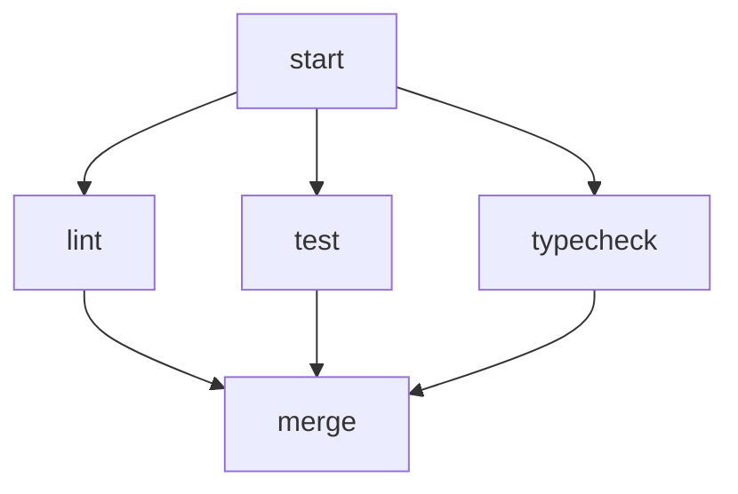
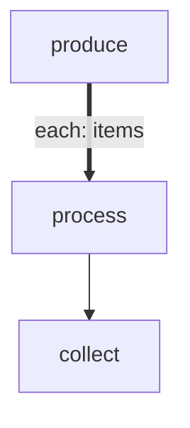

# Routing and Retries

How the engine picks an outgoing edge, parallelizes work across the graph, and
handles retry budgets and timeouts.

## Exit-code → edge mapping

Scripts route by exit code unless they emit an explicit `RESULT:`:

- `exit 0` → `next` (also accepted: `pass`, `ok`, `success`, `done`)
- Non-zero exit → `fail` (also accepted: `error`, `retry`)

Agents default the same way, with exit code 0 → `next`, non-zero → `fail`.

## Explicit routing via `RESULT:`

Any step can override the exit-code convention by emitting a sentinel line to stdout:

```
RESULT: {"edge": "custom-label", "summary": "short rationale"}
```

The `edge` value must match one of the node's outgoing edge labels (or the exhaustion handler). Validated against the graph at routing time.

## Edge annotations

```
A --> B                    # unconditional
A -->|pass| B              # labelled
A -->|fail max:3| B        # edge-level retry budget: up to 3 retries
A -->|fail:max| C          # followed when the retry budget is exhausted
```

## Parallel execution

Multiple unlabelled edges from a node fan out in parallel. A node with multiple incoming edges (a **merge node**) waits for all upstream nodes to resolve — complete or skipped — before executing.



`--no-parallel` (or `parallel: false` in config) forces sequential execution even when multiple tokens are ready.

## Retry budgets

Two retry mechanisms exist. They solve different problems and can coexist on the same node; when both apply, **step-level retry wins** and the validator emits a warning.

### Edge-level retry (graph-structural)

`A -->|fail max:N| A` declares a self-loop with a budget of N retries. The engine tracks a per-node, per-edge-label counter in `RetryState`. Each `fail` increments the counter; when it reaches N, the engine routes to the `fail:max` exhaustion handler instead.

This form is visible in the Mermaid diagram — useful when the retry *is* part of the flow, e.g. "run tests, fix, run tests again" with a dedicated `fix` step on the retry path.

### Step-level retry (intrinsic policy)

Declared in a step's `config` block (see [`configuration.md`](configuration.md)):

```yaml
retry:
  max: 3
  delay: 10s
  backoff: exponential
  maxDelay: 5m
  jitter: 0.3
```

On a `fail` result the runner sleeps according to the backoff curve and re-executes the step in place — no graph edge traversed, no new token. Only after the budget is exhausted does the `fail` edge route normally.

This form keeps the graph clean when the retry is a transient-error concern (API flakiness, rate limits) rather than a semantic state.

## Timeouts

Per-step `timeout: <duration>` in the step's `config` block, or workflow-level `timeout_default`, caps a single execution attempt. Retries each get a fresh window.

On timeout:
- The step exits with code 124.
- An `step:timeout` event is emitted (see [`event-sourced-run-log.md`](event-sourced-run-log.md)).
- Routing proceeds via the `fail` edge.

User-initiated aborts (`SIGINT`) take precedence over timeouts — a step aborted while the timeout was also firing is treated as a user abort, not a timeout.

## forEach (dynamic task mapping)

A thick edge (`==>|each: KEY|`) declares a forEach fan-out. The source step emits an array in `LOCAL.KEY`; the engine spawns one token per item through the body chain, then collects results at a downstream collector node.



### Concurrency control

By default all item tokens spawn immediately (unlimited parallelism). The `maxConcurrency` config on the source step limits how many run concurrently:

```yaml
foreach:
  maxConcurrency: 3      # sliding window of 3
  onItemError: continue  # or: fail-fast (default)
```

| `maxConcurrency` | Behavior |
|---|---|
| `0` or omitted | Unlimited — all items spawn at once |
| `1` | Serial — items process one at a time in order |
| `N` | Sliding window — as one item completes, the next spawns |

### Failure policies

- **fail-fast** (default): first item failure stops spawning new items; collector is skipped; source node routes via `fail` edge.
- **continue**: all items run regardless; collector receives `GLOBAL.results` with `{ ok, edge, local }` per item.

### Context available to body steps

| Variable | Content |
|---|---|
| `$ITEM` | JSON of the current array element |
| `$ITEM_INDEX` | Zero-based position in the source array |
| `$GLOBAL` | Shared workflow context |

### Results

After all items complete, `GLOBAL.results` is an array indexed by original position — order is deterministic regardless of completion timing or concurrency.

## Related events

The engine emits `route`, `retry:increment`, `retry:exhausted`, `step:retry`, `step:timeout`, `batch:start`, `batch:item:complete`, and `batch:complete` events at the corresponding transitions. See [`event-sourced-run-log.md`](event-sourced-run-log.md) for the full schema.

## See also

- [`configuration.md`](configuration.md) — retry policy and forEach config reference.
- [`event-sourced-run-log.md`](event-sourced-run-log.md) — how routing decisions are recorded.
