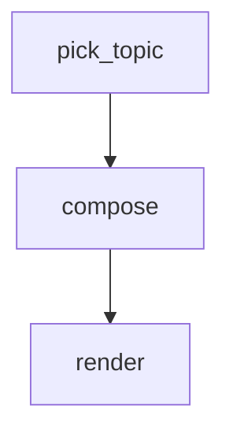

# Config Block

A small end-to-end workflow that demonstrates the **top-level `config` block**:
inline workflow defaults that make a `.md` file self-contained without a
sibling `.workflow.json`.

Given a random topic, the workflow asks claude to write a haiku about it and
prints the result. All three steps actually run; data flows `topic → haiku →
render`.

The block sits between the H1 and the `# Flow` heading. Recognized keys:

| Key                    | Type       | Maps to                            | Default  |
| ---------------------- | ---------- | ---------------------------------- | -------- |
| `agent`                | string     | `MarkflowConfig.agent`             | `claude` |
| `flags`                | list       | `MarkflowConfig.agentFlags`        | `[]`     |
| `parallel`             | bool       | `MarkflowConfig.parallel`          | `true`   |
| `max_retries_default`  | number     | `MarkflowConfig.maxRetriesDefault` | _unset_  |

Precedence (lowest → highest): built-in defaults < this block <
`.workflow.json` sidecar < programmatic `options.config` passed to
`executeWorkflow`. If both this block and a `.workflow.json` are present,
the engine prints a warning at start — the JSON wins.

**Non-interactive invocation is engine-owned.** `flags` is for *extra* args
only — never include the CLI's non-interactive switch. markflow auto-prepends
it based on the agent basename (`-p` for `claude` and `gemini`, `exec -` for
`codex`). Duplicates are deduped with a warning.

For the `compose` step below (an agent step inheriting the workflow-level
defaults), the engine actually spawns `claude -p --model haiku` — `-p`
auto-injected, `--model haiku` from the `flags` list.

Requires `jq` on `PATH`.

```config
agent: claude
flags:
  - --model
  - haiku
```

# Flow



# Steps

## pick_topic

Pick one topic at random from a short list and publish it on the workflow-wide
global context so downstream steps can read it as `{{ GLOBAL.topic }}`.

```bash
TOPICS=("autumn leaves" "morning coffee" "a sleeping cat" "rain on rooftop" "first snow")
TOPIC="${TOPICS[$RANDOM % ${#TOPICS[@]}]}"

echo "Topic: $TOPIC"
echo "GLOBAL: $(jq -nc --arg t "$TOPIC" '{topic:$t}')"
```

## compose

Write a traditional haiku about **{{ GLOBAL.topic }}**. Three lines,
5-7-5 syllable structure, no title, no commentary.

Emit the haiku on a LOCAL sentinel line so the next step can pick it up. Use
`\n` inside the JSON string to preserve line breaks — the line must be of the
form `LOCAL: {"haiku": "line1\nline2\nline3"}`.

## render

Format the haiku from the previous step with a small header showing the topic
it was written about.

```bash
TOPIC=$(jq -r '.topic' <<< "$GLOBAL")
HAIKU=$(jq -r '.compose.local.haiku // "(no haiku emitted)"' <<< "$STEPS")

echo
echo "— $TOPIC —"
echo "$HAIKU"
echo
```
