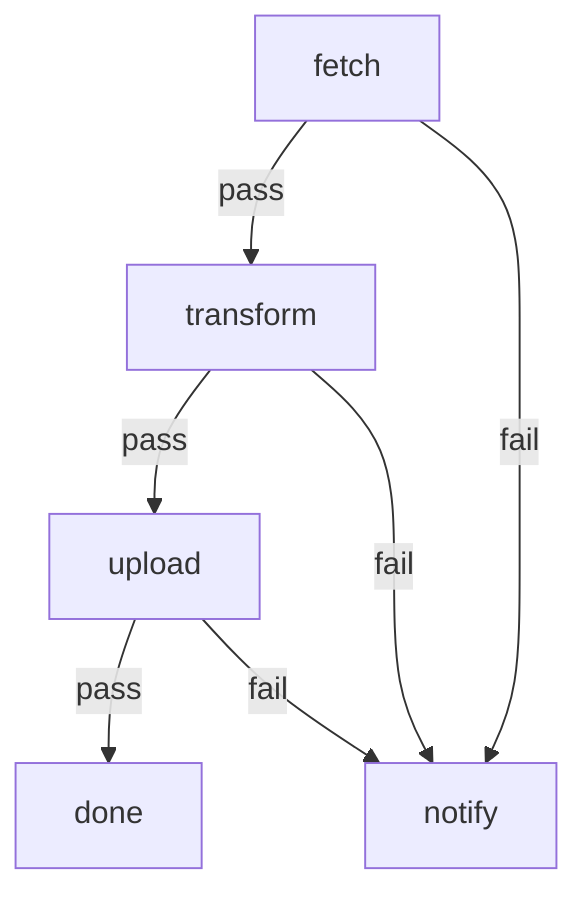

# Daily Sales Sync

Fetch the daily sales feed from the upstream API, transform the JSON with a
Python script, and publish the result to S3. Network fetches are wrapped in an
in-place retry with exponential backoff. If the fetch is still failing after the
retry budget is exhausted (or any other step fails), an operator is notified by
`mail`.

Requires `curl`, `python3`, `aws` and `mail` on `PATH`, plus AWS credentials in
the environment. Configure the bucket/key/recipient via the `Inputs` below.

# Inputs

- `sales_url` (string, default `https://api.example.com/sales.json`) — upstream API.
- `s3_target` (string, default `s3://example-sales/daily/sales.json`) — destination object URI.
- `ops_email` (string, default `ops@example.com`) — recipient for failure alerts.

# Flow



# Steps

## fetch

Download the sales JSON. Retries in place up to 5 times with exponential
backoff; only a final failure routes to `notify`.

```config
timeout: 2m
retry:
  max: 5
  delay: 2s
  backoff: exponential
  jitter: 0.3
```

```bash
set -euo pipefail

URL="${sales_url:-https://api.example.com/sales.json}"
OUT="${MARKFLOW_RUN_DIR:-.}/sales.raw.json"

echo "Fetching $URL"
# -f: fail on HTTP >=400, -sS: silent but show errors, -L: follow redirects.
curl -fsSL --max-time 60 "$URL" -o "$OUT"

BYTES=$(wc -c < "$OUT" | tr -d ' ')
echo "Wrote $BYTES bytes to $OUT"

# Publish the local path so downstream steps can read it.
printf 'GLOBAL: {"raw_path": "%s", "bytes": %s}\n' "$OUT" "$BYTES"
printf 'RESULT: {"edge": "pass", "summary": "fetched %s bytes"}\n' "$BYTES"
```

## transform

Run the Python transform against the fetched JSON and emit a normalized file
for upload.

```config
timeout: 2m
```

```python
import json, os, sys, pathlib

raw_path = json.loads(os.environ["GLOBAL"])["raw_path"]
run_dir = os.environ.get("MARKFLOW_RUN_DIR", ".")
out_path = pathlib.Path(run_dir) / "sales.transformed.json"

with open(raw_path, "r", encoding="utf-8") as f:
    data = json.load(f)

# Minimal illustrative transform: wrap records with a stable envelope.
# Replace with the real business logic as needed.
records = data.get("records", data if isinstance(data, list) else [])
transformed = {
    "version": 1,
    "count": len(records),
    "records": records,
}

with open(out_path, "w", encoding="utf-8") as f:
    json.dump(transformed, f, separators=(",", ":"))

print(f"Transformed {len(records)} records -> {out_path}")
print(f'GLOBAL: {{"transformed_path": "{out_path}", "count": {len(records)}}}')
print(f'RESULT: {{"edge": "pass", "summary": "transformed {len(records)} records"}}')
```

## upload

Upload the transformed JSON to S3.

```config
timeout: 2m
retry:
  max: 3
  delay: 5s
  backoff: exponential
  jitter: 0.2
```

```bash
set -euo pipefail

TARGET="${s3_target:-s3://example-sales/daily/sales.json}"
SRC=$(python3 -c 'import json,os;print(json.loads(os.environ["GLOBAL"])["transformed_path"])')

echo "Uploading $SRC -> $TARGET"
aws s3 cp "$SRC" "$TARGET"

printf 'RESULT: {"edge": "pass", "summary": "uploaded to %s"}\n' "$TARGET"
```

## notify

Any upstream failure (fetch after retries exhausted, transform error, or
upload error) funnels here. Send a short alert to the ops mailbox summarising
what happened, then exit non-zero so the run is recorded as failed.

```bash
set -euo pipefail

TO="${ops_email:-ops@example.com}"
SUBJECT="[markflow] daily sales sync failed"

# Build a small digest from STEPS so ops sees which stage broke.
BODY=$(python3 - <<'PY'
import json, os
steps = json.loads(os.environ.get("STEPS", "{}"))
lines = ["Daily sales sync failed.", ""]
for name in ("fetch", "transform", "upload"):
    s = steps.get(name)
    if not s:
        lines.append(f"- {name}: not run")
        continue
    lines.append(f"- {name}: edge={s.get('edge')!r} summary={s.get('summary')!r}")
print("\n".join(lines))
PY
)

printf '%s\n' "$BODY" | mail -s "$SUBJECT" "$TO"
echo "Notified $TO"

# Exit non-zero so the overall run is marked failed.
exit 1
```

## done

Terminal success marker. Prints a one-line summary for the run log.

```bash
set -euo pipefail
COUNT=$(python3 -c 'import json,os;print(json.loads(os.environ["GLOBAL"]).get("count","?"))')
echo "Daily sales sync complete: $COUNT records uploaded."
```
