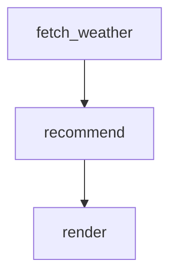

# Dog Walk Weather Advisor

Given a city, fetch its current weather from the free Open-Meteo API and have
Claude write a one-sentence recommendation about whether it's a good time to
walk a dog.

Requires `curl` and `jq` on `PATH`. No API key needed (Open-Meteo is free and
keyless).

```config
agent: claude
flags:
  - --model
  - haiku
```

# Inputs

- `city` (required): Name of the city to fetch weather for (e.g., `Paris`, `New York`)

# Flow



# Steps

## fetch_weather

Geocode the `city` input via Open-Meteo's geocoding API, then fetch its current
weather. Publishes the weather summary on `GLOBAL` so downstream steps can
read it.

```bash
set -euo pipefail

if [ -z "${city:-}" ]; then
  echo "ERROR: 'city' input is required" >&2
  exit 1
fi

echo "Looking up coordinates for: $city"

GEO=$(curl -fsSL --get \
  --data-urlencode "name=$city" \
  --data-urlencode "count=1" \
  --data-urlencode "language=en" \
  --data-urlencode "format=json" \
  "https://geocoding-api.open-meteo.com/v1/search")

COUNT=$(jq '.results | length // 0' <<< "$GEO")
if [ "$COUNT" -eq 0 ]; then
  echo "ERROR: could not geocode city '$city'" >&2
  exit 1
fi

LAT=$(jq -r '.results[0].latitude'  <<< "$GEO")
LON=$(jq -r '.results[0].longitude' <<< "$GEO")
RESOLVED=$(jq -r '.results[0].name' <<< "$GEO")
COUNTRY=$(jq -r '.results[0].country // ""' <<< "$GEO")

echo "Resolved '$city' to $RESOLVED, $COUNTRY ($LAT, $LON)"

WX=$(curl -fsSL --get \
  --data-urlencode "latitude=$LAT" \
  --data-urlencode "longitude=$LON" \
  --data-urlencode "current=temperature_2m,apparent_temperature,precipitation,wind_speed_10m,weather_code,relative_humidity_2m" \
  --data-urlencode "temperature_unit=celsius" \
  --data-urlencode "wind_speed_unit=kmh" \
  "https://api.open-meteo.com/v1/forecast")

TEMP_C=$(jq -r '.current.temperature_2m'        <<< "$WX")
FEELS_C=$(jq -r '.current.apparent_temperature' <<< "$WX")
PRECIP=$(jq -r '.current.precipitation'         <<< "$WX")
WIND=$(jq -r '.current.wind_speed_10m'          <<< "$WX")
HUMID=$(jq -r '.current.relative_humidity_2m'   <<< "$WX")
CODE=$(jq -r '.current.weather_code'            <<< "$WX")

echo "Weather: ${TEMP_C}C (feels ${FEELS_C}C), precip=${PRECIP}mm, wind=${WIND}km/h, humidity=${HUMID}%, code=${CODE}"

GLOBAL_JSON=$(jq -nc \
  --arg city    "$RESOLVED" \
  --arg country "$COUNTRY" \
  --argjson temp_c   "$TEMP_C" \
  --argjson feels_c  "$FEELS_C" \
  --argjson precip   "$PRECIP" \
  --argjson wind     "$WIND" \
  --argjson humidity "$HUMID" \
  --argjson code     "$CODE" \
  '{weather: {city: $city, country: $country, temp_c: $temp_c, feels_c: $feels_c, precipitation_mm: $precip, wind_kmh: $wind, humidity_pct: $humidity, weather_code: $code}}')

echo "GLOBAL: $GLOBAL_JSON"
```

## recommend

You are advising a dog owner. Based on the current weather below for
**{{ GLOBAL.weather.city }}, {{ GLOBAL.weather.country }}**,
write exactly **one sentence** recommending whether it is a good time to
walk a dog. Consider temperature, precipitation, and wind. Be concise and
direct — no preamble, no hedging, no extra lines.

Current weather:

- Temperature: {{ GLOBAL.weather.temp_c }}°C (feels like {{ GLOBAL.weather.feels_c }}°C)
- Precipitation: {{ GLOBAL.weather.precipitation_mm }} mm
- Wind: {{ GLOBAL.weather.wind_kmh }} km/h
- Humidity: {{ GLOBAL.weather.humidity_pct }}%

Emit your recommendation on a LOCAL sentinel so the next step can render it,
of the form `LOCAL: {"recommendation": "<your one sentence>"}`.

## render

Print the recommendation with a short header naming the city and the weather
that informed it.

```bash
set -euo pipefail

CITY=$(jq -r '.weather.city'              <<< "$GLOBAL")
TEMP=$(jq -r '.weather.temp_c'            <<< "$GLOBAL")
PRECIP=$(jq -r '.weather.precipitation_mm' <<< "$GLOBAL")
WIND=$(jq -r '.weather.wind_kmh'          <<< "$GLOBAL")
REC=$(jq -r '.recommend.local.recommendation // "(no recommendation produced)"' <<< "$STEPS")

printf '\n— Dog Walk Advisor: %s —\n' "$CITY"
printf 'Weather: %s°C, %s mm precip, %s km/h wind\n\n' "$TEMP" "$PRECIP" "$WIND"
printf '%s\n\n' "$REC"
```
