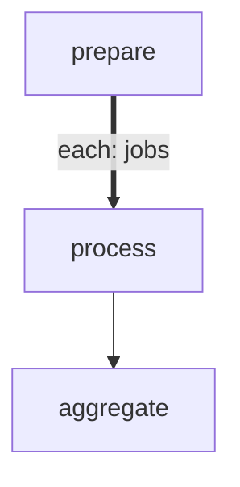

# Rate-Limited API Calls

Processes a batch of items with a concurrency limit to simulate
rate-limited work. Uses `maxConcurrency: 3` so at most 3 items
execute at any time — useful for APIs that enforce per-second quotas.

With `maxConcurrency: 1` this becomes a sequential loop. Without it,
all items would run in parallel.

# Flow



# Steps

## prepare

Emit an array of work items for the forEach to iterate over.

```config
foreach:
  maxConcurrency: 3
  onItemError: continue
```

```bash
set -euo pipefail

echo 'LOCAL: {"jobs": [
  {"id": 1, "name": "alpha",   "duration": 0.4},
  {"id": 2, "name": "bravo",   "duration": 0.2},
  {"id": 3, "name": "charlie", "duration": 0.6},
  {"id": 4, "name": "delta",   "duration": 0.3},
  {"id": 5, "name": "echo",    "duration": 0.5},
  {"id": 6, "name": "foxtrot", "duration": 0.2},
  {"id": 7, "name": "golf",    "duration": 0.4},
  {"id": 8, "name": "hotel",   "duration": 0.1}
]}'
echo 'RESULT: {"edge": "next", "summary": "prepared 8 jobs"}'
```

## process

Simulate rate-limited work by sleeping for the item's duration.
At most 3 of these run concurrently thanks to `maxConcurrency: 3`.

```bash
set -euo pipefail

name=$(echo "$ITEM" | jq -r '.name')
duration=$(echo "$ITEM" | jq -r '.duration')
id=$(echo "$ITEM" | jq -r '.id')

echo "[$id] Processing $name (${duration}s)..."
sleep "$duration"

# Simulate an occasional failure (item 5 fails)
if [ "$id" = "5" ]; then
  echo "[$id] $name failed!"
  echo "RESULT: {\"edge\": \"fail\", \"summary\": \"$name failed\"}"
  exit 1
fi

echo "[$id] $name done"
echo "LOCAL: {\"id\": $id, \"name\": \"$name\", \"took\": $duration}"
echo "RESULT: {\"edge\": \"next\", \"summary\": \"$name processed in ${duration}s\"}"
```

## aggregate

Collect results from all items. Because `onItemError: continue` is set,
this step runs even when some items fail.

```bash
set -euo pipefail

results=$(echo "$GLOBAL" | jq -c '.results')
total=$(echo "$results" | jq 'length')
succeeded=$(echo "$results" | jq '[.[] | select(.ok == true)] | length')
failed=$((total - succeeded))

echo "Processed $succeeded/$total jobs ($failed failed)"
echo "RESULT: {\"edge\": \"next\", \"summary\": \"$succeeded/$total jobs completed\"}"
```
