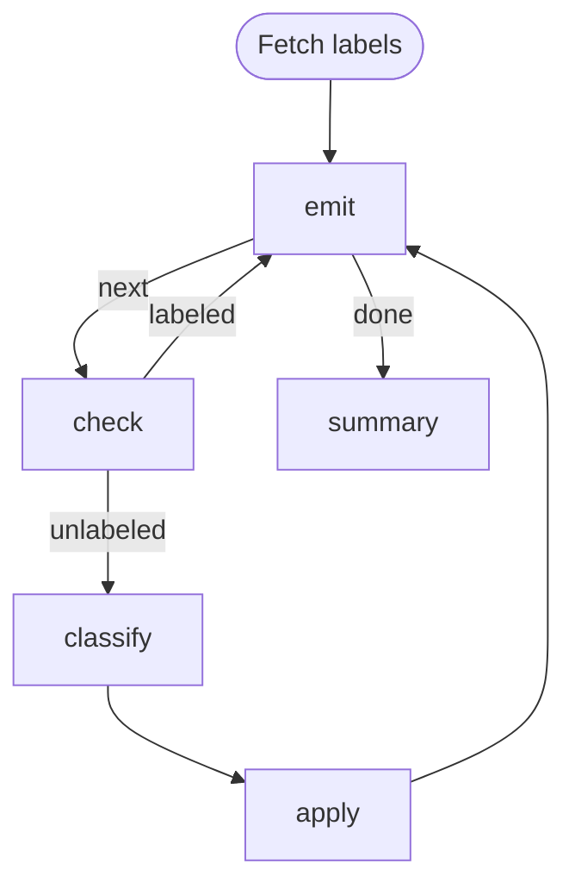

# Issue Triage Loop (JavaScript)

JavaScript port of [`loop.md`](./loop.md). Same emitter pattern: a single step
owns a cached list, keeps its cursor in `LOCAL`, and publishes the current item
into `GLOBAL` so downstream steps read it as `{{ GLOBAL.item.* }}`.

Each script runs via `node` and uses only the Node.js standard library —
`child_process` to invoke `gh`, `fs` for the cached issue list, and `JSON`
for parsing/serializing the `LOCAL` / `GLOBAL` / `STEPS` env-var payloads.

Requires `gh` (authenticated) on `PATH`.

# Flow



# Steps

## labels

Fetch the repo's label catalogue once and publish the raw array on the
workflow-wide global context. The classifier prompt iterates over it inline
via Liquid, so producer and consumer stay decoupled.

```js
const { execFileSync } = require("node:child_process");

const raw = execFileSync("gh", ["label", "list", "--json", "name,description"], {
  encoding: "utf-8",
});
const labels = JSON.parse(raw);
console.log(`GLOBAL: ${JSON.stringify({ labels })}`);
```

## emit

Fetch the issue list once into the step's cwd (the run workdir), hold the
cursor in the step's own `LOCAL`, publish the current item to `GLOBAL` so
downstream steps can read it as `{{ GLOBAL.item.* }}`. On re-entry via the
back-edge, `$LOCAL` (injected by the engine as a JSON string) carries the
prior cursor.

```js
const { execFileSync } = require("node:child_process");
const { existsSync, readFileSync, writeFileSync } = require("node:fs");

if (!existsSync("issues.json")) {
  const out = execFileSync(
    "gh",
    [
      "issue", "list",
      "--state", "open",
      "--search", "no:label",
      "--json", "number,title,body,labels",
      "--limit", "50",
    ],
    { encoding: "utf-8" },
  );
  writeFileSync("issues.json", out);
}

const issues = JSON.parse(readFileSync("issues.json", "utf-8"));
const local = JSON.parse(process.env.LOCAL || "{}");
const cursor = typeof local.cursor === "number" ? local.cursor : -1;
const next = cursor + 1;
const total = issues.length;

if (next >= total) {
  console.log(`LOCAL: ${JSON.stringify({ total })}`);
  console.log(`RESULT: ${JSON.stringify({ edge: "done" })}`);
  process.exit(0);
}

const item = issues[next];
console.log(`[${next + 1}/${total}] #${item.number} — ${item.title}`);
console.log(`LOCAL: ${JSON.stringify({ cursor: next })}`);
console.log(`GLOBAL: ${JSON.stringify({ item })}`);
```

## check

Skip issues that already carry a label; route fresh ones to the classifier.
Reads the current item from `$GLOBAL`.

```js
const global = JSON.parse(process.env.GLOBAL || "{}");
const item = global.item ?? {};
const labels = Array.isArray(item.labels) ? item.labels : [];

if (labels.length > 0) {
  console.log("Already labeled — skipping.");
  console.log(`RESULT: ${JSON.stringify({ edge: "labeled" })}`);
} else {
  console.log(`RESULT: ${JSON.stringify({ edge: "unlabeled" })}`);
}
```

## classify

```config
agent: claude
flags:
  - --model
  - haiku
```

Classify this GitHub issue into exactly one label from the list below.

**Title:** {{ GLOBAL.item.title }}

**Body:**
{{ GLOBAL.item.body | default: "(no body)" }}

Pick exactly one from:

{{ GLOBAL.labels | list: "name,description" }}

Emit `LOCAL: {"label": "<choice>"}` so the next step can pick it up.

## apply

Apply the classifier's label back to the issue. The issue number comes from
`$GLOBAL` (published by `emit`); the label comes from `classify`'s own local
state via the cross-step `$STEPS` map.

```js
const { execFileSync } = require("node:child_process");

const global = JSON.parse(process.env.GLOBAL || "{}");
const steps = JSON.parse(process.env.STEPS || "{}");
const number = global.item?.number;
const label = steps.classify?.local?.label;

if (!number || !label) {
  console.error(`Missing data — number=${number} label=${label}`);
  process.exit(1);
}

execFileSync("gh", ["issue", "edit", String(number), "--add-label", label], {
  stdio: "inherit",
});
console.log(`Labeled #${number} as ${label}.`);
```

## summary

```js
const steps = JSON.parse(process.env.STEPS || "{}");
const total = steps.emit?.local?.total ?? "?";
console.log(`Triage complete: ${total} issue(s) seen.`);
```
