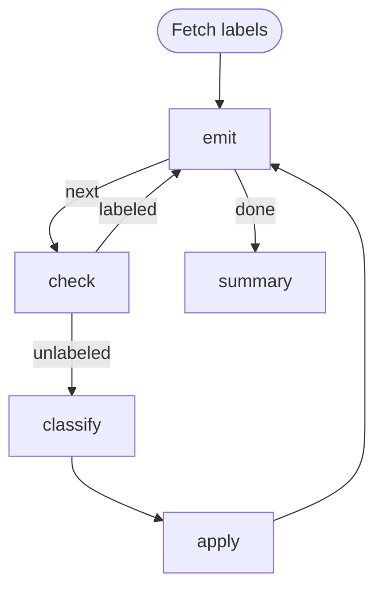

# Issue Triage Loop (Python)

Python port of [`loop.md`](./loop.md). Same emitter pattern: a single step
owns a cached list, keeps its cursor in `LOCAL`, and publishes the current
item into `GLOBAL` so downstream steps read it as `{{ GLOBAL.item.* }}`.

Each script runs via `python` and uses only the Python standard library —
`subprocess` to invoke `gh`, `pathlib`/`json` for the cached issue list,
`os`/`json` for parsing the `LOCAL` / `GLOBAL` / `STEPS` env-var payloads.

Requires `gh` (authenticated) and `python3` on `PATH`.

# Flow



# Steps

## labels

Fetch the repo's label catalogue once and publish the raw array on the
workflow-wide global context. The classifier prompt iterates over it inline
via Liquid, so producer and consumer stay decoupled.

```python
import json
import subprocess

raw = subprocess.check_output(
    ["gh", "label", "list", "--json", "name,description"],
    text=True,
)
labels = json.loads(raw)
print(f"GLOBAL: {json.dumps({'labels': labels})}")
```

## emit

Fetch the issue list once into the step's cwd (the run workdir), hold the
cursor in the step's own `LOCAL`, publish the current item to `GLOBAL` so
downstream steps can read it as `{{ GLOBAL.item.* }}`. On re-entry via the
back-edge, `$LOCAL` (injected by the engine as a JSON string) carries the
prior cursor.

```python
import json
import os
import subprocess
import sys
from pathlib import Path

cache = Path("issues.json")
if not cache.exists():
    out = subprocess.check_output(
        [
            "gh", "issue", "list",
            "--state", "open",
            "--search", "no:label",
            "--json", "number,title,body,labels",
            "--limit", "50",
        ],
        text=True,
    )
    cache.write_text(out)

issues = json.loads(cache.read_text())
local = json.loads(os.environ.get("LOCAL") or "{}")
cursor = local["cursor"] if isinstance(local.get("cursor"), int) else -1
nxt = cursor + 1
total = len(issues)

if nxt >= total:
    print(f"LOCAL: {json.dumps({'total': total})}")
    print(f"RESULT: {json.dumps({'edge': 'done'})}")
    sys.exit(0)

item = issues[nxt]
print(f"[{nxt + 1}/{total}] #{item['number']} — {item['title']}")
print(f"LOCAL: {json.dumps({'cursor': nxt})}")
print(f"GLOBAL: {json.dumps({'item': item})}")
```

## check

Skip issues that already carry a label; route fresh ones to the classifier.
Reads the current item from `$GLOBAL`.

```python
import json
import os

global_ctx = json.loads(os.environ.get("GLOBAL") or "{}")
item = global_ctx.get("item") or {}
labels = item.get("labels") or []

if len(labels) > 0:
    print("Already labeled — skipping.")
    print(f"RESULT: {json.dumps({'edge': 'labeled'})}")
else:
    print(f"RESULT: {json.dumps({'edge': 'unlabeled'})}")
```

## classify

```config
agent: claude
flags:
  - --model
  - haiku
```

Classify this GitHub issue into exactly one label from the list below.

**Title:** {{ GLOBAL.item.title }}

**Body:**
{{ GLOBAL.item.body | default: "(no body)" }}

Pick exactly one from:

{{ GLOBAL.labels | list: "name,description" }}

Emit `LOCAL: {"label": "<choice>"}` so the next step can pick it up.

## apply

Apply the classifier's label back to the issue. The issue number comes from
`$GLOBAL` (published by `emit`); the label comes from `classify`'s own local
state via the cross-step `$STEPS` map.

```python
import json
import os
import subprocess
import sys

global_ctx = json.loads(os.environ.get("GLOBAL") or "{}")
steps = json.loads(os.environ.get("STEPS") or "{}")
number = (global_ctx.get("item") or {}).get("number")
label = (steps.get("classify") or {}).get("local", {}).get("label")

if not number or not label:
    print(f"Missing data — number={number} label={label}", file=sys.stderr)
    sys.exit(1)

subprocess.run(
    ["gh", "issue", "edit", str(number), "--add-label", label],
    check=True,
)
print(f"Labeled #{number} as {label}.")
```

## summary

```python
import json
import os

steps = json.loads(os.environ.get("STEPS") or "{}")
total = (steps.get("emit") or {}).get("local", {}).get("total", "?")
print(f"Triage complete: {total} issue(s) seen.")
```
