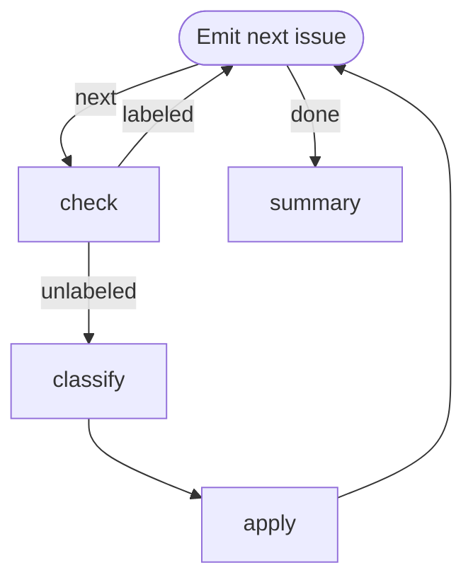

# Issue Triage Loop

Label un-triaged GitHub issues one at a time. Demonstrates the **emitter pattern**:
a single step owns a cached list and emits the next item as its state on each
re-entry, so downstream agents never see the full collection.

Requires `gh` (authenticated), `jq`, and `jo` on `PATH`.

# Flow



# Steps

## emit

Fetch the issue list once into the step's cwd (the run workdir), hold the
cursor in the step's own state, emit the current item. On re-entry via the
back-edge, `$STATE` (injected by the engine as a JSON string) carries the
prior state — `jq` pulls out the cursor.

```bash
if [ ! -f issues.json ]; then
  gh issue list --state open --json number,title,body,labels --limit 50 > issues.json
fi

CURSOR=$(jq -r '.cursor // -1' <<< "$STATE")
NEXT=$((CURSOR + 1))
TOTAL=$(jq length issues.json)

if [ "$NEXT" -ge "$TOTAL" ]; then
  echo "STATE: $(jo total=$TOTAL)"
  echo "RESULT: $(jo edge=done)"
  exit 0
fi

ITEM=$(jq -c ".[$NEXT]" issues.json)

echo "[$((NEXT + 1))/$TOTAL] #$(jq -r ".[$NEXT].number" issues.json) — $(jq -r ".[$NEXT].title" issues.json)"
echo "STATE: $(jo cursor=$NEXT item:=@<(echo "$ITEM"))"
echo "RESULT: $(jo edge=next)"
```

## check

Skip issues that already carry a label; route fresh ones to the classifier.
Reads `emit`'s current item from the cross-step map.

```bash
ITEM=$(jq -c '.emit.state.item' <<< "$STEPS")

if [ "$(jq '.labels | length' <<< "$ITEM")" -gt 0 ]; then
  echo "Already labeled — skipping."
  echo "RESULT: $(jo edge=labeled)"
else
  echo "RESULT: $(jo edge=unlabeled)"
fi
```

## classify

```config
agent: claude
flags:
  - --model
  - haiku
  - -p
```

Read the issue from `emit`'s state (available under `steps.emit.state.item`
in the context you were given). Pick exactly one label:

- `Bug` — something is broken or behaves incorrectly
- `Improvement` — feature request or UX enhancement
- `Maintenance` — refactor, dependency bump, chore, docs
- `Other` — anything that doesn't fit

Emit one STATE line carrying the chosen label, then the terminal RESULT:

```
STATE: {"label": "<choice>"}
RESULT: {"edge": "done", "summary": "<why>"}
```

## apply

Apply the classifier's label back to the issue via `gh`. Both pieces come
from the cross-step map.

```bash
echo $STEPS | jq
NUMBER=$(jq -r '.emit.state.item.number' <<< "$STEPS")
LABEL=$(jq -r '.classify.state.label' <<< "$STEPS")

gh issue edit "$NUMBER" --add-label "$LABEL"
echo "Labeled #$NUMBER as $LABEL."
```

## summary

```bash
echo "Triage complete: $(jq -r '.emit.state.total // "?"' <<< "$STEPS") issue(s) seen."
```
