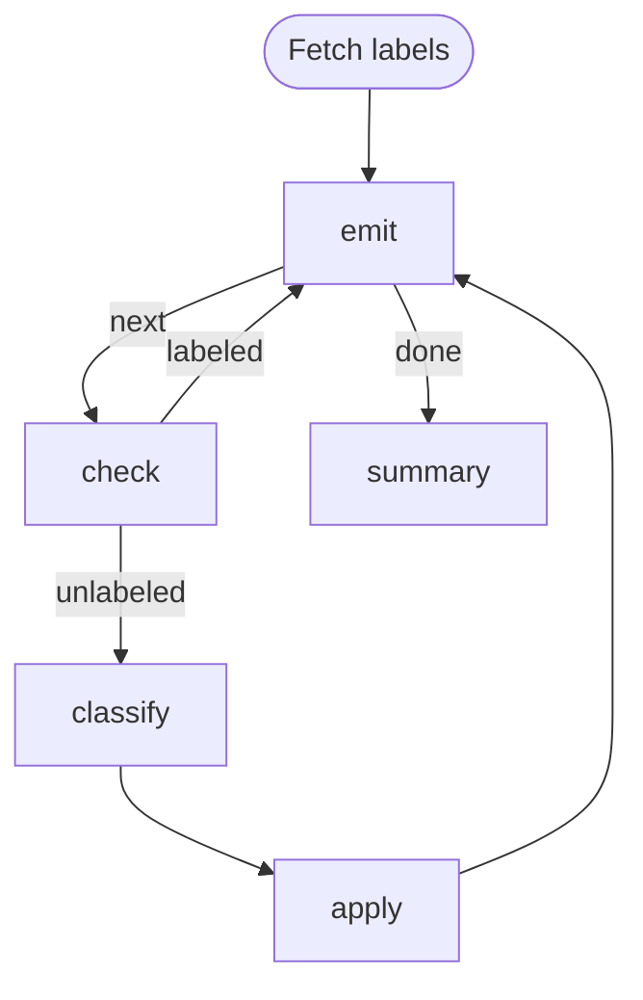

# Issue Triage Loop

Label un-triaged GitHub issues one at a time. Demonstrates the **emitter pattern**:
a single step owns a cached list, keeps its cursor in `STATE` (its own
self-reentry memory), and publishes the current item into `GLOBAL` so
downstream steps read it as `${GLOBAL.item.*}` without knowing about the
collection.

Requires `gh` (authenticated), `jq`, and `jo` on `PATH`.

# Flow



# Steps

## labels

Fetch the repo's label catalogue once and stash a markdown-formatted list on
the workflow-wide global context so the classifier prompt can splice it in
via `${GLOBAL.labels_markdown}`.

```bash
LABELS=$(gh label list --json name,description)
MD=$(jq -r '.[] | "- `\(.name)` — \(if .description == "" then "(no description)" else .description end)"' <<< "$LABELS")
echo "GLOBAL: $(jo labels_markdown="$MD")"
echo "RESULT: $(jo edge=pass)"
```

## emit

Fetch the issue list once into the step's cwd (the run workdir), hold the
cursor in the step's own `STATE`, publish the current item to `GLOBAL` so
downstream steps can read it as `${GLOBAL.item.*}`. On re-entry via the
back-edge, `$STATE` (injected by the engine as a JSON string) carries the
prior cursor.

```bash
if [ ! -f issues.json ]; then
  gh issue list --state open --search "no:label" --json number,title,body,labels --limit 50 > issues.json
fi

CURSOR=$(jq -r '.cursor // -1' <<< "$STATE")
NEXT=$((CURSOR + 1))
TOTAL=$(jq length issues.json)

if [ "$NEXT" -ge "$TOTAL" ]; then
  echo "STATE: $(jo total=$TOTAL)"
  echo "RESULT: $(jo edge=done)"
  exit 0
fi

ITEM=$(jq -c ".[$NEXT]" issues.json)

echo "[$((NEXT + 1))/$TOTAL] #$(jq -r ".[$NEXT].number" issues.json) — $(jq -r ".[$NEXT].title" issues.json)"
echo "STATE: $(jo cursor=$NEXT)"
echo "GLOBAL: $(jo item="$ITEM")"
echo "RESULT: $(jo edge=next)"
```

## check

Skip issues that already carry a label; route fresh ones to the classifier.
Reads the current item from `$GLOBAL`.

```bash
ITEM=$(jq -c '.item' <<< "$GLOBAL")

if [ "$(jq '.labels | length' <<< "$ITEM")" -gt 0 ]; then
  echo "Already labeled — skipping."
  echo "RESULT: $(jo edge=labeled)"
else
  echo "RESULT: $(jo edge=unlabeled)"
fi
```

## classify

```config
agent: claude
flags:
  - --model
  - haiku
  - -p
```

Classify this GitHub issue into exactly one label.

**Title:** ${GLOBAL.item.title}

**Body:**
${GLOBAL.item.body}

Pick exactly one from:

${GLOBAL.labels_markdown}

Emit one STATE line carrying the chosen label, then the terminal RESULT:

```
STATE: {"label": "<choice>"}
RESULT: {"edge": "done", "summary": "<why>"}
```

## apply

Apply the classifier's label back to the issue. The issue number comes from
`$GLOBAL` (published by `emit`); the label comes from `classify`'s own state
via the cross-step `$STEPS` map.

```bash
NUMBER=$(jq -r '.item.number' <<< "$GLOBAL")
LABEL=$(jq -r '.classify.state.label' <<< "$STEPS")

gh issue edit "$NUMBER" --add-label "$LABEL"
echo "Labeled #$NUMBER as $LABEL."
```

## summary

```bash
echo "Triage complete: $(jq -r '.emit.state.total // "?"' <<< "$STEPS") issue(s) seen."
```
