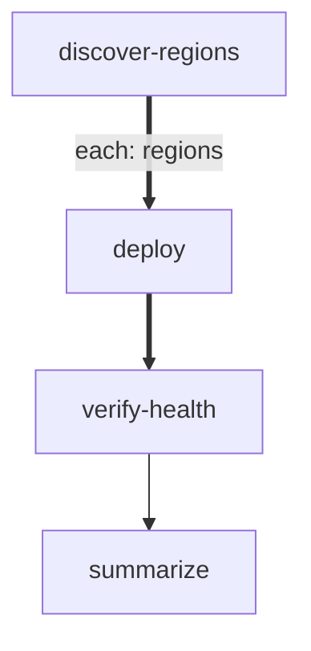

# Multi-Region Deploy

Deploys a Docker image to multiple cloud regions in parallel, waits for
all deployments to stabilize, then runs a global health check. Uses
forEach to fan out across regions defined by the discovery step.

Requires `docker`, `curl`, and `jq` on `PATH`.

# Inputs

- `IMAGE` (required): Docker image to deploy (e.g. `ghcr.io/acme/api:v2.4.1`)
- `CLUSTER_API` (default: `https://deploy.internal`): Deployment API base URL
- `API_TOKEN` (required): Bearer token for the deployment API

# Flow



# Steps

## discover-regions

Query the deployment API for active regions and emit them as the forEach
items array. Each item is an object with `name` and `endpoint`.

```bash
set -euo pipefail

response=$(curl -sf \
  -H "Authorization: Bearer $API_TOKEN" \
  "$CLUSTER_API/v1/regions")

regions=$(echo "$response" | jq -c '[.[] | {name: .name, endpoint: .endpoint}]')
count=$(echo "$regions" | jq 'length')

echo "LOCAL: {\"regions\": $regions}"
echo "RESULT: {\"edge\": \"next\", \"summary\": \"discovered $count regions\"}"
```

## deploy

Roll out the image to a single region. The region details are available
via `$ITEM` (a JSON object with `name` and `endpoint`).

```bash
set -euo pipefail

region_name=$(echo "$ITEM" | jq -r '.name')
endpoint=$(echo "$ITEM" | jq -r '.endpoint')

echo "Deploying $IMAGE to $region_name..."

response=$(curl -sf -X POST \
  -H "Authorization: Bearer $API_TOKEN" \
  -H "Content-Type: application/json" \
  -d "{\"image\": \"$IMAGE\"}" \
  "$endpoint/v1/deploy")

deploy_id=$(echo "$response" | jq -r '.id')

echo "LOCAL: {\"deploy_id\": \"$deploy_id\", \"region\": \"$region_name\"}"
echo "RESULT: {\"edge\": \"next\", \"summary\": \"deployed to $region_name ($deploy_id)\"}"
```

## verify-health

Wait for the deployment to stabilize in this region, then check the
health endpoint.

```bash
set -euo pipefail

endpoint=$(echo "$ITEM" | jq -r '.endpoint')
region_name=$(echo "$ITEM" | jq -r '.name')

for i in $(seq 1 10); do
  status=$(curl -sf "$endpoint/healthz" | jq -r '.status' 2>/dev/null || echo "unavailable")
  if [ "$status" = "healthy" ]; then
    echo "LOCAL: {\"healthy\": true}"
    echo "RESULT: {\"edge\": \"next\", \"summary\": \"$region_name healthy\"}"
    exit 0
  fi
  sleep 3
done

echo "RESULT: {\"edge\": \"fail\", \"summary\": \"$region_name unhealthy after 30s\"}"
exit 1
```

## summarize

Collect results from all regions and report the overall deployment status.
`$GLOBAL` contains `results` — an array with one entry per region.

```bash
set -euo pipefail

results=$(echo "$GLOBAL" | jq -c '.results')
total=$(echo "$results" | jq 'length')
healthy=$(echo "$results" | jq '[.[] | select(.summary | contains("healthy"))] | length')

echo "Deployment complete: $healthy/$total regions healthy"
echo "RESULT: {\"edge\": \"next\", \"summary\": \"$healthy/$total regions healthy\"}"
```
