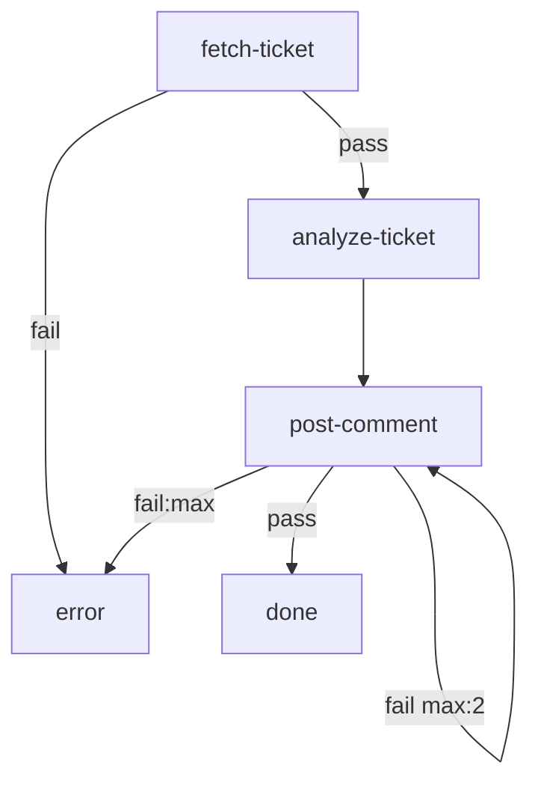

# Plane Ticket Analysis

Fetches a ticket from a Plane project management instance, runs a format
analysis against it using Claude Haiku, and posts the findings back as a
comment on the ticket.

**Format rule checked:** Every ticket description must include a `## Problem`
section and either a `## Steps to Reproduce` section (bugs) or an
`## Acceptance Criteria` section (features/improvements).

Requires `curl`, `jq`, and `jo` on `PATH`.

# Inputs

- `PLANE_URL` (default: `https://api.plane.so`): Base URL of your Plane instance's API
- `PLANE_API_KEY` (required): Plane API key (from workspace settings → API tokens)
- `WORKSPACE_SLUG` (required): Workspace slug (visible in your Plane URL)
- `PROJECT_ID` (required): UUID of the project containing the ticket
- `ISSUE_ID` (required): UUID of the issue to analyze (not the display ID like TEST-4 — find it in the Plane URL or via the API)

# Flow



# Steps

## fetch-ticket

Fetch the issue from the Plane API and save it to `ticket.json` in the
working directory so subsequent steps can read it.

```bash
set -euo pipefail

ISSUE_URL="${PLANE_URL}/api/v1/workspaces/${WORKSPACE_SLUG}/projects/${PROJECT_ID}/work-items/${ISSUE_ID}/"

echo "Fetching ticket from Plane API: ${ISSUE_URL}"

HTTP_CODE=$(curl -s \
  -o ticket.json \
  -w "%{http_code}" \
  -H "X-API-Key: ${PLANE_API_KEY}" \
  -H "Accept: application/json" \
  "${ISSUE_URL}")

if [ "${HTTP_CODE}" != "200" ]; then
  BODY=$(cat ticket.json 2>/dev/null || echo "(no response body)")
  echo "RESULT: $(jo summary="Plane API returned HTTP ${HTTP_CODE}: ${BODY}")"
  exit 1
fi

TITLE=$(jq -r '.name // "(no title)"' ticket.json)
echo "RESULT: $(jo summary="Fetched: ${TITLE}")"
```

## analyze-ticket

```config
agent: claude
flags:
  - --model
  - haiku
  - --dangerously-skip-permissions
```

Read the file `ticket.json` in the current working directory. It contains
a Plane issue as JSON. Extract the `name` (title) and `description` fields.

Evaluate the description against this format rule:

> **Format Rule v1**: Every ticket description must include:
> 1. A `## Problem` section — explains what the issue is.
> 2. Either a `## Steps to Reproduce` section (for bugs) **or** an
>    `## Acceptance Criteria` section (for features/improvements).

Write a structured analysis report to `analysis.md` in the current directory
using this exact template:

```
## Ticket Format Analysis

**Ticket:** <title>

**Format check:** PASS ✓  (or FAIL ✗)

**Sections found:**
- `## Problem`: present / missing
- `## Steps to Reproduce`: present / missing
- `## Acceptance Criteria`: present / missing

**Summary:** <one or two sentences describing what the ticket is about>

**Recommendations:** <if FAIL: concrete suggestions for what is missing;
if PASS: "Ticket meets the format requirements.">
```

Once you have written `analysis.md`, emit a one-sentence summary in your
RESULT line: `<PASS or FAIL> — <summary field>`.

## post-comment

Read `analysis.md` from the working directory and post it as a comment on the
Plane issue.

```bash
set -euo pipefail

COMMENT_URL="${PLANE_URL}/api/v1/workspaces/${WORKSPACE_SLUG}/projects/${PROJECT_ID}/work-items/${ISSUE_ID}/comments/"

# Wrap the analysis in a whitespace-preserving div so Plane renders the
# markdown line structure without the monospace look of <pre>. Build the
# JSON payload with jq so ticket/file content is never interpolated
# through the shell.
jq -Rs --arg prefix '<div style="white-space: pre-wrap">' \
       --arg suffix '</div>' \
       '{comment_html: ($prefix + . + $suffix)}' \
       analysis.md > comment-payload.json

HTTP_CODE=$(curl -s \
  -o comment.json \
  -w "%{http_code}" \
  -X POST \
  -H "X-API-Key: ${PLANE_API_KEY}" \
  -H "Content-Type: application/json" \
  --data-binary @comment-payload.json \
  "${COMMENT_URL}")

if [ "${HTTP_CODE}" != "201" ]; then
  echo "Failed to post comment: HTTP ${HTTP_CODE}" >&2
  cat comment.json >&2 || true
  exit 1
fi

echo "Comment posted successfully"
```

## done

```bash
echo "Analysis complete. Comment posted to issue ${ISSUE_ID}."
```

## error

```bash
echo "Workflow failed. Check the run log for details." >&2
exit 1
```
