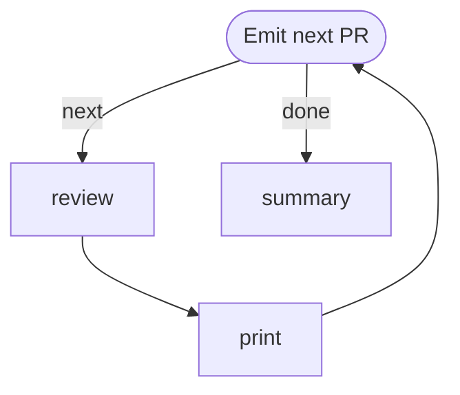

# Review Open PRs

Iterate over all open GitHub pull requests authored by the current user and have
an agent write a one-paragraph review summary for each. Each summary is printed
as soon as it is generated, using the **emitter pattern**: a single `emit` step
owns the cached PR list, keeps its cursor in `LOCAL`, and publishes the current
PR to `GLOBAL` for the downstream agent + printer.

Requires `gh` (authenticated), `jq`, and `jo` on `PATH`.

```config
agent: claude
flags:
  - --model
  - haiku
```

# Flow



# Steps

## emit

Fetch the list of the user's open PRs once into the run workdir, hold the
cursor in `LOCAL`, and publish the current PR to `GLOBAL`. On re-entry via the
back-edge from `print`, `LOCAL` carries the prior cursor.

```bash
if [ ! -f prs.json ]; then
  gh pr list --state open --author "@me" \
    --json number,title,body,url,headRefName,baseRefName,repository \
    --limit 100 > prs.json
fi

CURSOR=$(jq -r '.cursor // -1' <<< "$LOCAL")
NEXT=$((CURSOR + 1))
TOTAL=$(jq length prs.json)

if [ "$NEXT" -ge "$TOTAL" ]; then
  echo "LOCAL: $(jo total=$TOTAL)"
  echo "RESULT: $(jo edge=done)"
  exit 0
fi

ITEM=$(jq -c ".[$NEXT]" prs.json)
echo "[$((NEXT + 1))/$TOTAL] #$(jq -r ".[$NEXT].number" prs.json) — $(jq -r ".[$NEXT].title" prs.json)"
echo "LOCAL: $(jo cursor=$NEXT)"
echo "GLOBAL: $(jo item="$ITEM")"
echo "RESULT: $(jo edge=next)"
```

## review

Write a concise one-paragraph review summary of the pull request below. Focus
on what the PR changes, the apparent intent, risk areas, and anything a
reviewer should scrutinize. Keep it to a single paragraph (4–7 sentences), in
plain prose — no bullet lists, no headings.

**PR:** #{{ GLOBAL.item.number }} — {{ GLOBAL.item.title }}
**URL:** {{ GLOBAL.item.url }}
**Branch:** `{{ GLOBAL.item.headRefName }}` → `{{ GLOBAL.item.baseRefName }}`

**Description:**
{{ GLOBAL.item.body | default: "(no description provided)" }}

Put the paragraph itself in `RESULT.summary` so the next step can print it.

## print

Print the agent's one-paragraph review for this PR to stdout immediately, so
the user sees summaries stream as they are generated (one per loop iteration).

```bash
NUMBER=$(jq -r '.item.number' <<< "$GLOBAL")
TITLE=$(jq -r '.item.title' <<< "$GLOBAL")
URL=$(jq -r '.item.url' <<< "$GLOBAL")
REVIEW=$(jq -r '.review.summary // "(no summary produced)"' <<< "$STEPS")

echo
echo "=== PR #$NUMBER — $TITLE ==="
echo "$URL"
echo
echo "$REVIEW"
echo
```

## summary

```bash
echo "Reviewed $(jq -r '.emit.local.total // "?"' <<< "$STEPS") open PR(s)."
```
