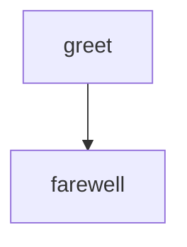

# Hello World

The simplest possible workflow: two steps running in sequence.
Demonstrates the minimal structure every workflow needs — a Mermaid
flowchart defining topology and step definitions with executable code.

# Flow



# Steps

## greet

```bash
echo "Hello from the first step!"
echo 'RESULT: {"edge": "next", "summary": "greeted"}'
```

## farewell

```bash
echo "Goodbye from the second step!"
echo 'RESULT: {"edge": "next", "summary": "done"}'
```
