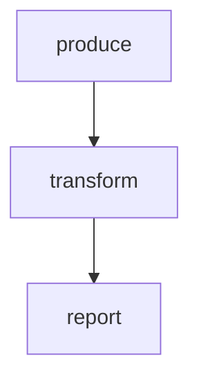

# Data Passing

Demonstrates how steps pass data to each other using the context system:

- **LOCAL** — step-private state, accessible by later steps via `$STEPS.<id>.local.*`
- **GLOBAL** — accumulated workflow-wide state, available as `$GLOBAL` (JSON)
- **STEPS** — read-only access to all prior steps' results via `$STEPS` (JSON)

LOCAL stays scoped to the step that emitted it. To share data with all
downstream steps, emit it with `GLOBAL: {...}` instead.

# Flow



# Steps

## produce

Generates data. Emits shared data via GLOBAL and step-private data via LOCAL.

```bash
set -euo pipefail

timestamp=$(date +%s)
items='["alpha", "bravo", "charlie"]'

echo "GLOBAL:"
jq -n --argjson items "$items" '{items: $items, count: ($items | length)}'

echo "LOCAL:"
jq -n --arg ts "$timestamp" '{generated_at: $ts}'

echo "RESULT: next | produced 3 items"
```

## transform

Reads shared data from GLOBAL, transforms it, and updates GLOBAL.

```bash
set -euo pipefail

count=$(echo "$GLOBAL" | jq '.count')

echo "Transformed $count items (added length prefix)"

echo "GLOBAL:"
echo "$GLOBAL" | jq '{transformed: [.items[] | "[\(. | length)]_\(.)"]}'

echo "RESULT: next | transformed $count items"
```

## report

Uses STEPS context to access specific prior step results (summary, local data).

```bash
set -euo pipefail

produce_summary=$(echo "$STEPS" | jq -r '.produce.summary')
produce_ts=$(echo "$STEPS" | jq '.produce.local.generated_at')
transformed=$(echo "$GLOBAL" | jq -c '.transformed')

echo "Produce said: $produce_summary (at $produce_ts)"
echo "Transformed items: $transformed"
echo "RESULT: next | report complete"
```
