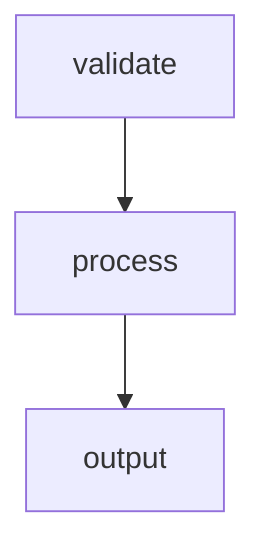

# Workflow Inputs

Demonstrates declared workflow parameters. Inputs are available as
environment variables in every step. Required inputs must be provided
at run time; optional inputs use their default value when omitted.

Run with: `markflow run 03-inputs.md --input NAME=Alice --input GREETING=Howdy`

# Inputs

- `NAME` (required): The name to greet
- `GREETING` (default: `Hello`): The greeting phrase to use
- `REPEAT` (default: `3`): How many times to repeat the greeting

# Flow



# Steps

## validate

```bash
set -euo pipefail

if [ -z "${NAME:-}" ]; then
  echo "ERROR: NAME input is required"
  echo 'RESULT: {"edge": "fail", "summary": "missing NAME"}'
  exit 1
fi

echo "Validated inputs: NAME=$NAME, GREETING=$GREETING, REPEAT=$REPEAT"
echo "RESULT: {\"edge\": \"next\", \"summary\": \"inputs valid\"}"
```

## process

```bash
set -euo pipefail

messages="[]"
for i in $(seq 1 "$REPEAT"); do
  messages=$(echo "$messages" | jq --arg msg "$GREETING, $NAME! (#$i)" '. + [$msg]')
done

echo "LOCAL: {\"messages\": $(echo "$messages" | jq -c .)}"
echo "RESULT: {\"edge\": \"next\", \"summary\": \"generated $REPEAT messages\"}"
```

## output

```bash
set -euo pipefail

echo "$GLOBAL" | jq -r '.messages[]'
count=$(echo "$GLOBAL" | jq '.messages | length')
echo "RESULT: {\"edge\": \"next\", \"summary\": \"printed $count messages\"}"
```
