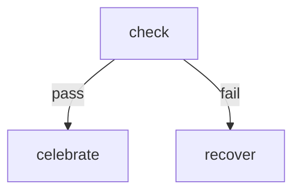

# Conditional Branching

Demonstrates routing tokens along different edges based on step outcomes.
A step can route via exit code (0 = success, non-zero = fail) or by
emitting an explicit `RESULT: {"edge": "label"}` on stdout.

Edges are labeled in the Mermaid diagram with `-->|label|`. The engine
matches the step's result edge to the label to decide where to go next.

# Flow



# Steps

## check

Simulates a health check that passes or fails based on a random coin flip.

```bash
set -euo pipefail

score=$((RANDOM % 100))
echo "Health score: $score/100"

if [ "$score" -ge 40 ]; then
  echo "RESULT: pass | healthy ($score)"
else
  echo "RESULT: fail | unhealthy ($score)"
fi
```

## celebrate

```bash
echo "System is healthy — no action needed."
echo "RESULT: next | all clear"
```

## recover

```bash
echo "System unhealthy — running recovery..."
sleep 0.2
echo "Recovery complete."
echo "RESULT: next | recovered"
```
