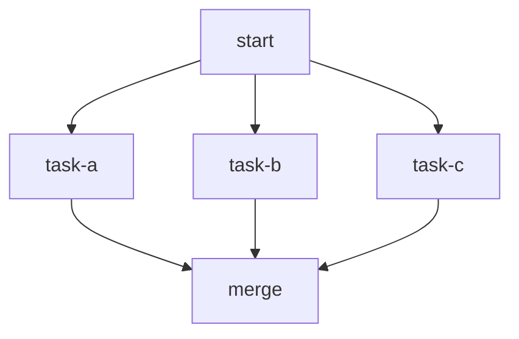

# Parallel Execution

Demonstrates fan-out (parallel) and fan-in (merge) patterns.
Multiple unlabeled edges from a single node spawn parallel tokens.
A node with multiple incoming edges waits for ALL upstream to complete.

# Flow



# Steps

## start

```bash
echo "Launching three parallel tasks..."
echo "RESULT: next | dispatched"
```

## task-a

```bash
echo "[A] Starting (will take 0.3s)..."
sleep 0.3
echo "[A] Complete"
echo 'LOCAL: {"task": "a", "duration": 0.3}'
echo "RESULT: next | task-a done in 0.3s"
```

## task-b

```bash
echo "[B] Starting (will take 0.1s)..."
sleep 0.1
echo "[B] Complete"
echo 'LOCAL: {"task": "b", "duration": 0.1}'
echo "RESULT: next | task-b done in 0.1s"
```

## task-c

```bash
echo "[C] Starting (will take 0.5s)..."
sleep 0.5
echo "[C] Complete"
echo 'LOCAL: {"task": "c", "duration": 0.5}'
echo "RESULT: next | task-c done in 0.5s"
```

## merge

Runs only after all three tasks complete.

```bash
set -euo pipefail

echo "All parallel tasks finished."
echo "  Task A: $(echo "$STEPS" | jq -r '.["task-a"].summary')"
echo "  Task B: $(echo "$STEPS" | jq -r '.["task-b"].summary')"
echo "  Task C: $(echo "$STEPS" | jq -r '.["task-c"].summary')"
echo "RESULT: next | merged"
```
