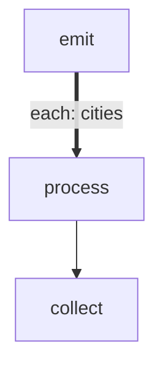

# forEach Basics

Demonstrates batch iteration using the forEach pattern. A source step
emits an array via LOCAL, and the engine spawns one token per item
through the body chain. A collector step runs once all items complete.

Key concepts:
- Thick edges (`==>`) define the forEach body chain
- `|each: key|` specifies which LOCAL array to iterate
- Body steps receive `$ITEM` (JSON value) and `$ITEM_INDEX` (0-based)
- The collector receives `$GLOBAL` with a `results` array

# Flow



# Steps

## emit

```bash
echo 'LOCAL: {"cities": ["Tokyo", "Paris", "New York", "Sydney", "Berlin"]}'
echo 'RESULT: {"edge": "next", "summary": "emitted 5 cities"}'
```

## process

```bash
set -euo pipefail

city=$(echo "$ITEM" | jq -r '.')
index=$ITEM_INDEX
length=${#city}

echo "[$index] Processing: $city ($length chars)"
local_json=$(jq -nc --arg c "$city" --argjson l "$length" '{city: $c, length: $l}')
result_json=$(jq -nc --arg s "$city ($length chars)" '{edge: "next", summary: $s}')
echo "LOCAL: $local_json"
echo "RESULT: $result_json"
```

## collect

```bash
set -euo pipefail

results=$(echo "$GLOBAL" | jq -c '.results')
count=$(echo "$results" | jq 'length')
longest=$(echo "$results" | jq -r '[.[] | .local.city] | sort_by(length) | last')

echo "Processed $count cities. Longest name: $longest"
echo "RESULT: {\"edge\": \"next\", \"summary\": \"collected $count cities\"}"
```
