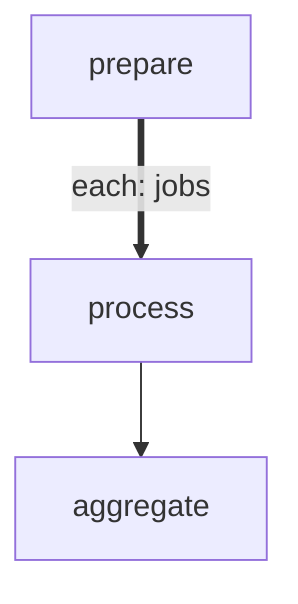

# forEach with Concurrency Limit

Demonstrates `maxConcurrency` to limit how many forEach items execute
in parallel. Instead of spawning all items at once, the engine uses a
sliding window: when one item completes, the next pending item starts.

- `maxConcurrency: 3` — at most 3 items run concurrently
- `maxConcurrency: 1` — serial execution (see 08-foreach-serial.md)
- `maxConcurrency: 0` or omitted — unlimited (all items at once)

Combined with `onItemError: continue` so all items run even if one fails.

# Flow



# Steps

## prepare

```config
foreach:
  maxConcurrency: 3
  onItemError: continue
```

```bash
set -euo pipefail

jobs='[{"id":1,"name":"alpha","duration":0.4},{"id":2,"name":"bravo","duration":0.2},{"id":3,"name":"charlie","duration":0.6},{"id":4,"name":"delta","duration":0.3},{"id":5,"name":"echo","duration":0.5},{"id":6,"name":"foxtrot","duration":0.2},{"id":7,"name":"golf","duration":0.4},{"id":8,"name":"hotel","duration":0.1}]'

echo "LOCAL: {\"jobs\": $jobs}"
echo 'RESULT: {"edge": "next", "summary": "prepared 8 jobs"}'
```

## process

At most 3 of these run concurrently. Each simulates work by sleeping.
Item 5 ("echo") intentionally fails to demonstrate `onItemError: continue`.

```bash
set -euo pipefail

name=$(echo "$ITEM" | jq -r '.name')
duration=$(echo "$ITEM" | jq -r '.duration')
id=$(echo "$ITEM" | jq -r '.id')

echo "[$id] Processing $name (${duration}s)..."
sleep "$duration"

if [ "$id" = "5" ]; then
  echo "[$id] $name failed!"
  echo "RESULT: {\"edge\": \"fail\", \"summary\": \"$name failed\"}"
  exit 1
fi

echo "[$id] $name done"
echo "LOCAL: {\"id\": $id, \"name\": \"$name\", \"took\": $duration}"
echo "RESULT: {\"edge\": \"next\", \"summary\": \"$name processed in ${duration}s\"}"
```

## aggregate

Runs after all items complete (including failures, thanks to `continue`).

```bash
set -euo pipefail

results=$(echo "$GLOBAL" | jq -c '.results')
total=$(echo "$results" | jq 'length')
succeeded=$(echo "$results" | jq '[.[] | select(.ok == true)] | length')
failed=$((total - succeeded))

echo "Processed $succeeded/$total jobs ($failed failed)"
echo "RESULT: {\"edge\": \"next\", \"summary\": \"$succeeded/$total jobs completed\"}"
```
