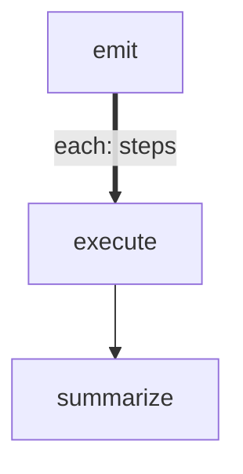

# forEach Serial (Sequential Loop)

Demonstrates `maxConcurrency: 1` to process items one at a time in order.
This replaces manual emit-loop patterns when you need guaranteed sequential
execution — each item completes fully before the next one starts.

Useful for: database migrations, ordered deployments, rate-limited APIs
that allow only 1 request at a time.

# Flow



# Steps

## emit

```config
foreach:
  maxConcurrency: 1
```

```bash
set -euo pipefail

steps='[{"order":1,"action":"create table","duration":0.2},{"order":2,"action":"add index","duration":0.3},{"order":3,"action":"migrate data","duration":0.4},{"order":4,"action":"drop old table","duration":0.1},{"order":5,"action":"verify schema","duration":0.2}]'

echo "LOCAL:"
jq -n --argjson s "$steps" '{steps: $s}'

echo "RESULT: next | planned 5 migration steps"
```

## execute

Runs one at a time, in order. Each step simulates a database operation.

```bash
set -euo pipefail

order=$(echo "$ITEM" | jq -r '.order')
action=$(echo "$ITEM" | jq -r '.action')
duration=$(echo "$ITEM" | jq -r '.duration')

echo "[$order/5] Running: $action..."
sleep "$duration"
echo "[$order/5] Done: $action (${duration}s)"

echo "LOCAL:"
jq -n --argjson o "$order" --arg a "$action" '{order: $o, action: $a}'

echo "RESULT: next | step $order: $action"
```

## summarize

```bash
set -euo pipefail

results=$(echo "$GLOBAL" | jq -c '.results')
count=$(echo "$results" | jq 'length')
actions=$(echo "$results" | jq -r '[.[] | .local.action] | join(" -> ")')

echo "Migration complete: $count steps executed"
echo "Order: $actions"
echo "RESULT: next | $count migrations applied"
```
