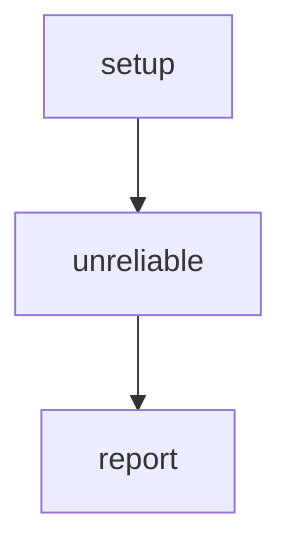

# Step-Level Retry

Demonstrates the intrinsic retry policy configured in a step's config block.
When a step fails, the engine automatically re-runs it with exponential
backoff — no graph edges needed. The step is re-invoked in place until
it succeeds or exhausts the retry budget.

Config options:
- `max` — number of additional attempts (3 = up to 4 total runs)
- `delay` — initial delay between attempts
- `backoff` — fixed, linear, or exponential
- `maxDelay` — upper bound on computed delay
- `jitter` — random factor (0-1) to spread retries

# Flow



# Steps

## setup

```bash
echo "Starting workflow with unreliable step..."
echo "RESULT: next | ready"
```

## unreliable

```config
retry:
  max: 3
  delay: 1s
  backoff: exponential
  jitter: 0.5
```

```bash
set -euo pipefail

roll=$((RANDOM % 100))
echo "Attempt: rolled $roll (need >= 40 to succeed)"

if [ "$roll" -lt 40 ]; then
  echo "Failed! Will retry..."
  echo "RESULT: fail | rolled too low"
  exit 1
fi

echo "Success!"
echo 'LOCAL: {"roll": '$roll'}'
echo "RESULT: next | succeeded with $roll"
```

## report

```bash
set -euo pipefail

result=$(echo "$STEPS" | jq -r '.unreliable.summary')
echo "Unreliable step result: $result"
echo "RESULT: next | done"
```
