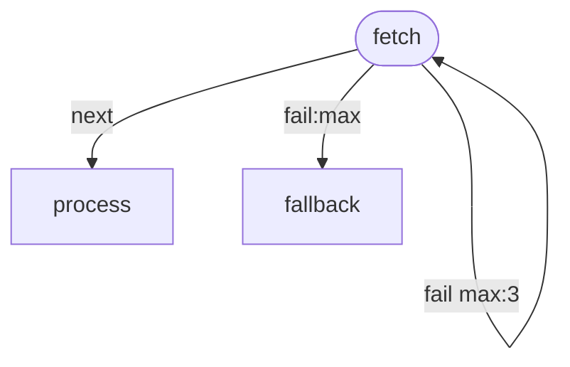

# Edge-Level Retry with Exhaustion Handler

Demonstrates graph-structural retry using labeled fail edges. Unlike
step-level retry (invisible, in-place), edge-level retry is visible
in the flowchart as a self-loop with a budget.

- `-->|fail max:3|` — retry up to 3 times on failure
- `-->|fail:max|` — route here when retry budget is exhausted

This makes the retry strategy part of the workflow's visual documentation.

# Flow



# Steps

## fetch

Simulates an unreliable network call. Succeeds ~40% of the time.
The graph gives it 4 total chances (initial + 3 retries).

```bash
set -euo pipefail

roll=$((RANDOM % 100))
echo "Fetch attempt (roll=$roll, need >= 60)..."

if [ "$roll" -lt 60 ]; then
  echo "Connection timeout!"
  echo "RESULT: fail | timeout (roll=$roll)"
  exit 1
fi

echo "Success!"
echo 'LOCAL: {"data": {"status": "live", "items": 42}}'
echo "RESULT: next | fetched 42 items"
```

## process

Runs if fetch succeeds within the retry budget.

```bash
set -euo pipefail

items=$(echo "$STEPS" | jq '.fetch.local.data.items')
echo "Processing $items items from successful fetch..."
echo "RESULT: next | processed $items items"
```

## fallback

Only runs if all 3 retries are exhausted.

```bash
echo "All retries exhausted — using cached data instead."
echo "RESULT: next | used fallback (cached)"
```
