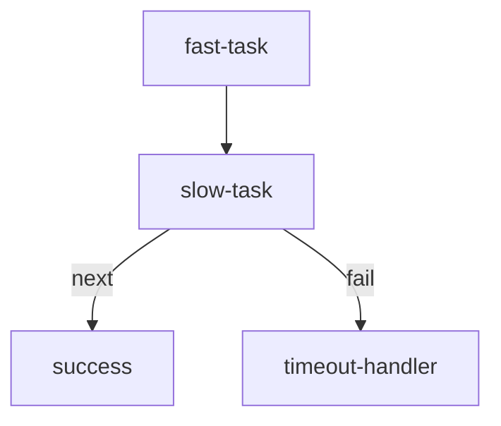

# Step Timeouts

Demonstrates per-step timeouts. When a step exceeds its timeout, the
engine kills the process (exit code 124) and routes via the `fail` edge.

Timeouts use human-readable durations: `500ms`, `2s`, `1m30s`, `1h`.
Set per-step via `timeout:` in the config block, or workflow-wide via
`timeout_default` in the top-level config.

# Flow



# Steps

## fast-task

Completes well within any timeout.

```bash
echo "Quick task done."
echo "RESULT: next | fast"
```

## slow-task

```config
timeout: 1s
```

```bash
echo "Starting long operation..."
sleep 5
echo "This line is never reached."
echo "RESULT: next | completed"
```

## success

```bash
echo "Slow task completed normally (should not happen in this demo)."
echo "RESULT: next | success path"
```

## timeout-handler

```bash
echo "Slow task was killed after exceeding timeout."
echo "Proceeding with degraded service..."
echo "RESULT: next | timeout handled"
```
