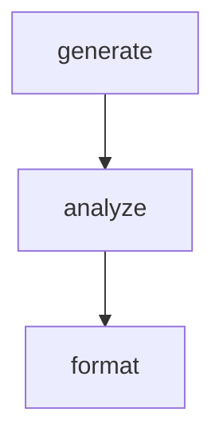

# Multi-Language Steps

Demonstrates mixing Bash, Python, and JavaScript in a single workflow.
Each step uses the language best suited for its task. Data flows between
steps via GLOBAL regardless of language — all use the same JSON protocol.

Requires: `bash`, `python3`, `node` on PATH.

# Flow



# Steps

## generate

Bash step: generates raw data as JSON arrays.

```bash
set -euo pipefail

measurements='[{"sensor":"temp","value":22.5,"unit":"C"},{"sensor":"temp","value":23.1,"unit":"C"},{"sensor":"humidity","value":65,"unit":"%"},{"sensor":"temp","value":21.8,"unit":"C"},{"sensor":"humidity","value":70,"unit":"%"},{"sensor":"pressure","value":1013,"unit":"hPa"},{"sensor":"temp","value":24.0,"unit":"C"}]'

echo "GLOBAL:"
jq -n --argjson m "$measurements" '{measurements: $m}'

echo "RESULT: next | generated 7 measurements"
```

## analyze

Python step: computes statistics grouped by sensor type.

```python
import json, os

global_ctx = json.loads(os.environ["GLOBAL"])
measurements = global_ctx["measurements"]

# Group by sensor
groups = {}
for m in measurements:
    groups.setdefault(m["sensor"], []).append(m["value"])

# Compute stats per group
stats = {}
for sensor, values in groups.items():
    stats[sensor] = {
        "count": len(values),
        "min": min(values),
        "max": max(values),
        "avg": round(sum(values) / len(values), 2),
    }

output = {"stats": stats, "total": len(measurements)}
print(f"GLOBAL: {json.dumps(output)}")
print(f'RESULT: {json.dumps({"edge": "next", "summary": f"analyzed {len(groups)} sensor types"})}')
```

## format

JavaScript step: renders the analysis as a human-readable report.

```javascript
const global = JSON.parse(process.env.GLOBAL);
const { stats, total } = global;

const lines = [`Sensor Report (${total} measurements)`, "=".repeat(40)];

for (const [sensor, data] of Object.entries(stats)) {
  lines.push(`  ${sensor}: avg=${data.avg}, min=${data.min}, max=${data.max} (n=${data.count})`);
}

lines.forEach((l) => console.log(l));

const summary = `formatted ${Object.keys(stats).length} sensor groups`;
console.log(`RESULT: ${JSON.stringify({ edge: "next", summary })}`);
```
