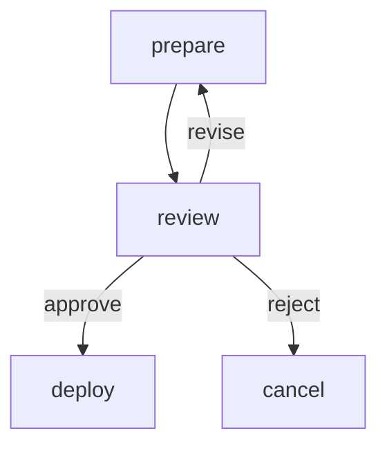

# Approval Nodes

Demonstrates human decision points that suspend workflow execution.
An approval step presents options to the operator; the workflow resumes
along the chosen edge when a decision is provided.

The workflow suspends at the `review` step. Resume with:
`markflow run <run-id> --approve review=approve`

# Flow



# Steps

## prepare

```bash
set -euo pipefail

version="2.4.$(( RANDOM % 100 ))"
changes=$((RANDOM % 10 + 1))

echo "LOCAL:"
jq -n --arg v "$version" --argjson c "$changes" '{version: $v, changes: $c}'

echo "Release v$version ready: $changes changes staged"
echo "RESULT: next | v$version prepared ($changes changes)"
```

## review

A human reviews the release and decides to approve, reject, or send back.

```config
type: approval
prompt: Review release and decide how to proceed
options:
  - approve
  - reject
  - revise
```

## deploy

```bash
set -euo pipefail

version=$(echo "$GLOBAL" | jq -r '.version')
echo "Deploying v$version to production..."
sleep 0.3
echo "Deployment complete."
echo "RESULT: next | deployed v$version"
```

## cancel

```bash
set -euo pipefail

version=$(echo "$GLOBAL" | jq -r '.version')
echo "Release v$version was rejected. No deployment."
echo "RESULT: next | v$version cancelled"
```
