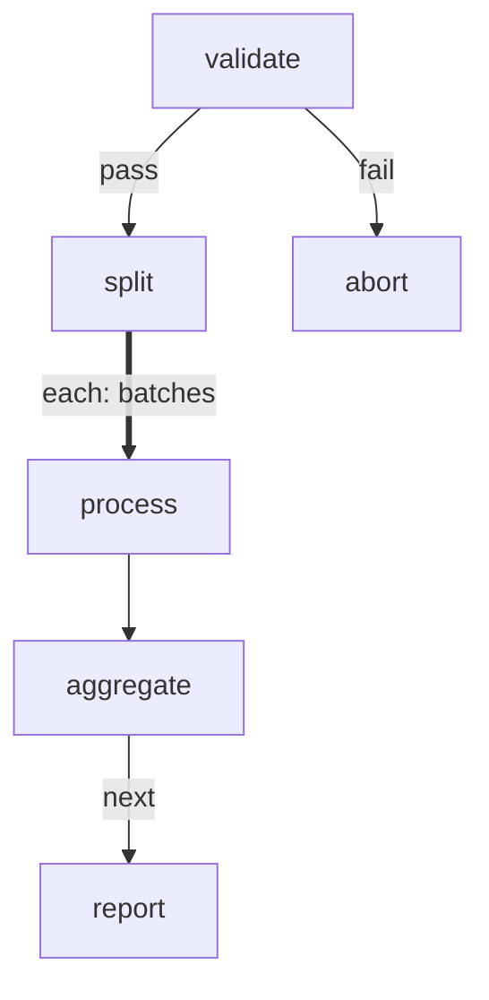

# Complex Pipeline

Combines multiple features into a realistic data processing workflow:
branching, forEach with concurrency, step-level retry, and timeouts.

Simulates: validate input data → split into batches → process each
batch (with retries) → aggregate results.

# Flow



# Steps

## validate

Checks whether the simulated dataset is valid. Succeeds ~90% of the time.

```bash
set -euo pipefail

roll=$((RANDOM % 100))
echo "Validating dataset (score: $roll)..."

if [ "$roll" -lt 10 ]; then
  echo "RESULT: fail | invalid data (score $roll)"
  exit 1
fi

record_count=$((RANDOM % 20 + 10))
echo 'GLOBAL: {"record_count": '$record_count'}'
echo "RESULT: pass | valid ($record_count records)"
```

## abort

```bash
echo "Pipeline aborted: data validation failed."
echo "RESULT: next | aborted"
```

## split

```config
foreach:
  maxConcurrency: 3
  onItemError: continue
```

```bash
set -euo pipefail

count=$(echo "$GLOBAL" | jq -r '.record_count')

batches=$(jq -nc --argjson count "$count" '
  [range(0; $count; 5) | {batch: (. / 5 | floor + 1), size: ([$count - ., 5] | min)}]
')
batch_num=$(echo "$batches" | jq 'length')

echo "LOCAL:"
jq -n --argjson b "$batches" '{batches: $b}'

echo "RESULT: next | split into $batch_num batches"
```

## process

```config
retry:
  max: 2
  delay: 1s
  backoff: linear
timeout: 5s
```

```bash
set -euo pipefail

batch=$(echo "$ITEM" | jq '.batch')
size=$(echo "$ITEM" | jq '.size')

echo "[Batch $batch] Processing $size records..."
sleep 0.$(( RANDOM % 3 + 1 ))

roll=$((RANDOM % 100))
if [ "$roll" -lt 20 ]; then
  echo "[Batch $batch] Transient error (roll=$roll), will retry"
  echo "RESULT: fail | batch $batch failed (transient)"
  exit 1
fi

processed=$size
echo "[Batch $batch] Done: $processed records processed"
echo 'LOCAL: {"batch": '$batch', "processed": '$processed'}'
echo "RESULT: next | batch $batch: $processed records"
```

## aggregate

Collects results from all batches.

```bash
set -euo pipefail

results=$(echo "$GLOBAL" | jq -c '.results')
total=$(echo "$results" | jq 'length')
succeeded=$(echo "$results" | jq '[.[] | select(.ok == true)] | length')
failed=$((total - succeeded))
processed=$(echo "$results" | jq '[.[] | select(.ok == true) | .local.processed] | add // 0')

echo "GLOBAL:"
jq -n --argjson t "$total" --argjson s "$succeeded" --argjson f "$failed" --argjson r "$processed" \
  '{total_batches: $t, succeeded: $s, failed: $f, records_processed: $r}'

echo "RESULT: next | $succeeded/$total batches ok, $processed records processed"
```

## report

```bash
set -euo pipefail

succeeded=$(echo "$GLOBAL" | jq '.succeeded')
total=$(echo "$GLOBAL" | jq '.total_batches')
records=$(echo "$GLOBAL" | jq '.records_processed')
failed=$(echo "$GLOBAL" | jq '.failed')

echo "=== Pipeline Report ==="
echo "  Batches: $succeeded/$total succeeded"
echo "  Records: $records processed"
echo "  Errors:  $failed batches failed"
echo "========================"
echo "RESULT: next | pipeline complete: $records records"
```
