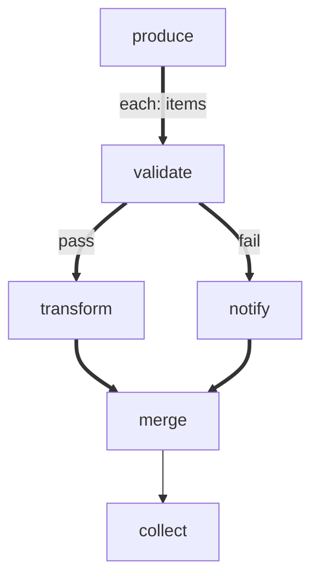

# forEach with Branching

Demonstrates conditional branching inside a forEach body. Each item is
validated and routed to different processing paths based on the result.
Both paths reconverge at a merge node before exiting to the collector.

Key concepts:
- Labeled thick edges (`==>|pass|`, `==>|fail|`) route items conditionally
- Merge nodes (multiple unlabeled incoming thick edges) wait for the active branch
- Each item routes independently — some take the pass path, others take fail
- `$ITEM` is available in all body nodes, not just the entry

# Flow



# Steps

## produce

```bash
set -euo pipefail

echo 'LOCAL: {"items": [{"name": "alpha", "valid": true}, {"name": "beta", "valid": false}, {"name": "gamma", "valid": true}]}'
echo "RESULT: next | produced 3 items"
```

## validate

```bash
set -euo pipefail

name=$(echo "$ITEM" | jq -r '.name')
valid=$(echo "$ITEM" | jq -r '.valid')

if [ "$valid" = "true" ]; then
  echo "RESULT: pass | $name is valid"
else
  echo "RESULT: fail | $name is invalid"
fi
```

## transform

```bash
set -euo pipefail

name=$(echo "$ITEM" | jq -r '.name')
upper=$(echo "$name" | tr '[:lower:]' '[:upper:]')

echo "LOCAL:"
jq -n --arg n "$upper" '{transformed: $n}'
echo "RESULT: next | transformed $name"
```

## notify

```bash
set -euo pipefail

name=$(echo "$ITEM" | jq -r '.name')

echo "LOCAL:"
jq -n --arg n "$name" '{notified: $n, reason: "validation failed"}'
echo "RESULT: next | notified about $name"
```

## merge

```bash
set -euo pipefail

name=$(echo "$ITEM" | jq -r '.name')
echo "RESULT: next | merged $name"
```

## collect

```bash
set -euo pipefail

results=$(echo "$GLOBAL" | jq -c '.results')
total=$(echo "$results" | jq 'length')
ok=$(echo "$results" | jq '[.[] | select(.ok == true)] | length')

echo "=== Results ==="
echo "$results" | jq -r '.[] | "  [\(.itemIndex)] \(.summary)"'

echo "RESULT: next | $ok/$total items processed"
```
