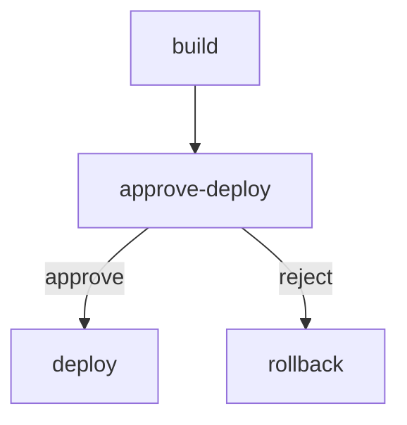

# 04 — Human-in-the-Loop / Approval Nodes

**Status** IMPLEMENTED
**Tier:** Essential | **Effort:** Small (1-2 days) once [19](19-resume-entry-point.md) lands | **Priority:** High

**Depends on:** [18 — Event-Sourced Run Log](18-event-sourced-log.md) (shipped) and [19 — Engine Resume Entry Point](19-resume-entry-point.md) (shipped). Suspend/resume is impossible without 18's log and 19's resume primitive. Interactive-mode prompting, timeouts, and webhook paths are deferred to follow-up ideas.

## Problem

Workflows that require human judgment (deployment gates, review checkpoints, manual data entry) have no way to pause and wait for input. This is a core requirement for operational and enterprise workflows.

## Reference Implementations

- **Step Functions:** `Task` state with callback pattern (token-based resume)
- **GitHub Actions:** Environment protection rules with required reviewers
- **n8n:** Form trigger + Wait node
- **Temporal:** Signals (external events that resume workflow)

## Scope for v1

**In scope:** non-interactive suspend/resume. The engine never prompts. On hitting an approval node it emits a waiting event and exits; the run is resumed via a separate CLI invocation.

**Deferred (separate follow-up ideas):**
- Interactive inline prompting (`--interactive` flag, readline callback, parallel-prompt serialization).
- Timeouts with auto-approve/auto-reject.
- Webhook-based approvals (Slack/Teams integration).
- Template variables in the prompt (`{{ GLOBAL.version }}`).
- Approval reason / comment field.

Splitting these out keeps v1 small and avoids cross-layer design (readline, TTY detection, abort-mid-prompt) that isn't needed for the suspend/resume primitive itself.

## Proposed Design

### Step definition

Approval nodes are identified by `type: approval` in the step's ` ```config ` block — the same mechanism that distinguishes `script` from `agent`. **Mermaid node shape is not used for identification.** The graph parser already ignores shape for semantics; overloading it would create a second source of truth. Users are free to use any shape (e.g. `approve-deploy{{"Deploy?"}}`) for visual clarity; it carries no load-bearing meaning.

````markdown
## approve-deploy

```config
type: approval
prompt: "Deploy to production?"
options:
  - approve
  - reject
```
````

No script body. The step block may contain prose as documentation for reviewers — it is not executed.

### Mermaid graph (edges work normally)



Each option in the `config` block must correspond to an outgoing edge label from the node. The validator enforces this.

### CLI surface

Two new commands. Both behave identically whether a human or a CI script is consuming the output — the only differentiators are exit codes and `--json`.

```bash
# List runs with waiting approval tokens (current workspace by default)
markflow pending [--all] [--json]

# Decide an approval and resume the run inline
markflow approve <run-id> <node-id> <choice> [--json]
```

`<run-id>` accepts a unique prefix (e.g. `markflow approve 20260414-143 …`); an ambiguous prefix is an error.

### Exit codes (new contract)

Applies to both `run` and `approve`:

- `0` — run completed successfully.
- `1` — run failed, or the command itself was invalid (bad choice, wrong state, missing run).
- `2` — **run suspended, waiting for approval.** New code, distinct from failure. CI systems branch on this.

### Suspend output

When the engine hits an approval node, step output still streams to stdout as today. The suspend notice is written to **stderr** as plain text so stdout pipes remain clean:

```
[markflow] run suspended: 20260414-143022-deploy
[markflow] waiting at node: approve-deploy
[markflow] prompt: Deploy to production?
[markflow] options: approve, reject
[markflow] resume: markflow approve 20260414-143022-deploy approve-deploy <choice>
```

With `--json`, each event (including `suspended`) is emitted as JSONL on stdout:

```
{"type":"step","node":"build","edge":"next"}
{"type":"suspended","runId":"20260414-143022-deploy","nodeId":"approve-deploy","prompt":"Deploy to production?","options":["approve","reject"]}
```

Process exits with code `2` after emitting the suspend record.

### Resume output

`markflow approve` streams the continuation inline, exactly like `markflow run`. If the run completes, exit `0`. If it hits another approval downstream, suspend again with the same format and exit `2`. If the chosen branch fails, exit `1`.

Validation errors (unknown run, invalid choice, no waiting token at the named node) fail fast with a stderr message and exit `1` — **no events are written** when validation fails.

```
$ markflow approve 20260414-143022-deploy approve-deploy maybe
error: "maybe" is not a valid choice for approve-deploy
       valid options: approve, reject
```

## Implementation Approach

### 1. Types (`src/core/types.ts`)

- Extend `StepType`: `"script" | "agent" | "approval"`.
- Extend `TokenState`: add `"waiting"`.
- Extend `StepDefinition` (or add a sibling `approvalConfig`) with `prompt: string` and `options: string[]`.
- Extend `EngineEventPayload`:
  ```ts
  | { type: "step:waiting"; v: 1; nodeId: string; tokenId: string; prompt: string; options: string[] }
  | { type: "approval:decided"; v: 1; nodeId: string; tokenId: string; choice: string; decidedAt: string }
  ```
- Extend `EngineOptions`:
  ```ts
  approvalDecision?: { nodeId: string; choice: string };
  ```
  A single decision per invocation. Parallel approvals are handled by repeated invocations (see §5).

### 2. Parser + validator (`src/core/parser/markdown.ts`, `src/core/validator.ts`)

- Parse `type: approval`, `prompt`, and `options` list from the step's `config` block. Approval steps have no script body and no `lang`.
- Validator rules:
  - `prompt` is required and non-empty.
  - `options` must be non-empty.
  - Every option must match a label on an outgoing edge from the node.
  - Conversely, every non-exhaustion outgoing edge from an approval node must have its label listed in `options` (avoids dead branches).

### 3. Replay (`src/core/replay.ts`)

- `step:waiting`: pure notification (state change is carried by the paired `token:state` running→waiting).
- `approval:decided`: pure notification. Paired with `token:state` waiting→running and a subsequent `step:complete` whose `StepResult.edge` equals the chosen option.

All state mutations continue to flow through `token:state`, `step:complete`, etc. — no new mutating event types.

### 4. Engine — approval branch (`src/core/engine.ts`)

In `executeToken`, branch early when `step.type === "approval"`:

**Case A — no decision supplied (first encounter, or a different branch's approval is pending):**
1. `record()` `token:state` running→waiting.
2. `emit()` `step:waiting` carrying `prompt` and `options`.
3. Return without emitting `step:complete`. The token stays in `waiting`.

**Case B — `options.approvalDecision` targets this token's node:**
1. Validate `choice` against `options` (paranoia; CLI also validates).
2. `record()` `token:state` waiting→running (or running→running-with-decision; whichever matches the replay contract).
3. `emit()` `approval:decided`.
4. Synthesize `StepResult { edge: choice, summary: "approved: ${choice}", exit_code: 0 }`.
5. Continue down the normal `step:complete` + `routeFrom` path — routing, fan-out, merges all behave as if the node had run a script that emitted the chosen edge.
6. Clear the consumed `approvalDecision` so a second waiting token with the same nodeId doesn't get auto-decided.

### 5. Engine — suspend-on-waiting loop exit (`src/core/engine.ts`)

Current `runLoop` throws `ExecutionError("Deadlock: …")` when pending tokens exist but none are ready. New rule:

- If any token is in state `waiting` → **clean suspend exit**. `RunManager.completeRun` records status `running` (not `complete`), `workflow:complete` is **not** emitted. `start()` returns a `RunInfo` with `status: "running"`.
- If no waiting tokens and pending-but-none-ready → genuine deadlock, throw as today.

This makes parallel approvals fall out naturally. Fan-out to two approval branches produces two `step:waiting` events in one pass; the loop exits suspended; `markflow pending` shows both; each `markflow approve` call decides one and either suspends again (one left) or completes (both decided).

### 6. Resume with decision (CLI → engine)

`markflow approve` does **not** write events itself. Single-writer discipline (the engine owns the log) is preserved:

1. `openExistingRun(id)` → `ResumeHandle` (from idea 19).
2. Read-only validation against the replayed snapshot:
   - A token exists at `nodeId` in state `waiting`.
   - The token's `step:waiting` event recorded `options` contains `choice`.
3. Call `executeWorkflow(workflow, { resumeFrom: handle, approvalDecision: { nodeId, choice }, onEvent: cliRenderer })`.
4. Engine appends `approval:decided` + related events itself via `record()` / `emit()`.
5. CLI exits with the engine's resulting status code (`0` / `1` / `2`).

### 7. CLI commands (`src/cli/commands/approve.ts`, `pending.ts`)

- `pending`: scan the configured runs directory, replay each run's log (cheap — already cached in `meta.json` for status, but tokens require the event log), filter to runs with at least one `waiting` token, print a text table or JSONL.
- `approve`: prefix-match `<run-id>` against run directories, open, validate, resume as above. Reuses the same stream renderer as `run`.

Both commands respect the existing `--workspace` / runs-dir resolution used by `ls` and `show`.

### 8. Suspend rendering (`src/cli/commands/run.ts` + new shared renderer)

The `run` command's event stream renderer already handles step output. Add:

- On `step:waiting`: emit the stderr block shown in "Suspend output" above (or the JSON object if `--json` is set).
- On engine return with `status === "running"` (suspended): exit `2`.

Because `approve` reuses the same renderer, suspend-on-downstream-approval prints the same block with the same exit code.

## What It Extends

- `TokenState` (add `"waiting"`)
- `StepType` (add `"approval"`)
- `StepDefinition` / parser (prompt, options)
- `EngineEventPayload` (`step:waiting`, `approval:decided`)
- `EngineOptions` (`approvalDecision`)
- `replay()` (cases for the two new events, both pure notifications)
- `WorkflowEngine.executeToken` (approval branch)
- `WorkflowEngine.runLoop` (suspend-on-waiting exit rule)
- CLI (new `approve` and `pending`, new exit-code contract including `2`, suspend renderer in `run`)
- Idea-19 resume entry point (consumed, not extended)

## Key Files

- `src/core/types.ts`
- `src/core/parser/markdown.ts`
- `src/core/validator.ts`
- `src/core/replay.ts`
- `src/core/engine.ts`
- `src/core/run-manager.ts` (status-on-suspend handling)
- `src/cli/commands/run.ts` (exit-code contract, suspend renderer)
- `src/cli/commands/approve.ts` (new)
- `src/cli/commands/pending.ts` (new)
- `src/cli/index.ts` (register commands)

## Tests

- Parser: `type: approval` with `prompt` + `options` parses; missing prompt/options rejected.
- Validator: option not matching any outgoing edge label rejected; outgoing edge label not listed in options rejected.
- Engine suspend: approval node emits `step:waiting`, transitions token to `waiting`, `runLoop` exits cleanly with `status: "running"`.
- Parallel approvals: two fan-out approval branches produce two waiting tokens; `markflow pending` lists both; deciding one leaves the other waiting.
- Resume round-trip: `approve` → engine emits `approval:decided` + `step:complete` → downstream step executes → `replay(events)` equals live snapshot.
- CLI validation errors (bad choice, wrong state, unknown run id, ambiguous prefix) write no events and exit `1`.
- Exit code contract: `run` with no approvals exits `0`; with an approval exits `2`; with a failing step exits `1`.
- `--json` suspend record has the documented shape.

## Open Questions

- **Status field for suspended runs.** Today `RunStatus` is `"running" | "complete" | "error"`. A suspended run technically is `"running"` (not terminal). Should we add `"suspended"` as a distinct status for clarity in `ls` output? Leaning yes — cheap, removes ambiguity — but it touches `RunStatus` which is part of the public API.
- **Concurrent `approve` on the same waiting token.** Two operators race to decide. First-writer-wins at the log-append level; the second invocation's snapshot is stale by the time it tries to resume. Needs a CAS check on `lastSeq` at first append, or a lock file. Flag as follow-up (same concurrency issue noted in idea 19).
- **Decision provenance.** Should `approval:decided` carry an operator identifier (env user, CI actor)? Trivial to add now (`decidedBy?: string`, sourced from `$USER` or a `--as` flag); expensive to retrofit later if audit requirements appear. Recommend including the field but leaving it optional in v1.
