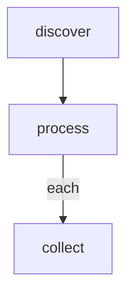
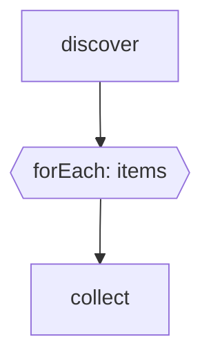

# 07 — Dynamic Task Mapping / forEach

**Status** IMPLEMENTED (v1)
**Tier:** Essential | **Effort:** Deep (5-8 days) | **Priority:** High

## Guarantees (v1)

- **Result ordering.** `GLOBAL.results` after batch completion is an array
  indexed by input position (`itemIndex`), not by completion time. The engine
  pre-allocates a fixed-length slot per item at `batch:start` and writes each
  result to its own slot, so parallel completions cannot shuffle the output.
- **Mid-batch resume.** `batch:start` carries the full `itemContexts` array,
  pinned in the event log. On `markflow resume`, any batch with
  `completed < expected` re-spawns tokens only for the missing `itemIndex`
  values (reusing the original `batchId`); completed items are never re-run,
  in-flight items left as `running` are reset to `pending` and re-dispatched.
- **Failure policy** (see below) is frozen at `batch:start` time. Edits to
  the source step's `foreach.onItemError` config after that point do not
  affect an in-flight batch — replay is deterministic.

## Failure semantics — `onItemError`

Configured on the source step (the node with the outgoing `==>|each: KEY|`
edge):

````markdown
## produce

```config
foreach:
  onItemError: fail-fast   # or: continue
```
````

- `fail-fast` (default): the first item that resolves on `fail` marks the
  batch as errored. In-flight items still run to completion (no cancellation
  in v1), but the collector is **skipped**; the source node routes on its
  outgoing `fail` edge if one exists.
- `continue`: every item runs. The collector runs regardless; `GLOBAL.results`
  contains both ok and failed entries, each tagged `{ ok: boolean, edge }`,
  so the collector can decide how to react.

`batch:complete` carries `succeeded`, `failed`, and an overall
`status: "ok" | "error"` derived from the pinned policy.

## Validator rules

| Code | Meaning |
|---|---|
| `FOREACH_NO_COLLECTOR` | A `==>|each:|` chain does not terminate at a normal-edge fan-in (collector). |
| `FOREACH_LABEL_MISSING_KEY` | Thick edge carries an `each:` label with no key. |
| `FOREACH_ORPHAN_THICK` | A `==>` edge starts outside any forEach chain. |
| `FOREACH_NESTED` | A forEach source is reachable from another forEach body chain. |

## Problem

The current emitter pattern processes items sequentially via LOCAL cursor + back-edges. There's no way to process N items in parallel at runtime. This is needed for batch API calls, parallel test shards, multi-region deployments, and data processing pipelines.

## Reference Implementations

- **Step Functions:** `Map` state — iterates over an array, runs a sub-workflow per item, collects results
- **Airflow:** `expand()` / dynamic task mapping — generates tasks at runtime from data
- **Prefect:** `.map()` — submits tasks concurrently for each item in an iterable
- **GitHub Actions:** `matrix` strategy — runs job variants in parallel
- **LangGraph:** `Send` API — dynamic fan-out to multiple nodes

## Proposed Design

### Option A: Edge annotation



- `discover` emits `GLOBAL: {"items": [...]}`
- Engine spawns one `process` token per item, each with `GLOBAL.item` set to the current element
- `collect` is a merge node that waits for all dynamic tokens

### Option B: Config block

````markdown
## process

```config
forEach: GLOBAL.items
as: item
```

```bash
echo "Processing {{ item.name }}"
```
````

### Option C: Dedicated map node shape



### Results collection

The merge node downstream receives:
- `GLOBAL.results` — array of results from all parallel executions (ordered by original index)
- Each result contains the step's `edge`, `summary`, and `local` state

### Error handling strategies

```yaml
## process
```config
forEach: GLOBAL.items
as: item
onItemError: continue  # or: fail-fast, collect
```
```

- `fail-fast`: Abort all parallel items on first failure (default)
- `continue`: Run all items, collect failures at the end
- `collect`: Like continue, but route to error edge if any failed

## Event model (event-sourced log, idea 18)

All batch state must be reconstructible from `events.jsonl` — otherwise resume (idea 19) cannot continue a mid-batch run. Three new persisted events:

```ts
// v2 (shipped)
{
  type: "batch:start"; v: 2;
  batchId: string; nodeId: string;
  items: number;                 // cardinality
  itemContexts: unknown[];       // per-item input values, captured for resume
  onItemError: "fail-fast" | "continue";
}
{
  type: "batch:item:complete"; v: 2;
  batchId: string; itemIndex: number; tokenId: string;
  ok: boolean;                   // edge !== "fail"
  edge: string;
}
{
  type: "batch:complete"; v: 2;
  batchId: string;
  succeeded: number; failed: number;
  status: "ok" | "error";
}
```

`token:created` is extended (not a new variant — 18 deliberately left `parentTokenId` out, naming this idea as the consumer):

```ts
{
  type: "token:created";
  v: 1;
  tokenId: string;
  nodeId: string;
  generation: number;
  parentTokenId?: string;   // the forEach producer token
  batchId?: string;         // set for all N children of a single fan-out
  itemIndex?: number;       // 0…N-1
}
```

`EngineSnapshot` gains a `batches` field:

```ts
interface EngineSnapshot {
  // ...existing fields...
  batches: Map<string, { nodeId: string; expected: number; completed: number }>;
}
```

`replay()` folds batches strictly: `batch:start` inserts; `batch:item:complete` increments `completed`; `batch:complete` requires `completed === expected` or throws `InconsistentLogError`. Unknown `batchId` on an item/complete throws.

## Implementation Approach

1. Add `forEach` and `as` to `StepDefinition` / config block parsing.
2. In `engine.ts:executeToken`, detect forEach steps. Follow the write-ahead rule from 18 (append → mutate → dispatch):
   a. Evaluate the forEach expression against current context to get the items array.
   b. Emit `batch:start` with `expected = items.length`.
   c. For each item, emit `token:created` with `batchId`, `itemIndex`, `parentTokenId` set.
   d. Create N tokens for the same node, each with a unique `itemIndex` and scoped context.
3. Extend merge detection in `graph.ts` — the downstream node's wait condition becomes snapshot-visible: `batches.get(batchId).completed === expected`.
4. On each item token reaching a terminal state, emit `batch:item:complete`. When the last one lands, emit `batch:complete` and aggregate results into `GLOBAL.results` via the existing `global:update` event.
5. Add replay cases for the three new batch events plus the extended `token:created`.

## What It Extends

- `StepDefinition` (new `forEach`, `as` fields)
- Token model (add `batchId`, `itemIndex`)
- `engine.ts` — token spawning and batch tracking
- `graph.ts` — dynamic merge detection
- `EngineEvent` — batch events
- Template rendering — scoped item context

## Key Files

- `src/core/engine.ts`
- `src/core/types.ts`
- `src/core/graph.ts`
- `src/core/parser/markdown.ts`
- `src/core/template.ts`

## Resume semantics (idea 19)

On `run:resumed`, replay reconstructs `batches` from `batch:start` + per-item events. Any item token that was mid-flight at crash time is in `pending` state and re-dispatches naturally via the standard run loop — no batch-specific resume logic needed. Completed items are terminal and are not retried. Failed items honor whatever `onItemError` mode was recorded when the batch started (the mode is fixed at `batch:start` time, not re-read from config on resume — prevents mid-flight semantics drift).

## Complexity Considerations

- **Token tracking:** Dynamic cardinality means the engine can't know in advance how many tokens to expect at a merge node — the `batches` map in the snapshot provides the authoritative expected count.
- **Partial failure:** What if 3/10 items fail? Need clear semantics.
- **Nested forEach:** Should `forEach` inside a `forEach` be supported? (Probably not in v1.)
- **Concurrency limit:** `maxParallel: 5` to avoid overwhelming resources. Scheduling-only — not logged as an event; it affects dispatch order, not state.

## Open Questions

- Should dynamic tokens share GLOBAL state or each get an isolated copy?
- How are results ordered — by completion time or original index?
- Should there be a `maxParallel` / concurrency limit?
- Can forEach be combined with retry (retry individual items)?
