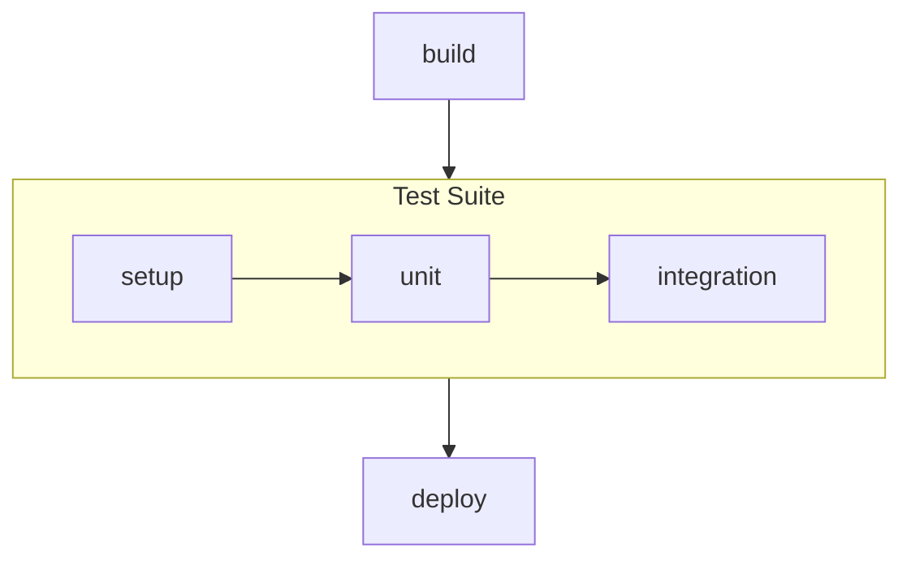

# 08 — Sub-workflow Composition

**Tier:** Essential | **Effort:** Medium (3-5 days) | **Priority:** High

## Problem

As workflows grow beyond a dozen steps, users need to decompose them into reusable, composable units. Teams want to share common sub-workflows (test suites, deployment procedures, notification patterns).

## Reference Implementations

- **GitHub Actions:** Reusable workflows (up to 10 nesting levels, 50 total workflows per run)
- **Step Functions:** Nested state machines via `arn:` reference
- **Airflow:** `TaskGroup` (visual grouping) + `SubDagOperator` (deprecated, replaced by TaskGroup)
- **Dagger:** Module system (first-class reusable components)

## Proposed Design

### External file reference

````markdown
## run-tests

```config
workflow: ./test-suite.md
inputs:
  ENV: staging
  VERBOSE: "true"
```
````

### Input/output mapping

The child workflow:
- Receives `inputs` as its declared inputs (same as CLI `--input`)
- Its `GLOBAL` state is isolated from the parent by default
- The parent step's result captures the child's final status

To pass child state back to parent:

````markdown
## run-tests

```config
workflow: ./test-suite.md
inputs:
  ENV: staging
outputs:
  testResults: GLOBAL.results
  coverage: GLOBAL.coverage
```
````

The mapped outputs become available in the parent's `STEPS.run-tests.local.*`.

### Inline subgraph alternative (preserves single-file philosophy)



Steps for `setup`, `unit`, `integration` are defined in the same `# Steps` section. The subgraph creates a scope boundary.

## Implementation Approach

### Event model (event-sourced log, idea 18)

Each child run is independently event-sourced — it gets its own `events.jsonl` under `runs/<parent-id>/sub/<step-id>/`, with its own `run:start`, seq counter, and sidecar files. The parent log references the child via two new persisted events:

```ts
{ type: "subworkflow:start"; v: 1; stepSeq: number; childRunId: string; workflowPath: string; inputs: Record<string, unknown> }
{ type: "subworkflow:complete"; v: 1; childRunId: string; status: "complete" | "error"; outputs: Record<string, unknown> }
```

**Outputs land on the `subworkflow:complete` event payload**, not on the parent's `StepResult.local`. Otherwise replay of the parent would have to re-open and re-replay every child run to recover mapped values — breaking the pure-fold contract. The parent fold copies `outputs` directly into the step's `StepResult.local`.

### External workflow path

1. In `runner/index.ts`, detect `workflow` in step config.
2. Call `parseWorkflow(resolvedPath)` to parse the child workflow.
3. Emit `subworkflow:start` on the parent log.
4. Call `executeWorkflow(childDef, { inputs: mappedInputs, runDir: childRunDir })` to run it — the child writes its own `events.jsonl` to the nested directory.
5. On child termination, read the mapped output keys from the child's final `EngineSnapshot.globalContext` and emit `subworkflow:complete` on the parent log with those `outputs`.
6. The child's run directory is nested under the parent's: `runs/<parent-id>/sub/<step-id>/`.

### Resume semantics (idea 19)

If the parent is resumed while a sub-workflow was mid-flight (i.e. the parent's log has `subworkflow:start` but no matching `subworkflow:complete` for some `childRunId`):

1. The parent's `replay()` surfaces the token for the sub-workflow step in `pending` state (because no `step:complete` for the wrapping step landed).
2. Before re-dispatching that token, the runner checks for an existing child run directory. If present, invoke 19's `RunManager.openExistingRun(childRunId)` on the child and execute with `resumeFrom`, rather than starting a fresh child.
3. The recursion terminates because each child has its own single log to replay — no fixed-point needed.
4. If the child directory is missing (corrupted state), error with a specific `SubWorkflowStateMissingError` rather than silently re-running.

### Inline subgraph path (stretch goal)

1. Detect Mermaid `subgraph` blocks in the parser.
2. Create scoped execution contexts for subgraph nodes.
3. The subgraph entry/exit nodes connect to the parent graph.

## What It Extends

- `StepAgentConfig` / config block (new `workflow`, `inputs`, `outputs` fields)
- `runStep` dispatcher in `runner/index.ts`
- `parseWorkflow` / `executeWorkflow` (recursive invocation)
- `RunManager` (nested run directories)

## Key Files

- `src/core/runner/index.ts`
- `src/core/types.ts`
- `src/core/parser/markdown.ts`
- `src/core/run-manager.ts`
- `src/core/engine.ts`

## Single-File Tension

The external file reference is the one feature that directly breaks the single-file philosophy. Mitigations:
- Make it optional — inline subgraphs as the "pure" alternative
- Resolve paths relative to the parent workflow file
- Consider a `# Include` section that inlines external workflow content at parse time

## Open Questions

- Should child workflow errors propagate as the parent step's failure, or be catchable?
- Recursion depth limit?
- Should the child inherit the parent's GLOBAL, or start fresh?
- How to handle naming collisions between parent and child step IDs?
