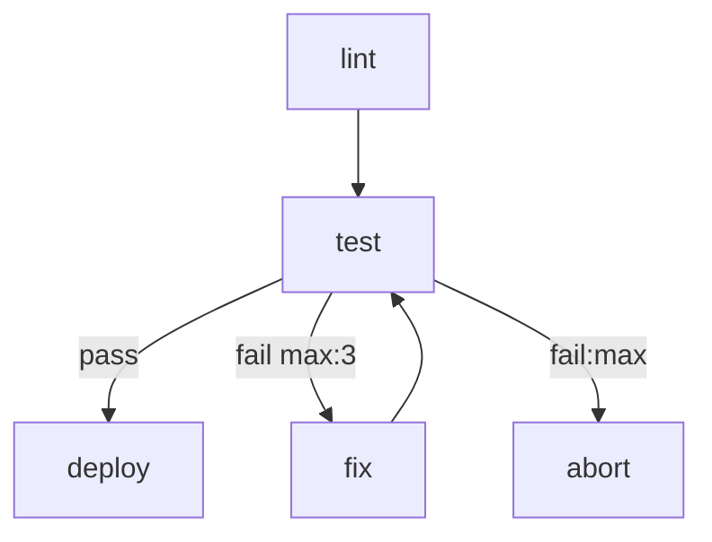
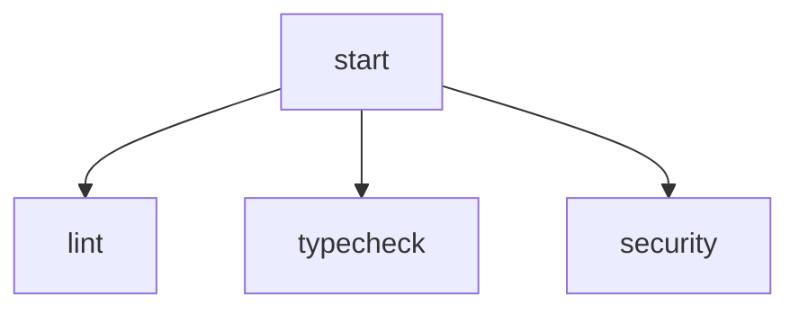
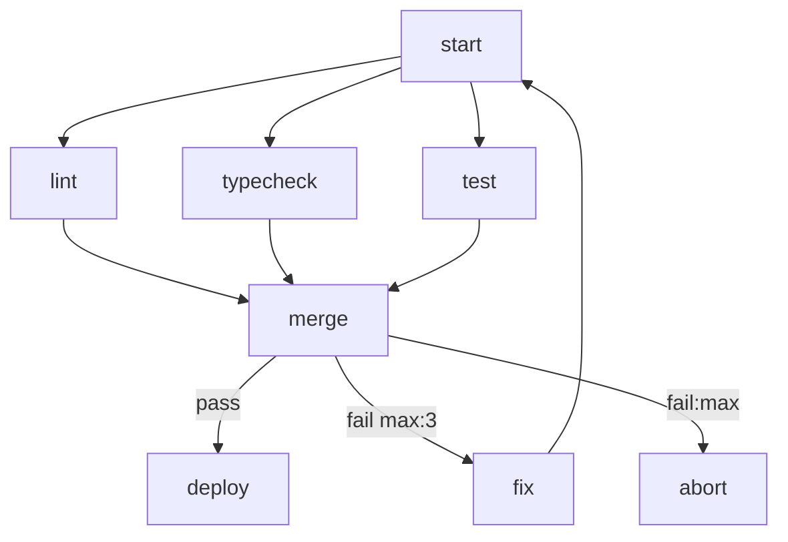

# Workflow Engine Technical Specification

## Overview

A workflow engine that uses a single Markdown file as both human-readable documentation and executable specification. Workflows are defined as a Mermaid flowchart topology with steps implemented as either shell scripts or agent prompts. The engine executes steps as OS-level processes, routing between them based on their output.

---

## Workflow File Format

A workflow is a single `.md` file with a required structure of three top-level sections.

### 1. Name and Description

The H1 heading is the workflow name. Any prose between the H1 and the `# Flow` section is a human-readable description and is ignored by the parser.

```markdown
# My Workflow Name

Optional description of what this workflow does.
Ignored by the parser.
```

### 2. Flow Section

A required `# Flow` section containing exactly one fenced mermaid code block. This defines the execution topology.

````markdown
# Flow


````

### 3. Steps Section

A required `# Steps` section containing one `##` subsection per node referenced in the flow. The subsection heading is the node ID. The content of each subsection determines the step type.

````markdown
# Steps

## lint

```bash
npm run lint
```

## test

```bash
npm test
```

## fix

You are a coding agent. Review the test failures in context and fix the
source code so the tests pass. Do not modify the tests themselves.

## deploy

```bash
./scripts/deploy.sh
```

## abort

```bash
echo "Workflow failed after max retries" && exit 1
```
````

---

## Step Types

Step type is determined solely by the content of the `##` subsection.

| Content | Type | Executor |
|---|---|---|
| Fenced code block ` ```bash ` or ` ```sh ` | Script | `bash` |
| Fenced code block ` ```python ` | Script | `python3` |
| Fenced code block ` ```js ` or ` ```javascript ` | Script | `node` |
| Plain prose (no code block) | Agent | Configured agent CLI |

Any unrecognised code block language is an error at parse time.

---

## Mermaid Syntax

Only `flowchart` diagram type is supported. Direction (`TD`, `LR`, etc.) is accepted but ignored by the executor.

### Node Declaration

Nodes are declared implicitly by their appearance in edges. The node ID must match a `##` heading in the Steps section exactly.

Node labels are optional and used only for display purposes:

```
nodeId[Human readable label]
nodeId[Human readable label annotation:value]
```

#### Start Nodes

By default the engine treats any node with no incoming edges as a start
node. In cyclic workflows every node may have an incoming edge (e.g. a
loop returns to its emitter), so the entry must be marked explicitly
using Mermaid's stadium shape:

```
emit([Emit next issue])
```

When any node carries the stadium shape, those nodes are the start set
and the "no incoming edges" fallback is ignored. Only the first mention
of a node needs the shape; subsequent references can use the plain ID.

### Edge Declaration

```
A --> B               # unconditional edge
A -->|label| B        # labelled edge
A -->|label max:N| B  # labelled edge with retry limit
A -->|label:max| B    # exhaustion handler edge
```

### Annotations

Annotations are embedded in edge labels using `key:value` syntax.

| Annotation | Location | Meaning |
|---|---|---|
| `max:N` | Edge label | Maximum times this edge can be followed. When N is reached the engine looks for a matching `label:max` edge. |
| `label:max` | Edge label | Followed when the corresponding `label max:N` edge is exhausted. |

#### Retry Example

```mermaid
test -->|fail max:3| fix
test -->|fail:max| abort
```

- `fail max:3` — follow this edge up to 3 times
- `fail:max` — follow this edge when the `fail` retry budget is exhausted

If a `fail:max` edge is declared but no `max:N` is set on the corresponding `fail` edge, it is a parse error. If a `max:N` is set but no `:max` handler exists, the engine halts the workflow with an error when the budget is exhausted.

---

## Execution Model

### Run Workspace

Each workflow execution creates an isolated run directory:

```
runs/
  <iso-timestamp>/
    context.json        # append-only execution ledger
    workspace/          # shared working directory for all steps
```

All steps execute with `workspace/` as their working directory. Steps communicate by reading and writing files here.

### Step Execution

#### Script Steps

Executed directly as a subprocess:

```bash
bash nodes/lint.sh
```

Exit code `0` is success. Non-zero is failure. The edge to follow is determined by the exit code and the available outgoing edges (see Routing below).

Environment variables injected by the engine:

| Variable | Value |
|---|---|
| `MARKFLOW_RUNDIR` | Absolute path to the run directory |
| `MARKFLOW_WORKDIR` | Absolute path to the per-run working directory |
| `MARKFLOW_WORKSPACE` | Absolute path to the persistent workspace (if available) |
| `MARKFLOW_STEP` | ID of the current step |
| `MARKFLOW_PREV_STEP` | ID of the previous step |
| `MARKFLOW_PREV_EDGE` | Edge label that led to this step |
| `MARKFLOW_PREV_SUMMARY` | Summary from the previous step result |
| `STEPS` | JSON object `{ <node>: { edge, summary, state? } }` for every completed step |
| `STATE` | JSON string of this step's own accumulated state from its prior invocation; `{}` on first entry |
| `GLOBAL` | JSON string of the current workflow-wide global context |

#### Agent Steps

The prompt body is **verbatim** — everything between the optional ` ```config ` block and the next `## <step>` heading is used as-is, including lists, sub-headings, nested fenced blocks, and blockquotes. The engine does **not** inject a "Workflow Context" section or auto-list completed steps. The author decides exactly what context a step needs by referencing it explicitly through template substitution.

**Template substitution.** Before the body is sent to the agent CLI, the engine rewrites these forms (see `$STEPS` / `$STATE` / `$GLOBAL` shapes in the env-var table above):

| Form | Meaning |
|---|---|
| `${NAME}` | Flat variable (inputs, `MARKFLOW_*`, etc.). First identifier must be uppercase. |
| `${GLOBAL.path.to.key}` | Dotted path into the workflow-wide global context. |
| `${STEPS.<node>.state.<key>}` | State value emitted by an earlier step. |
| `${STEPS.<node>.summary}` / `${STEPS.<node>.edge}` | Prior step's summary or routing edge. |
| `$${NAME}` | Escape — emits the literal `${NAME}` with no substitution. |

If a referenced variable, namespace, or dotted path does not resolve, the step fails with an error naming the missing reference. There is no silent fallback — authors get a loud signal that context they expected isn't there.

Example — a classifier that pulls only the fields it needs:

```markdown
## classify

\`\`\`config
agent: claude
flags: [--model, haiku, -p]
\`\`\`

Classify this issue into exactly one label.

**Title:** ${STEPS.emit.state.item.title}

**Body:** ${STEPS.emit.state.item.body}

Pick one of: `Bug`, `Improvement`, `Maintenance`, `Other`.
```

**Trailing protocol block.** After the rendered body the engine appends a short fixed block describing the sentinel protocol:

```
---

The last line of your response MUST be exactly:
RESULT: {"edge": "<label>", "summary": "<one sentence>"}

You MAY emit zero or more STATE/GLOBAL lines anywhere before that:
STATE:  {...}   merges into this step's own state (visible as ${STEPS.<id>.state.*} to later steps)
GLOBAL: {...}   merges into the workflow-wide global (visible as ${GLOBAL.*} to later steps)

Multiple STATE or GLOBAL lines shallow-merge (later keys win). Do NOT put "state" or "global" keys inside RESULT.
```

When the step has 2+ outgoing edges, an additional line is appended:

```
Choose edge from: <label1>, <label2>, ...
```

Single-edge steps get no edge hint — the routing is unambiguous and `"edge": "done"` (or any label) suffices.

The engine streams stdout, intercepting three sentinel prefixes on their own lines:

- `STATE: {...}` — shallow-merged into this step's `state` (accumulates across multiple lines).
- `GLOBAL: {...}` — shallow-merged into the workflow-wide `global` context (visible to every subsequent step via `$GLOBAL` / `$STEPS`).
- `RESULT: {"edge": "...", "summary": "..."}` — the terminal routing decision. Must appear exactly once. Including `state` or `global` keys inside RESULT is an error and fails the step.

Everything else in stdout is logged unchanged and ignored by the engine. Sentinel-looking lines whose JSON is malformed are treated as prose.

Invocation: the engine spawns the agent with only the configured `agent_flags`
in argv and pipes the assembled prompt to stdin, e.g. equivalent to:

```bash
echo "<assembled prompt>" | claude -p
```

The agent CLI is configurable via `.workflow.json` (`agent`, `agent_flags`).
Default: `{ agent: "claude", agent_flags: ["-p"] }`. For other CLIs set the
appropriate headless-mode flags — e.g. `["-p"]` for `gemini`, `["exec", "-"]`
for `codex`.

### Step Result

After each step completes the engine records a result object in `context.json`:

```json
{
  "node": "test",
  "type": "script",
  "edge": "fail",
  "summary": "3 of 47 tests failed in auth module.",
  "state": { "failed": 3, "total": 47 },
  "started_at": "2026-04-09T10:23:01Z",
  "completed_at": "2026-04-09T10:23:04Z",
  "exit_code": 1
}
```

For agent steps, `edge` and `summary` come from the parsed `RESULT:` JSON. For script steps, `summary` is set to stdout of the process (truncated to 500 chars). `edge` is derived from the exit code and routing rules.

---

## Routing

### Edge Resolution

Given the set of outgoing edges from a completed node and its result, the engine selects the next node as follows:

1. If the node has exactly one outgoing edge, follow it regardless of label.
2. If the node has multiple outgoing edges, match the result edge label to an outgoing edge label.
3. If no matching edge is found, halt the workflow with a routing error.

### Exit Code to Edge Mapping for Scripts

If a script step has labelled outgoing edges, the engine maps exit codes as follows:

| Exit code | Edge followed |
|---|---|
| `0` | First edge labelled `pass`, `ok`, `success`, or `done`. If none, the single unlabelled edge. |
| Non-zero | First edge labelled `fail`, `error`, or `retry`. If none, halt with error. |

If a script needs fine-grained edge control it can emit `RESULT: {"edge": "..."}` as its last stdout line, which takes precedence over exit code mapping.

### Retry Accounting

The engine maintains a per-run counter `retries[nodeId][edgeLabel]`. Each time an edge with `max:N` is followed, the counter increments. When the counter reaches N:

- The engine does **not** follow the `max:N` edge.
- The engine looks for an outgoing edge labelled `edgeLabel:max`.
- If found, it follows it.
- If not found, the workflow halts with an error.

---

## Parallel Execution

### Fan-out

When a node has multiple outgoing edges pointing to **different** nodes with no label conflict, those target nodes are candidates for parallel execution. The engine runs them concurrently as separate subprocesses.



`lint`, `typecheck`, and `security` all execute in parallel after `start` completes.

### Fan-in (Merge Nodes)

A node with multiple **incoming** edges is a merge node. The engine applies this rule:

> A node is ready to execute when every node that has a direct edge pointing to it has completed, regardless of which edge that node took on exit.

This means if an upstream node routed away (e.g. to an error handler), it is still considered "done" for the purposes of unblocking the merge node. The merge node receives context only from upstream nodes that **actually routed to it**.

```json
{
  "lint":      { "edge": "pass", "summary": "No errors." },
  "typecheck": { "edge": "pass", "summary": "No type errors." }
}
```

If `security` routed to `abort` instead of `merge`, it does not appear in the merge node's context. The merge node — as a script or agent — inspects who arrived and decides what to do. No special policy is declared in the engine; the logic lives in the step content.

### Parallel Execution with Cycles

Parallel branches that contain cycles are supported. Each branch maintains its own retry counter independently. The merge node waits for the current execution token from each upstream node, not a historical one.

---

## Token Model

To support cycles, the engine tracks execution as **tokens** rather than node states.

A token represents a single in-flight execution of a node. When a node completes and routes to the next node, the token moves. When a cycle routes back to a previously visited node, a new token is created for that node.

Token state:

| State | Meaning |
|---|---|
| `pending` | Waiting for upstream dependencies |
| `running` | Currently executing |
| `complete` | Finished, edge selected |
| `skipped` | Upstream routed away, never ran |

The merge node waits for all upstream nodes to reach `complete` or `skipped` in the current token generation.

---

## Parse-Time Validation

The parser validates the following before execution begins:

- All node IDs referenced in the flow exist as `##` headings in Steps.
- All `##` headings in Steps are referenced in the flow (warning only).
- Every `max:N` edge has a corresponding `:max` handler edge from the same node.
- No node has two outgoing edges with the same label (excluding `:max` edges).
- Script code blocks use a supported language.

---

## Complete Example

````markdown
# CI Pipeline

Runs lint, type checking and tests in parallel, then deploys on success.
Retries the fix agent up to 3 times before aborting.

# Flow



# Steps

## start

```bash
echo "Starting CI pipeline"
git status
```

## lint

```bash
npm run lint
```

## typecheck

```bash
npm run typecheck
```

## test

```bash
npm test
```

## merge

Review the results from lint, typecheck and test. If all passed, return
edge: pass. If any failed, summarise which checks failed and why, and
return edge: fail.

## deploy

```bash
./scripts/deploy.sh staging
```

## fix

You are a coding agent. Review the failures described in context.
Fix the source code to resolve the failures. Do not modify test files
or type definition files. Focus only on the implementation.

## abort

```bash
echo "Pipeline failed after maximum retries" >&2
exit 1
```
````

---

## Configuration

A `.workflow.json` file in the same directory as the workflow file can override defaults:

```json
{
  "agent": "claude",
  "agent_flags": ["--dangerously-skip-permissions"],
  "max_retries_default": 3,
  "parallel": true
}
```

| Key | Default | Meaning |
|---|---|---|
| `agent` | `claude` | Agent CLI to use (`claude`, `codex`) |
| `agent_flags` | `[]` | Extra flags passed to the agent CLI |
| `max_retries_default` | none | Global retry limit if no `max:N` is specified |
| `parallel` | `true` | Enable parallel execution of fan-out nodes |
