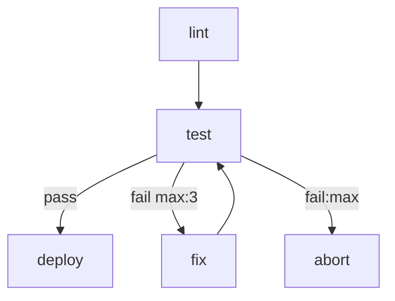
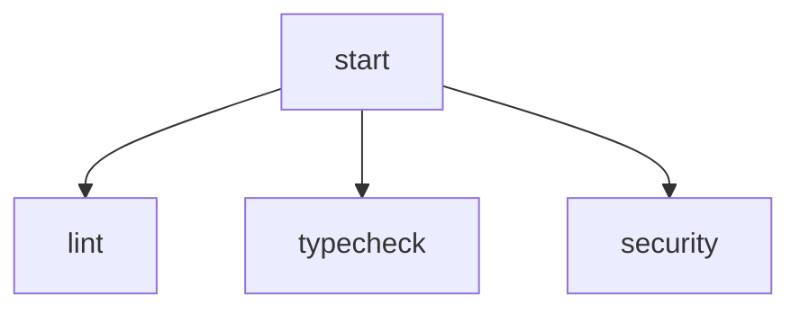
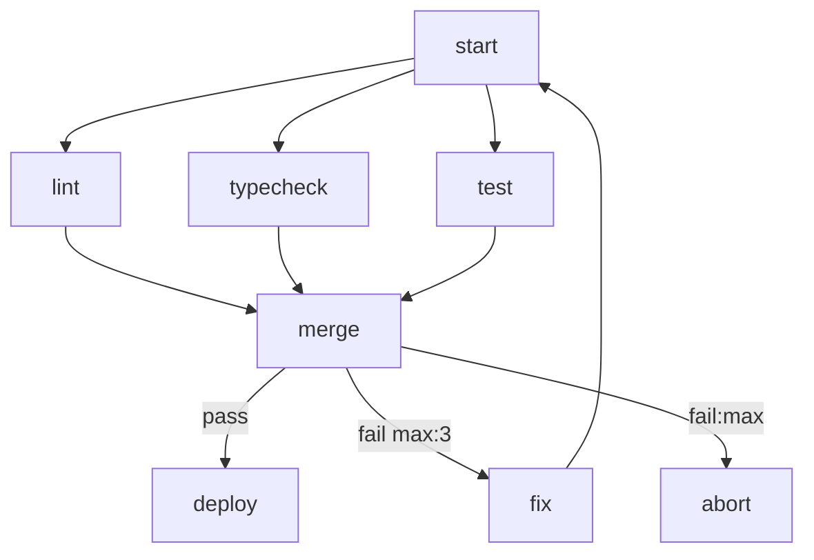

# Workflow Engine Technical Specification

## Overview

A workflow engine that uses a single Markdown file as both human-readable documentation and executable specification. Workflows are defined as a Mermaid flowchart topology with steps implemented as either shell scripts or agent prompts. The engine executes steps as OS-level processes, routing between them based on their output.

---

## Workflow File Format

A workflow is a single `.md` file with a required structure of three top-level sections.

### 1. Name and Description

The H1 heading is the workflow name. Any prose between the H1 and the `# Flow` section is a human-readable description and is ignored by the parser.

```markdown
# My Workflow Name

Optional description of what this workflow does.
Ignored by the parser.
```

### 2. Flow Section

A required `# Flow` section containing exactly one fenced mermaid code block. This defines the execution topology.

````markdown
# Flow


````

### 3. Steps Section

A required `# Steps` section containing one `##` subsection per node referenced in the flow. The subsection heading is the node ID. The content of each subsection determines the step type.

````markdown
# Steps

## lint

```bash
npm run lint
```

## test

```bash
npm test
```

## fix

You are a coding agent. Review the test failures in context and fix the
source code so the tests pass. Do not modify the tests themselves.

## deploy

```bash
./scripts/deploy.sh
```

## abort

```bash
echo "Workflow failed after max retries" && exit 1
```
````

---

## Step Types

Step type is determined by the **presence** of a supported fenced code block anywhere in the `##` subsection. Prose may appear before, after, or around the code block without affecting classification.

| Content | Type | Executor |
|---|---|---|
| Contains ` ```bash ` or ` ```sh ` code block | Script | `bash` |
| Contains ` ```python ` code block | Script | `python3` |
| Contains ` ```js ` or ` ```javascript ` code block | Script | `node` |
| Plain prose only (no supported code block) | Agent | Configured agent CLI |

Any unrecognised code block language (without a ` ```config ` block) is an error at parse time.

### Explicit type override

A step's ` ```config ` block may declare `type: agent` to force agent classification even when a supported code block is present. This is useful when the code block is example content for an AI agent prompt, not executable logic.

```
type: script   # redundant — validates a code block exists, errors if not
type: agent    # forces agent; code blocks become part of the prose prompt
type: approval # interactive approval gate (see Approval Steps)
```

---

## Mermaid Syntax

Only `flowchart` (or its alias `graph`) diagram type is supported. Direction (`TD`, `LR`, `TB`, `BT`, `RL`) is accepted but ignored by the executor. Parsing is handled by `@emily/mermaid-ast`, which vendors Mermaid's own JISON grammar for full-fidelity AST extraction.

### Node Declaration

Nodes are declared implicitly by their appearance in edges, or as standalone declarations. The node ID must match a `##` heading in the Steps section exactly.

Node labels are optional and used only for display purposes. All standard Mermaid flowchart shapes are supported:

| Syntax | Shape | Example |
|---|---|---|
| `A[label]` | square (rectangle) | `build[Build Project]` |
| `A(label)` | round | `init(Initialize)` |
| `A([label])` | stadium | `emit([Emit next])` |
| `A{label}` | diamond | `check{Pass?}` |
| `A((label))` | circle | `hub((Hub))` |
| `A(((label)))` | doublecircle | `end(((Done)))` |
| `A[(label)]` | cylinder | `db[(Database)]` |
| `A[[label]]` | subroutine | `sub[[Subroutine]]` |
| `A>label]` | odd (asymmetric) | `flag>Flag]` |
| `A{{label}}` | hexagon | `prep{{Prepare}}` |
| `A[/label/]` | lean_right (parallelogram) | `input[/Data/]` |
| `A[\label\]` | lean_left | `output[\Result\]` |
| `A[/label\]` | trapezoid | `wide[/Trapezoid\]` |
| `A[\label/]` | inv_trapezoid | `narrow[\Inv Trap/]` |

Labels may be quoted for multi-word text: `A["Long label with spaces"]`.

#### Start Nodes

By default the engine treats any node with no incoming edges as a start
node. In cyclic workflows every node may have an incoming edge (e.g. a
loop returns to its emitter), so the entry must be marked explicitly
using Mermaid's stadium shape:

```
emit([Emit next issue])
```

When any node carries the stadium shape, those nodes are the start set
and the "no incoming edges" fallback is ignored. Only the first mention
of a node needs the shape; subsequent references can use the plain ID.

### Edge Declaration

All standard Mermaid edge types are supported:

```
A --> B               # normal arrow
A --- B               # open link (no arrow)
A -.-> B              # dotted arrow
A ==> B               # thick arrow
A -->|label| B        # labelled edge
A -.->|label| B       # labelled dotted edge
A ==>|label| B        # labelled thick edge
A -->|label max:N| B  # labelled edge with retry limit
A -->|label:max| B    # exhaustion handler edge
```

### Subgraphs

Mermaid `subgraph ... end` blocks are parsed — nodes declared inside subgraphs are included in the graph like any other node. Subgraph grouping metadata is not currently used by the engine but may be leveraged for visualization in the future.

### Annotations

Annotations are embedded in edge labels using `key:value` syntax.

| Annotation | Location | Meaning |
|---|---|---|
| `max:N` | Edge label | Maximum times this edge can be followed. When N is reached the engine looks for a matching `label:max` edge. |
| `label:max` | Edge label | Followed when the corresponding `label max:N` edge is exhausted. |

#### Retry Example

```mermaid
test -->|fail max:3| fix
test -->|fail:max| abort
```

- `fail max:3` — follow this edge up to 3 times
- `fail:max` — follow this edge when the `fail` retry budget is exhausted

If a `fail:max` edge is declared but no `max:N` is set on the corresponding `fail` edge, it is a parse error. If a `max:N` is set but no `:max` handler exists, the engine halts the workflow with an error when the budget is exhausted.

---

## Execution Model

### Run Workspace

Each workflow execution creates an isolated run directory:

```
runs/
  <iso-timestamp>/
    context.json        # append-only execution ledger
    workspace/          # shared working directory for all steps
```

All steps execute with `workspace/` as their working directory. Steps communicate by reading and writing files here.

### Step Execution

#### Script Steps

Executed directly as a subprocess:

```bash
bash nodes/lint.sh
```

Exit code `0` is success. Non-zero is failure. The edge to follow is determined by the exit code and the available outgoing edges (see Routing below).

Environment variables injected by the engine:

| Variable | Value |
|---|---|
| `MARKFLOW_RUNDIR` | Absolute path to the run directory |
| `MARKFLOW_WORKDIR` | Absolute path to the per-run working directory |
| `MARKFLOW_WORKSPACE` | Absolute path to the persistent workspace (if available) |
| `MARKFLOW_STEP` | ID of the current step |
| `MARKFLOW_PREV_STEP` | ID of the previous step |
| `MARKFLOW_PREV_EDGE` | Edge label that led to this step |
| `MARKFLOW_PREV_SUMMARY` | Summary from the previous step result |
| `STEPS` | JSON object `{ <node>: { edge, summary, local? } }` for every completed step |
| `LOCAL` | JSON string of this step's own accumulated local state from its prior invocation; `{}` on first entry |
| `GLOBAL` | JSON string of the current workflow-wide global context |

> `LOCAL` and `GLOBAL` are the two step-accessible context surfaces — the former is step-private (survives across a step's own re-entries, e.g. via a back-edge loop), the latter is workflow-wide. Both are unrelated to the internal token-state machine described later.

#### Agent Steps

The prompt body is **verbatim** — everything between the optional ` ```config ` block and the next `## <step>` heading is used as-is, including lists, sub-headings, nested fenced blocks, and blockquotes. The engine does **not** inject a "Workflow Context" section or auto-list completed steps. The author decides exactly what context a step needs by referencing it explicitly through template substitution.

**Template substitution.** Before the body is sent to the agent CLI, the engine renders it as a [Liquid](https://liquidjs.com/) template (strict mode — undefined references hard-fail). The following forms are available (see `$STEPS` / `$LOCAL` / `$GLOBAL` shapes in the env-var table above):

| Form | Meaning |
|---|---|
| `{{ NAME }}` | Flat variable (inputs, `MARKFLOW_*`, etc.). |
| `{{ GLOBAL.path.to.key }}` | Dotted path into the workflow-wide global context. |
| `{{ STEPS.<node>.local.<key> }}` | Local-state value emitted by an earlier step. |
| `{{ STEPS.<node>.summary }}` / `{{ STEPS.<node>.edge }}` | Prior step's summary or routing edge. |
| `...` | Iterate over arrays — keeps producer steps free of consumer-specific formatting. |
| `...` | Conditional sections. |
| `{{ value \| default: "..." }}` | Built-in Liquid filters — `default`, `upcase`, `size`, `escape`, `join` are the officially supported set. |
| `{{ VAR }}` | Escape — emits the literal `{{ VAR }}` with no substitution. |

**Markdown filters.** The engine also registers a set of custom filters tuned for producing markdown inside agent prompts:

| Filter | Example | Output |
|---|---|---|
| `json` | `{{ obj \| json }}` | Pretty-printed JSON (2-space indent). |
| `json: "a,b"` | `{{ obj \| json: "name,age" }}` | JSON, filtered to the named fields (applies per-element for arrays). |
| `yaml` / `yaml: "a,b"` | `{{ obj \| yaml }}` | YAML representation, with optional field filter. |
| `list` | `{{ xs \| list: "name,description" }}` | Bullet list. First field becomes `` `code` `` header; remaining fields join with ` — `. Primitives render as `- value`. |
| `table` | `{{ xs \| table: "name,age" }}` | Markdown table; nested object cells become JSON; `\|` is escaped. At least one field is required. |
| `code` | `{{ text \| code: "json" }}` | Wraps in a fenced code block. Language argument is optional (empty fence by default). Composes cleanly: `{{ obj \| json \| code: "json" }}`. |
| `heading: N` | `{{ title \| heading: 2 }}` | Prefixes `N` `#` characters (clamped to 1–6). |
| `quote` | `{{ text \| quote }}` | Prefixes every line with `> `. |
| `indent: N` | `{{ text \| indent: 4 }}` | Pads every line with `N` spaces. |
| `pluck: "field"` | `{{ xs \| pluck: "name" \| join: ", " }}` | Extracts one field from each object in an array. |
| `keys` / `values` | `{{ obj \| keys \| join: "," }}` | Object introspection. |

If a referenced variable, namespace, or dotted path does not resolve, the step fails with an error naming the missing reference and the step id. There is no silent fallback — authors get a loud signal that context they expected isn't there.

> **Whitespace.** Liquid preserves newlines around tags by default. Use the trim markers `` (or `{{-` / `-}}`) when iterating inline to avoid stray blank lines in the rendered prompt.

Example — a classifier that iterates over a raw list emitted by an earlier step:

```markdown
## classify

\`\`\`config
agent: claude
flags: [--model, haiku]
\`\`\`

Classify this issue into exactly one label.

**Title:** {{ GLOBAL.item.title }}

**Body:** {{ GLOBAL.item.body | default: "(no body)" }}

Pick one of:

{{ GLOBAL.labels | list: "name,description" }}
```

**Trailing protocol block.** After the rendered body the engine appends a short fixed block describing the sentinel protocol:

```
---

The last line of your response MUST be exactly:
RESULT: {"edge": "<label>", "summary": "<one sentence>"}

You MAY emit zero or more LOCAL/GLOBAL lines anywhere before that:
LOCAL:  {...}   merges into this step's own local state (visible as {{ STEPS.<id>.local.* }} to later steps)
GLOBAL: {...}   merges into the workflow-wide global (visible as {{ GLOBAL.* }} to later steps)

Multiple LOCAL or GLOBAL lines shallow-merge (later keys win). Do NOT put "local" or "global" keys inside RESULT.
```

When the step has 2+ outgoing edges, an additional line is appended:

```
Choose edge from: <label1>, <label2>, ...
```

Single-edge steps get no edge hint — the routing is unambiguous and `"edge": "done"` (or any label) suffices.

The engine streams stdout, intercepting three sentinel prefixes:

- `LOCAL: {...}` — shallow-merged into this step's own `local` state (accumulates across multiple lines).
- `GLOBAL: {...}` — shallow-merged into the workflow-wide `global` context (visible to every subsequent step via `$GLOBAL` / `$STEPS`).
- `RESULT: {"edge": "...", "summary": "..."}` — the terminal routing decision. Optional: when omitted (or emitted without an `edge` key), the engine defaults to `edge: "next"` on exit 0 and `edge: "fail"` on non-zero exit — the same rule for script and agent steps. May appear at most once. Including `local` or `global` keys inside RESULT is an error and fails the step.

**Multiline JSON:** The parser uses brace-balanced accumulation. A sentinel line whose JSON `{` does not close on that line causes the parser to collect subsequent output lines until braces balance, then parses the concatenated text as JSON. This allows natural `jq` pretty-printed output:

```bash
echo "GLOBAL:"
curl -s "$API_URL/data" | jq '{payload: ., count: (.items | length)}'
```

A bare sentinel (e.g. `GLOBAL:` with nothing after the colon) begins accumulation from the next line.

**RESULT shorthand:** If the text after `RESULT:` does not begin with `{`, it is parsed as plain text in the format `<edge>` or `<edge> | <summary>`:

```bash
echo "RESULT: pass"
echo "RESULT: fail | region us-east unhealthy after 30s"
```

Everything else in stdout is logged unchanged and ignored by the engine.

Invocation: the engine spawns the agent with its CLI-specific non-interactive
argv prefix (engine-owned) followed by the configured `agent_flags`, and pipes
the assembled prompt to stdin, e.g. equivalent to:

```bash
echo "<assembled prompt>" | claude -p [agent_flags...]
```

The agent binary is configurable via `.workflow.json` (`agent`, `agent_flags`);
default `{ agent: "claude", agent_flags: [] }`. The non-interactive prefix is
*not* a user setting — markflow prepends it based on the agent basename:
`-p` for `claude` and `gemini`, `exec -` for `codex`. Unknown agents get no
prefix, so `agent_flags` is passed through verbatim. If a user-supplied flag
collides with the baseline it is silently deduped with a warning.

### Step Result

After each step completes the engine records a result object in `context.json`:

```json
{
  "node": "test",
  "type": "script",
  "edge": "fail",
  "summary": "3 of 47 tests failed in auth module.",
  "local": { "failed": 3, "total": 47 },
  "started_at": "2026-04-09T10:23:01Z",
  "completed_at": "2026-04-09T10:23:04Z",
  "exit_code": 1
}
```

`edge` and `summary` come from the parsed `RESULT:` JSON for both step types. When RESULT is missing or has no `edge` key, `edge` defaults to `"next"` on exit 0 and `"fail"` on non-zero exit. For script steps, `summary` falls back to the step's stdout (truncated to 500 chars) when not explicitly provided.

---

## Routing

### Edge Resolution

Given the set of outgoing edges from a completed node and its `result.edge`, the engine selects the next node as follows:

1. **Single outgoing edge** — follow it regardless of label.
2. **Fan-out** — if all outgoing edges are unlabelled and point to distinct targets, run them in parallel.
3. **Exact label match** — find an outgoing edge whose label equals `result.edge`.
4. **Synonym groups** — treat `next` / `pass` / `ok` / `success` / `done` as interchangeable success signals, and `fail` / `error` / `retry` as interchangeable failure signals. A step that emits (or defaults to) `edge: "next"` therefore routes to an existing `pass`-labelled edge.
5. **Unlabelled catch-all** — if one of the outgoing edges has no label, it catches any result that didn't match above. This lets you write `A -->|classified| B` next to `A --> fallback` and get an explicit `else` branch without enumerating every possible label.
6. **No match** — halt the workflow with a routing error.

### Retry Accounting

The engine maintains a per-run counter `retries[nodeId][edgeLabel]`. Each time an edge with `max:N` is followed, the counter increments. When the counter reaches N:

- The engine does **not** follow the `max:N` edge.
- The engine looks for an outgoing edge labelled `edgeLabel:max`.
- If found, it follows it.
- If not found, the workflow halts with an error.

---

## Parallel Execution

### Fan-out

When a node has multiple outgoing edges pointing to **different** nodes with no label conflict, those target nodes are candidates for parallel execution. The engine runs them concurrently as separate subprocesses.



`lint`, `typecheck`, and `security` all execute in parallel after `start` completes.

### Fan-in (Merge Nodes)

A node with multiple **incoming** edges is a merge node. The engine applies this rule:

> A node is ready to execute when every node that has a direct edge pointing to it has completed, regardless of which edge that node took on exit.

This means if an upstream node routed away (e.g. to an error handler), it is still considered "done" for the purposes of unblocking the merge node. The merge node receives context only from upstream nodes that **actually routed to it**.

```json
{
  "lint":      { "edge": "pass", "summary": "No errors." },
  "typecheck": { "edge": "pass", "summary": "No type errors." }
}
```

If `security` routed to `abort` instead of `merge`, it does not appear in the merge node's context. The merge node — as a script or agent — inspects who arrived and decides what to do. No special policy is declared in the engine; the logic lives in the step content.

### Parallel Execution with Cycles

Parallel branches that contain cycles are supported. Each branch maintains its own retry counter independently. The merge node waits for the current execution token from each upstream node, not a historical one.

---

## Token Model

To support cycles, the engine tracks execution as **tokens** rather than node states.

A token represents a single in-flight execution of a node. When a node completes and routes to the next node, the token moves. When a cycle routes back to a previously visited node, a new token is created for that node.

Token state:

| State | Meaning |
|---|---|
| `pending` | Waiting for upstream dependencies |
| `running` | Currently executing |
| `complete` | Finished, edge selected |
| `skipped` | Upstream routed away, never ran |

The merge node waits for all upstream nodes to reach `complete` or `skipped` in the current token generation.

---

## Parse-Time Validation

The parser and validator check the following before execution begins. Diagnostics include source file path, line numbers (where available), and actionable suggestions.

**Errors** (block execution):

- All node IDs referenced in the flow exist as `##` headings in Steps.
- Every `max:N` edge has a corresponding `:max` handler edge from the same node (and vice versa).
- No node has two outgoing edges with the same label (excluding `:max` edges).
- Exactly one start node — either explicitly marked with stadium shape `([...])` or the sole node with no incoming edges. Multiple entry points are not allowed; use a single start node that fans out.
- No duplicate `## step` headings (first definition's line is reported).
- No duplicate input names in `# Inputs`.
- Script code blocks use a supported language.
- The `# Flow` mermaid block is not empty.

**Warnings** (do not block execution):

- `##` headings in Steps not referenced in the flow (orphan steps).
- Nodes unreachable from the start node (dead code in the graph).
- Nodes with both labelled and unlabelled outgoing edges (ambiguous routing — the unlabelled edge acts as an implicit catch-all).
- Steps with no content (empty code block or no prose).

---

## Complete Example

````markdown
# CI Pipeline

Runs lint, type checking and tests in parallel, then deploys on success.
Retries the fix agent up to 3 times before aborting.

# Flow



# Steps

## start

```bash
echo "Starting CI pipeline"
git status
```

## lint

```bash
npm run lint
```

## typecheck

```bash
npm run typecheck
```

## test

```bash
npm test
```

## merge

Review the results from lint, typecheck and test. If all passed, return
edge: pass. If any failed, summarise which checks failed and why, and
return edge: fail.

## deploy

```bash
./scripts/deploy.sh staging
```

## fix

You are a coding agent. Review the failures described in context.
Fix the source code to resolve the failures. Do not modify test files
or type definition files. Focus only on the implementation.

## abort

```bash
echo "Pipeline failed after maximum retries" >&2
exit 1
```
````

---

## Configuration

A `.workflow.json` file in the same directory as the workflow file can override defaults:

```json
{
  "agent": "claude",
  "agent_flags": ["--dangerously-skip-permissions"],
  "max_retries_default": 3,
  "parallel": true
}
```

| Key | Default | Meaning |
|---|---|---|
| `agent` | `claude` | Agent CLI to use (`claude`, `codex`) |
| `agent_flags` | `[]` | Extra flags passed to the agent CLI |
| `max_retries_default` | none | Default retry budget applied to `fail`/`error`/`retry`-group edges when `max:N` is absent — only when a matching `:max` handler is present on the same node. Ignored otherwise. |
| `parallel` | `true` | Enable parallel execution of fan-out nodes |
