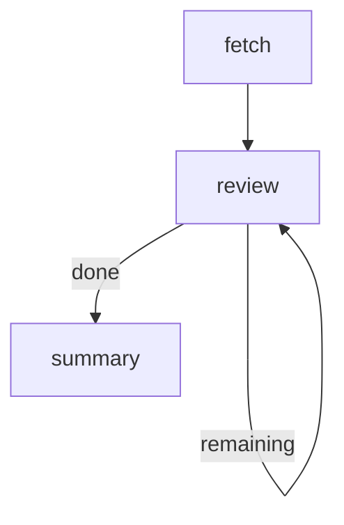

# Issue Review Loop

Fetch a list of items and process each one sequentially using a back-edge loop.
Demonstrates step data passing and cursor-based iteration.

# Flow



# Steps

## fetch

Seed the loop with a list of items and an initial cursor.

```bash
cat <<'EOF'
Fetching items to review...
EOF

echo 'RESULT: {"edge": "pass", "data": {"items": ["ISSUE-1: Add login page", "ISSUE-2: Fix cart total", "ISSUE-3: Update docs"], "cursor": 0}}'
```

## review

Read the item list and cursor from prior step data, process the current item,
then advance the cursor and route back or forward.

```bash
STEPS="$MARKFLOW_STEPS_JSON"

# On first call, read from fetch; on subsequent calls, read from our own prior output
CURSOR=$(echo "$STEPS" | python3 -c "
import json, sys
steps = json.load(sys.stdin)
# review's own prior data has the cursor (after first iteration)
if 'review' in steps and steps['review'].get('data', {}).get('cursor') is not None:
    print(steps['review']['data']['cursor'])
else:
    print(steps['fetch']['data']['cursor'])
")

ITEMS=$(echo "$STEPS" | python3 -c "
import json, sys
steps = json.load(sys.stdin)
# items always come from fetch
items = steps['fetch']['data']['items']
print(len(items))
for item in items:
    print(item)
")

TOTAL=$(echo "$ITEMS" | head -1)
CURRENT_ITEM=$(echo "$ITEMS" | tail -n +2 | sed -n "$((CURSOR + 1))p")

echo "[$((CURSOR + 1))/$TOTAL] Reviewing: $CURRENT_ITEM"
echo "  -> Looks good, approved."

NEXT=$((CURSOR + 1))

if [ "$NEXT" -ge "$TOTAL" ]; then
  echo ""
  echo "All items reviewed."
  echo "RESULT: {\"edge\": \"done\", \"data\": {\"cursor\": $NEXT, \"reviewed\": $TOTAL}}"
else
  echo "RESULT: {\"edge\": \"remaining\", \"data\": {\"cursor\": $NEXT, \"reviewed\": $((CURSOR + 1))}}"
fi
```

## summary

Print a final summary of the review loop.

```bash
STEPS="$MARKFLOW_STEPS_JSON"

REVIEWED=$(echo "$STEPS" | python3 -c "
import json, sys
steps = json.load(sys.stdin)
print(steps['review']['data']['reviewed'])
")

echo "Review complete: $REVIEWED item(s) processed."
```
