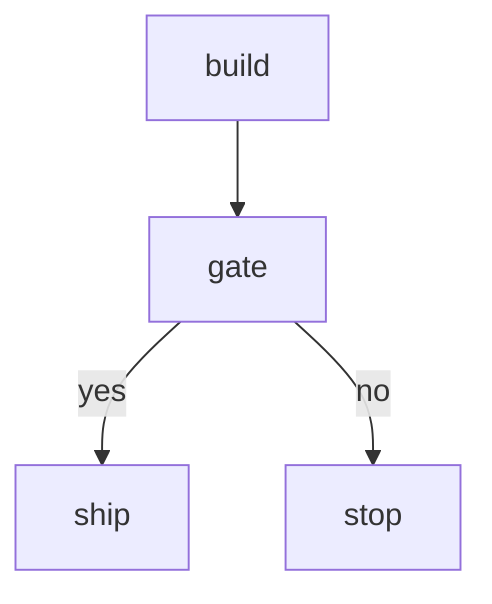

# Approval Pipeline

Two scripts bracketing an approval gate. Used by the Journey 3 e2e test.

# Flow



# Steps

## build

```bash
echo "built"
```

## gate

```config
type: approval
prompt: Ship?
options:
  - yes
  - no
```

Reviewer notes: approve to ship.

## ship

```bash
echo "shipped"
```

## stop

```bash
echo "stopped"
```
