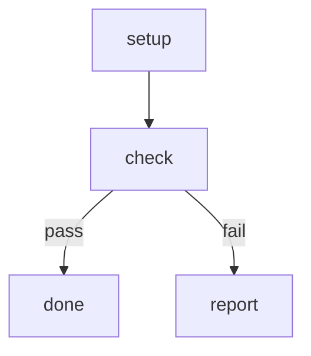

# Failing Pipeline

Linear workflow where the second step fails. Used by e2e tests.

# Flow



# Steps

## setup

```bash
echo "setup ok"
```

## check

```bash
echo "check failed" >&2
exit 1
```

## done

```bash
echo "all done"
```

## report

```bash
echo "failure reported"
```
