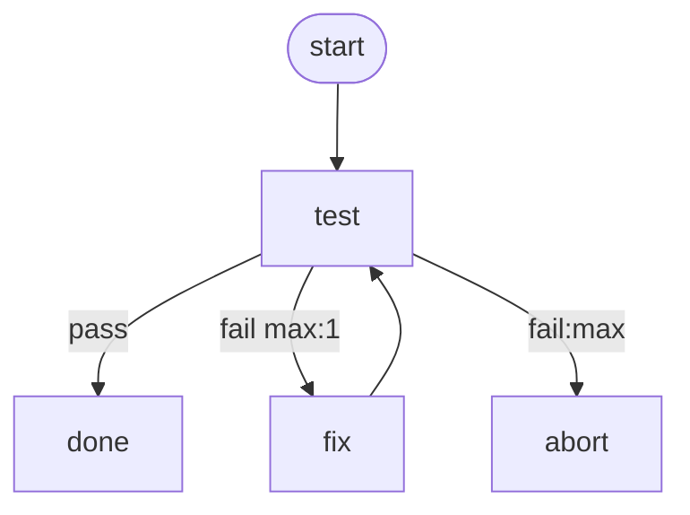

# Flaky Pipeline

Fails on the first run, recovers via a `fix` step once a marker file exists.
Used by the Journey 2 re-run e2e test.

# Flow



# Steps

## start

```bash
echo "starting"
```

## test

```bash
if [ -f "$MARKFLOW_WORKSPACE_DIR/.fixed" ]; then
  echo "test ok"
  exit 0
fi
echo "test failed" >&2
exit 1
```

## fix

```bash
touch "$MARKFLOW_WORKSPACE_DIR/.fixed"
echo "fix applied"
```

## done

```bash
echo "done"
```

## abort

```bash
echo "aborted" >&2
exit 1
```
