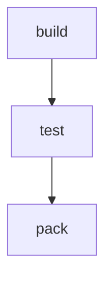

# Hello Pipeline

Trivial three-step workflow used by the Journey 1 e2e test.

# Flow



# Steps

## build

```bash
echo "build ok"
```

## test

```bash
echo "test ok"
```

## pack

```bash
echo "pack ok"
```
