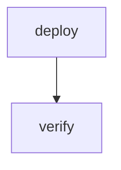

# Deploy With Inputs

A workflow with required and optional inputs for e2e testing.

# Inputs

- `TARGET` (required): Deploy target environment
- `REGION` (default: "us-east-1"): AWS region

# Flow



# Steps

## deploy

```bash
echo "deploying to $TARGET in $REGION"
```

## verify

```bash
echo "verified"
```
