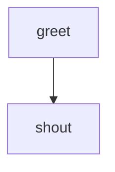

# markflow-cli

A workflow engine that treats a single Markdown file as both documentation and executable spec. Define topology with Mermaid flowcharts, implement steps with shell scripts or AI agent prompts, and run everything from the terminal.

## Install

```bash
npm install -g markflow-cli
```

Or run directly:

```bash
npx markflow-cli run workflow.md
```

## Quick Start

Create `hello.md`:

````markdown
# Hello World

A simple two-step workflow.

# Flow



# Steps

## greet

```bash
echo "Hello from markflow!"
echo 'GLOBAL: {"message": "it works"}'
```

## shout

```bash
echo "Step 2 received: $message"
```
````

Run it:

```bash
markflow run hello.md
```

## Workflow File Format

A workflow is a Markdown file with up to four sections:

| Section | Purpose |
|---------|---------|
| `# Title` | Workflow name and description |
| `# Inputs` | Declared parameters with types and defaults |
| `# Flow` | Mermaid `flowchart TD` defining the execution graph |
| `# Steps` | Step implementations (fenced code = script, plain prose = agent prompt) |

## Features

- **Fan-out/fan-in**: Multiple edges from a node run in parallel; nodes with multiple incoming edges wait for all upstream to complete
- **Routing**: Exit code 0 follows the success path, non-zero follows `fail`. Steps can emit `RESULT: {"edge": "..."}` for explicit routing
- **Retries**: Edge-level (`fail max:N`) or step-level (`retry:` config block) with backoff and jitter
- **Timeouts**: Per-step or workflow-level with configurable defaults
- **Data flow**: Steps communicate via `LOCAL` (step-scoped), `GLOBAL` (workflow-wide), and `STEPS` (read upstream outputs) contexts, rendered with LiquidJS templates
- **AI agents**: Steps written as plain prose are sent to an AI agent CLI (configurable via `agent:` in a `config` block)
- **Event-sourced runs**: Every state mutation is persisted to `events.jsonl` for replay, inspection, and resumption
- **Approvals**: Steps can pause for human approval before continuing
- **Resume**: Failed runs can be resumed from the point of failure

## Commands

```
markflow run <target>                   Execute a workflow
markflow init <target>                  Create or update a workspace
markflow ls <workspace>                 List runs in a workspace
markflow show <id>                      Show details of a specific run
markflow pending <workspace>            List runs waiting for approval
markflow approve <run> <node> <choice>  Decide a pending approval
markflow resume <run>                   Resume a failed run
```

## Library API

The engine is also available as a library:

```typescript
import {
  parseWorkflow,
  validateWorkflow,
  executeWorkflow,
  createRunManager,
} from "markflow-cli";

const workflow = await parseWorkflow("workflow.md");
const errors = validateWorkflow(workflow);

await executeWorkflow(workflow, {
  onEvent: (event) => console.log(event.type),
});
```

## Requirements

- Node.js >= 22

## License

MIT
