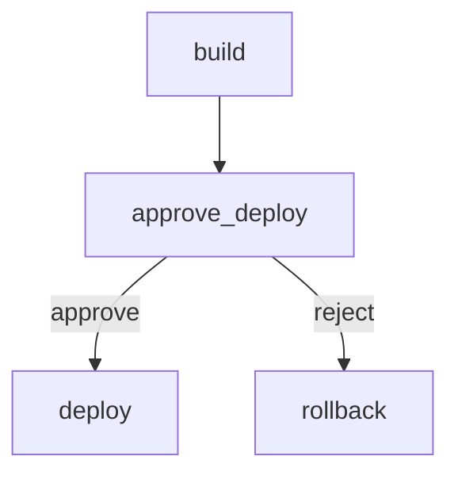

# Approval Workflow

Build, wait for human approval, then deploy or rollback.

# Flow



# Steps

## build

```bash
echo "built"
```

## approve_deploy

```config
type: approval
prompt: Deploy to production?
options:
  - approve
  - reject
```

Reviewer notes: ensure CI is green.

## deploy

```bash
echo "deploying"
```

## rollback

```bash
echo "rolling back"
```
