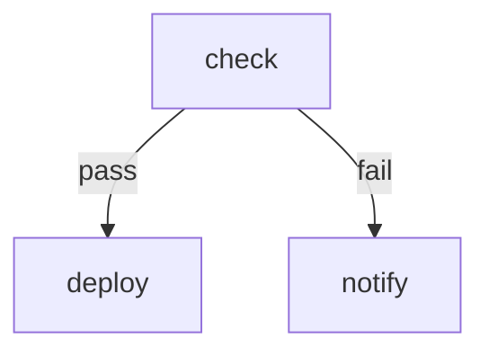

# Branch Workflow

Tests pass/fail branching based on exit code.

# Flow



# Steps

## check

```bash
echo "Running checks"
```

## deploy

```bash
echo "Deploying"
```

## notify

```bash
echo "Notifying about failure"
```
