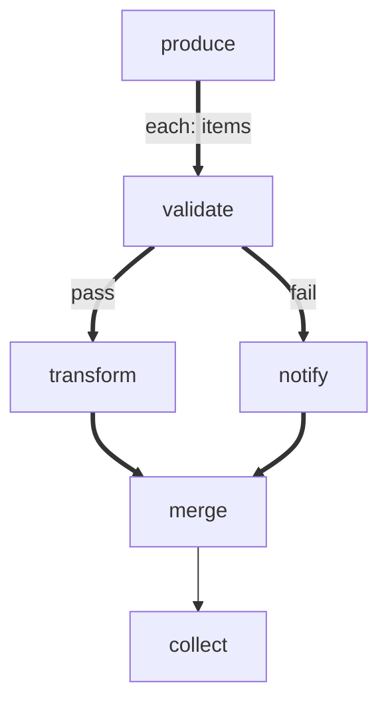

# forEach Diamond

A forEach workflow where each item branches and reconverges.

# Flow



# Steps

## produce

```bash
echo 'LOCAL: {"items": ["good", "bad", "good2"]}'
echo 'RESULT: {"edge": "next", "summary": "produced"}'
```

## validate

```bash
item=$(echo "$ITEM" | tr -d '"')
if [ "$item" = "bad" ]; then
  echo "RESULT: {\"edge\": \"fail\", \"summary\": \"invalid-${item}\"}"
else
  echo "RESULT: {\"edge\": \"pass\", \"summary\": \"valid-${item}\"}"
fi
```

## transform

```bash
item=$(echo "$ITEM" | tr -d '"')
echo "RESULT: {\"edge\": \"next\", \"summary\": \"transformed-${item}\"}"
```

## notify

```bash
item=$(echo "$ITEM" | tr -d '"')
echo "RESULT: {\"edge\": \"next\", \"summary\": \"notified-${item}\"}"
```

## merge

```bash
item=$(echo "$ITEM" | tr -d '"')
echo "RESULT: {\"edge\": \"next\", \"summary\": \"merged-${item}\"}"
```

## collect

```bash
echo 'RESULT: {"edge": "next", "summary": "collected"}'
```
