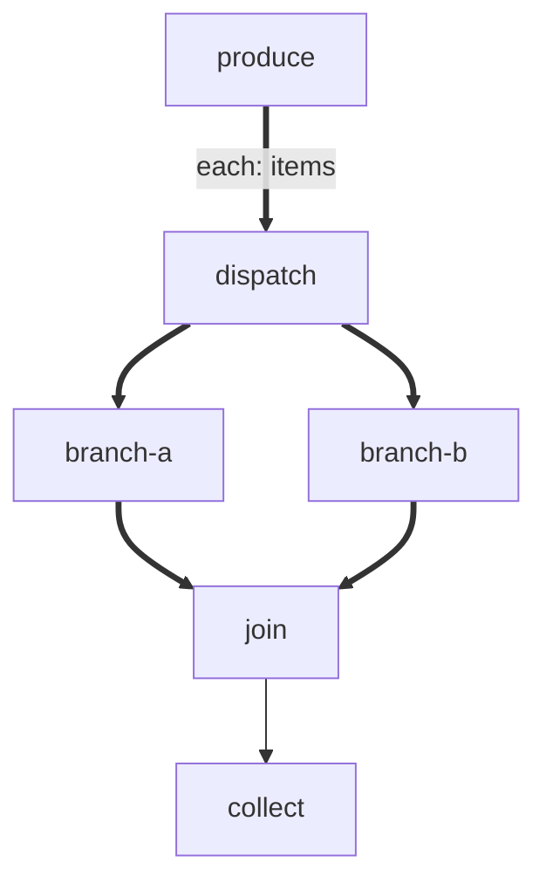

# forEach Fan-out

A forEach workflow where items fan out to parallel branches within the body via unlabeled thick edges, then reconverge at a merge node.

# Flow



# Steps

## produce

```bash
echo 'LOCAL: {"items": ["x", "y", "z"]}'
echo 'RESULT: {"edge": "next", "summary": "produced"}'
```

## dispatch

```bash
echo "RESULT: {\"edge\": \"next\", \"summary\": \"dispatched-$ITEM\"}"
```

## branch-a

```bash
echo "RESULT: {\"edge\": \"next\", \"summary\": \"a-$ITEM\"}"
```

## branch-b

```bash
echo "RESULT: {\"edge\": \"next\", \"summary\": \"b-$ITEM\"}"
```

## join

```bash
echo "RESULT: {\"edge\": \"next\", \"summary\": \"joined-$ITEM\"}"
```

## collect

```bash
echo 'RESULT: {"edge": "next", "summary": "collected"}'
```
