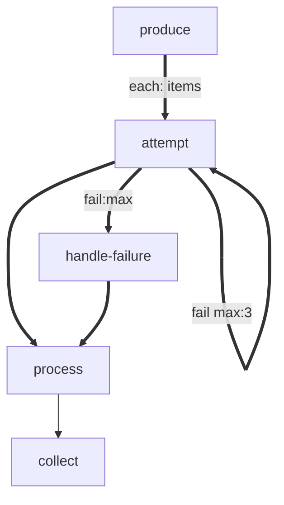

# forEach Retry

A forEach workflow where items can retry within the body.

# Flow



# Steps

## produce

```bash
echo 'LOCAL: {"items": [0, 2, 5]}'
echo 'RESULT: {"edge": "next", "summary": "produced"}'
```

## attempt

```bash
# Item value = number of failures before success. 5 means exhaust retries (max:3).
item=$ITEM
attempt_num=${ATTEMPT_NUM:-0}
ATTEMPT_NUM=$((attempt_num + 1))
export ATTEMPT_NUM
if [ "$item" -gt "$attempt_num" ]; then
  echo "LOCAL: {\"ATTEMPT_NUM\": $ATTEMPT_NUM}"
  echo "RESULT: {\"edge\": \"fail\", \"summary\": \"attempt-fail-$ATTEMPT_NUM\"}"
  exit 1
fi
echo "RESULT: {\"edge\": \"next\", \"summary\": \"attempt-pass\"}"
```

## handle-failure

```bash
echo "RESULT: {\"edge\": \"next\", \"summary\": \"handled-failure\"}"
```

## process

```bash
item=$ITEM
echo "RESULT: {\"edge\": \"next\", \"summary\": \"processed-$item\"}"
```

## collect

```bash
echo 'RESULT: {"edge": "next", "summary": "collected"}'
```
