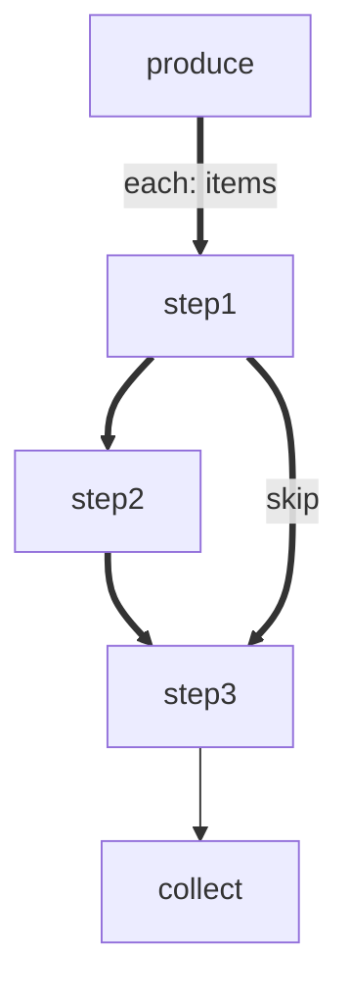

# forEach Skip

A forEach workflow where items can skip intermediate steps.

# Flow



# Steps

## produce

```bash
echo 'LOCAL: {"items": ["full", "skip", "full2"]}'
echo 'RESULT: {"edge": "next", "summary": "produced"}'
```

## step1

```bash
item=$(echo "$ITEM" | tr -d '"')
if [ "$item" = "skip" ]; then
  echo "RESULT: {\"edge\": \"skip\", \"summary\": \"skipping-${item}\"}"
else
  echo "RESULT: {\"edge\": \"next\", \"summary\": \"s1-${item}\"}"
fi
```

## step2

```bash
item=$(echo "$ITEM" | tr -d '"')
echo "RESULT: {\"edge\": \"next\", \"summary\": \"s2-${item}\"}"
```

## step3

```bash
item=$(echo "$ITEM" | tr -d '"')
echo "RESULT: {\"edge\": \"next\", \"summary\": \"s3-${item}\"}"
```

## collect

```bash
echo 'RESULT: {"edge": "next", "summary": "collected"}'
```
