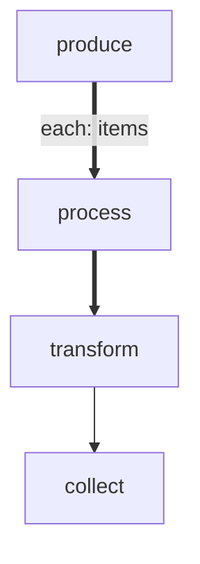

# forEach Demo

A workflow that processes items in parallel using forEach.

# Flow



# Steps

## produce

```bash
echo 'LOCAL: {"items": ["alpha", "bravo", "charlie"]}'
echo 'RESULT: {"edge": "next", "summary": "produced"}'
```

## process

```bash
item=$(echo "$ITEM" | tr -d '"')
echo "LOCAL: {\"processed\": \"${item}\"}"
echo "RESULT: {\"edge\": \"next\", \"summary\": \"processed-${item}\"}"
```

## transform

```bash
item=$(echo "$ITEM" | tr -d '"')
echo "LOCAL: {\"done\": true}"
echo "RESULT: {\"edge\": \"next\", \"summary\": \"transformed-${item}\"}"
```

## collect

```bash
echo "Collected results"
echo 'RESULT: {"edge": "next", "summary": "collected"}'
```
